# Orkystra FleetOps

Orkystra FleetOps is a modular fleet operations MVP for small and mid-sized transport businesses. The platform covers the operational chain from identity and tenant isolation to vehicle tracking, dispatch execution, offline-capable driver workflows, proof of delivery, deterministic alerting, exception-driven operator work, maintenance coordination, external integrations, and pilot packaging.

## Full Multi-Tenant Simulation

FleetOps includes a deterministic development simulator that exercises the real versioned APIs as nine fictitious users across three isolated organizations. It creates and executes missions, telemetry, inspection evidence, proof of delivery, maintenance, compliance, operations, integrations, and Sprint 20 pilot-review data. The runner also proves that resources from one organization return `404` to authenticated users from another organization and that Operator and Driver accounts cannot access Admin-only pilot controls.

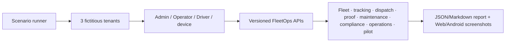
```mermaid
flowchart LR
  Runner["Scenario runner"] --> Tenants["3 fictitious tenants"]
  Tenants --> Roles["Admin / Operator / Driver / device"]
  Roles --> API["Versioned FleetOps APIs"]
  API --> Modules["Fleet · tracking · dispatch · proof · maintenance · compliance · operations · pilot"]
  Modules --> Evidence["JSON/Markdown report + Web/Android screenshots"]
```

Run the complete Web/API scenario from the repository root:

```powershell
powershell -ExecutionPolicy Bypass -File scripts/run-full-simulation.ps1
```

With exactly one Android device connected through ADB, include installation, real driver sign-in, mission-list capture, and mission-detail capture:

```powershell
powershell -ExecutionPolicy Bypass -File scripts/run-full-simulation.ps1 -IncludeAndroid
```

The command builds the solution, starts an isolated in-memory Development API, seeds only fictitious data, drives all tenant and role workflows over HTTP, starts the Web console for Playwright captures, and then stops its processes. It does not use or mutate the configured SQL Server database. Runtime reports and logs are written to `.runtime/full-simulation/`; curated screenshots are written to `docs/assets/screenshots/`.

The automated walkthrough performs the following sequence for every tenant:

1. authenticate the Admin, Operator, and Driver personas and verify role restrictions;
2. inspect tenant-scoped fleet data and ingest device telemetry;
3. create, plan, assign, inspect, execute, and complete a mission;
4. upload private delivery photo and signature evidence and submit proof of delivery;
5. create, cost, schedule, and complete a maintenance work order;
6. create expiring compliance data, scan alerts, and inspect the coverage matrix;
7. inspect integration contracts and the operations queue;
8. enable simulated pilot consent, aggregate privacy-minimal metrics, resolve a support incident, and export the evidence package;
9. prove cross-tenant mission isolation in both directions.

All generated reports are labelled **SIMULATED DEVELOPMENT EVIDENCE — NOT PILOT OR COMMERCIAL PROOF**. The simulator never creates a Sprint 20 niche decision and therefore cannot replace measured alpha evidence from real consenting pilot organizations.

## Tracking quality, trips and business zones

The live fleet map distinguishes fresh, delayed, inaccurate, invalid, and silent signals. Operators can inspect freshness, accuracy, source, sequence, and quality reason without trusting implausible jumps. Administrators can create tenant-scoped circular or polygonal business zones and recalculate versioned trip summaries for one vehicle over at most seven days.

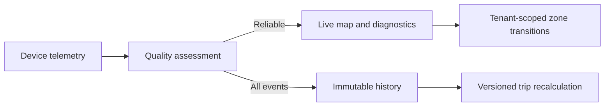
```mermaid
flowchart LR
  Device["Device telemetry"] --> Quality["Quality assessment"]
  Quality -->|Reliable| Map["Live map and diagnostics"]
  Quality -->|All events| History["Immutable history"]
  History --> Trips["Versioned trip recalculation"]
  Map --> Zones["Tenant-scoped zone transitions"]
```

Tracking reads remain under `/api/v1/tracking` for Administrator and Operator roles. `POST /trips/recalculate` and `POST /geofences` are Administrator-only and every query is server-side tenant filtered.

## Virtual telematics provider

Development and demos can submit versioned virtual-provider events through the internal Sandbox Telematics Provider. The HTTP adapter normalizes `sandbox-telematics.v1` events into the same tenant-scoped tracking ingestion pipeline as a real device, including replay protection. It is non-commercial by design and can be replaced by a real-provider adapter without changing the tracking domain; see [the contract guide](docs/02-engineering/SANDBOX_TELEMATICS_PROVIDER.md).

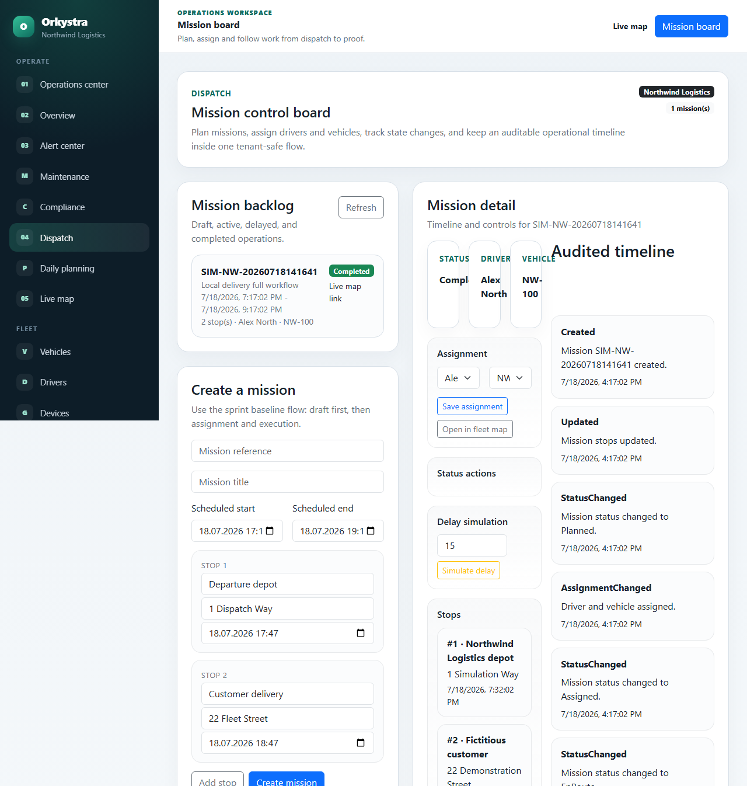

## Dispatch productivity

Operators can prepare a daily or weekly plan from a paged capacity board, save reusable route templates, preview and confirm idempotent imports, and retain an auditable record of every bulk assignment decision. Resource suggestions are deterministic: FleetOps selects the first active, non-conflicting driver and vehicle by name and registration; it does not apply opaque route optimisation.

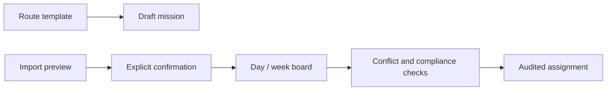
```mermaid
flowchart LR
  T["Route template"] --> D["Draft mission"]
  I["Import preview"] --> C["Explicit confirmation"]
  C --> B["Day / week board"]
  B --> A["Conflict and compliance checks"]
  A --> M["Audited assignment"]
```

## Compliance campaigns

Administrators configure their own document types and blocking policy; FleetOps does not provide legal advice. The compliance workspace presents vehicle and driver coverage, private document evidence, replacement history, review status, expiry horizons, and a CSV audit export. A blocking rule is enforced only when the tenant enables it; an Admin override requires an audit reason. Targeted inspection campaigns are cached in the driver app's Room database and submitted idempotently by WorkManager after connectivity returns.

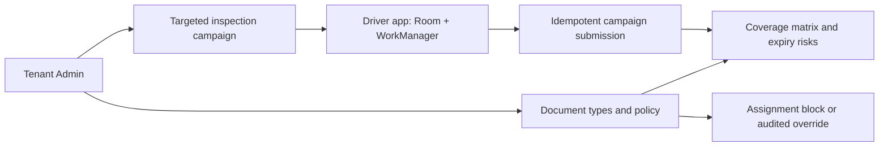
```mermaid
flowchart LR
  Admin["Tenant Admin"] --> Policy["Document types and policy"]
  Policy --> Matrix["Coverage matrix and expiry risks"]
  Policy --> Dispatch["Assignment block or audited override"]
  Admin --> Campaign["Targeted inspection campaign"]
  Campaign --> Driver["Driver app: Room + WorkManager"]
  Driver --> Evidence["Idempotent campaign submission"]
  Evidence --> Matrix
```

## Maintenance work orders

The maintenance backlog lets authorized operators schedule lightweight corrective work from a stable source key, record labour and parts costs in a three-letter currency, attach a private media asset, and complete the order with a required reason. An active immobilising work order prevents dispatch from assigning its vehicle; completion restores availability without deleting the audit trail.

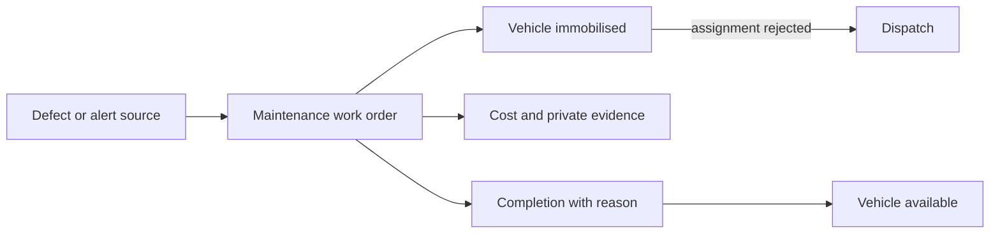
```mermaid
flowchart LR
  S[Defect or alert source] --> W[Maintenance work order]
  W --> I[Vehicle immobilised]
  I -->|assignment rejected| D[Dispatch]
  W --> C[Cost and private evidence]
  W --> R[Completion with reason]
  R --> A[Vehicle available]
```

The repository currently delivers Sprints 00 through 19 and the product-side controls of active Sprint 20, giving the product a functional, recovery, end-to-end validation, security, field-execution, tenant-activation, private-media, maintenance, compliance, and dispatch-productivity baseline:

- reproducible local environment;
- modular ASP.NET Core backend;
- Vue 3 web console for Admin and Operator roles;
- Android driver app foundation;
- SQL Server persistence with Entity Framework Core migrations;
- tenant-aware authentication and authorization;
- tenant-scoped vehicle, driver, and GPS device registry;
- historized GPS device-to-vehicle assignments;
- idempotent CSV imports for fleet master data;
- persisted live telemetry with replay protection and current-position snapshots;
- paged tracking history and tenant-scoped tracking metrics;
- SignalR streaming for live fleet positions;
- deterministic multi-vehicle GPS simulator for demos and validation.
- dispatch missions with explicit state transitions, assignment checks, audited timelines, and mission-to-map linkage.
- Android driver login, offline mission cache, Room persistence, idempotent action outbox, and WorkManager-based background sync.
- compliance campaigns with tenant-controlled document types, four-eyes review, replacement history, 30/14/7-day expiry horizons, coverage matrix, audit export, assignment policy, and Android offline campaign submission.
- pre-departure inspections, critical defect blocking, private media uploads with resumable sessions, and operator-visible delivery proof.
- deterministic alert scans for compliance, maintenance, and inactive vehicles with worker-backed retries.
- web alert center for scan triggering, assignment, acknowledgment, compliance setup, and odometer-driven maintenance configuration.
- actionable operations center workflows that unify alerts, mission delays, critical inspection defects, and blocked driver synchronizations into one queue with saved views, deterministic prioritization, concurrency-safe triage, and realtime refresh.
- scoped API keys for partners and devices, SQL outbox-backed webhooks, sandbox receipts, OpenAPI exposure, and web administration for integrations;
- administrator MFA with authenticator challenge, tenant export and controlled purge tooling, OpenTelemetry OTLP wiring, JSON logs, readiness checks, pilot container packaging, and SQL backup/restore scripts.
- protected Web sessions using HttpOnly/SameSite cookies and CSRF tokens held only in memory, with server-side rotation and revocation;
- Android Keystore-backed credential encryption with a non-destructive Room 2-to-3 migration that removes the access token column;
- configurable media size, type, signature, and malware-test scanning with pre-publication quarantine.
- production S3-compatible private media storage, tenant-bound short-lived read capabilities, checksum verification, and retention cleanup.
- CameraX delivery and inspection capture with a permission-free system photo-picker fallback, controlled JPEG compression, and handwritten signature capture.
- a durable mobile proof queue that preserves image bytes, upload offsets, and immutable command identifiers across app process restarts.
- administrator-guided tenant activation with resumable CSV preview and confirmation, role-aware invitations, one-use Android pairing codes, removable sample data, readiness checks, privacy-minimal diagnostics, and activation metrics.

The audit baseline remains a usable MVP, not yet a production-ready product. Sprints 10 through 16 established Production truth, recovery, security, field execution, tenant activation, and private evidence. Sprints 17 through 19 added maintenance work orders, compliance campaigns, and dispatch productivity. Active Sprint 20 adds measured-alpha controls, but its commercial gate still requires real consenting pilot organizations; deterministic simulation is deliberately excluded from that decision evidence. The approved roadmap continues through Sprint 30 while preserving the mission–proof–exception core and modular-monolith architecture.

## Product Goal

The product goal is to provide a commercially credible fleet management platform that remains understandable, maintainable, and extensible for a small product team.

The MVP is intentionally staged in vertical sprints:

1. foundation and reproducibility;
2. identity, organizations, and roles;
3. fleet registry and devices;
4. live tracking and simulation;
5. dispatch and mission execution;
6. driver mobile workflows;
7. inspections and proof of delivery;
8. integrations and auditability;
9. production hardening and pilot readiness.

## Core Architecture

FleetOps follows a modular monolith architecture. The goal is to keep deployment and operations simple while preserving clear module boundaries and tenant-safe business flows.

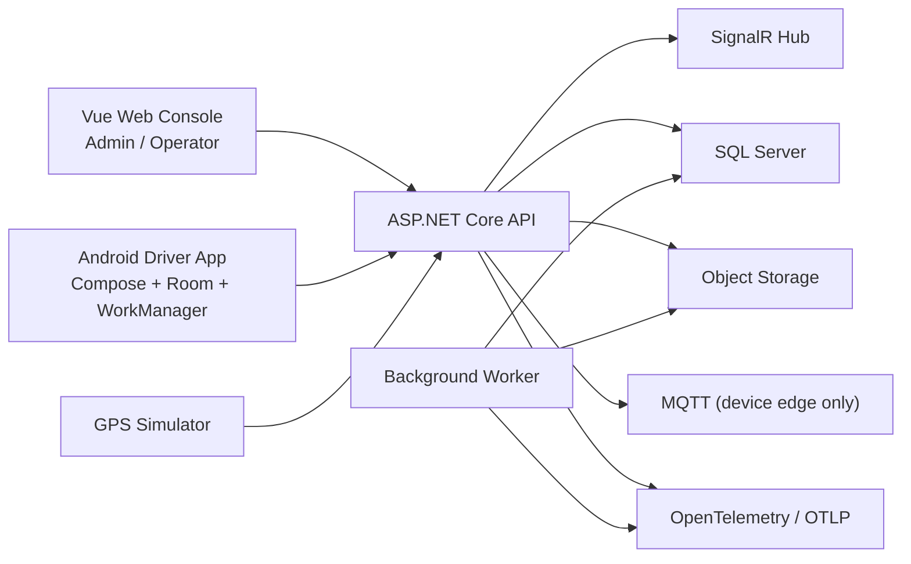
```mermaid
flowchart LR
    Web["Vue Web Console<br/>Admin / Operator"] --> Api["ASP.NET Core API"]
    Android["Android Driver App<br/>Compose + Room + WorkManager"] --> Api
    Simulator["GPS Simulator"] --> Api
    Api --> SignalR["SignalR Hub"]
    Api --> Db["SQL Server"]
    Api --> ObjectStore["Object Storage"]
    Api --> Mqtt["MQTT (device edge only)"]
    Worker["Background Worker"] --> Db
    Worker --> ObjectStore
    Api --> OTel["OpenTelemetry / OTLP"]
    Worker --> OTel
```

### Architectural principles

- Modular monolith instead of microservices.
- One Web application for Admin and Operator personas.
- One native Android application dedicated to Driver workflows.
- SQL Server as the main transactional store.
- SignalR only for real-time positions, states, and alerts.
- MQTT reserved for direct device or simulator communication.
- Tenant-aware entities carry `OrganizationId`.
- Tenant resolution comes from authenticated claims, never from free-form client input.
- Security-sensitive actions are enforced server-side.

## Solution Structure

```text
apps/
  backend/
    FleetOps.Api/              HTTP API, auth, SignalR, minimal endpoints
    FleetOps.Core/             domain model and business invariants
    FleetOps.Infrastructure/   EF Core, Identity, persistence, migrations, seeding
    FleetOps.Worker/           background services
  web/                         Vue 3 Admin/Operator console
  android-driver/              Android driver application
simulators/
  GpsSimulator/                deterministic telemetry simulator
  FleetOpsScenarioSimulator/   multi-tenant role and module walkthrough
docs/                          product, architecture, engineering, and commercial docs
scripts/                       local environment and quality-gate automation
tests/
  backend/FleetOps.UnitTests/  domain and integration coverage
```

## Module View

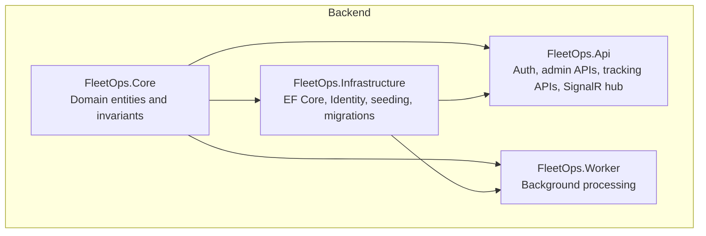
```mermaid
flowchart TD
    subgraph Backend
        Core["FleetOps.Core<br/>Domain entities and invariants"]
        Infra["FleetOps.Infrastructure<br/>EF Core, Identity, seeding, migrations"]
        Api["FleetOps.Api<br/>Auth, admin APIs, tracking APIs, SignalR hub"]
        Worker["FleetOps.Worker<br/>Background processing"]
    end

    Core --> Infra
    Core --> Api
    Infra --> Api
    Core --> Worker
    Infra --> Worker
```

### Current functional slices

- Identity and tenancy
  - organizations;
  - seeded users and roles;
  - JWT-based authentication;
  - claim-based tenant resolution;
  - audit logs for login and administrative actions.
- Fleet registry
  - tenant-aware `Vehicle`, `Driver`, `GpsDevice`, and `DeviceAssignment` entities;
  - unique vehicle registrations, driver license numbers, and GPS serial numbers per organization;
  - active/inactive status lifecycle;
  - historized GPS device assignments with a single active assignment per device;
  - CSV imports for vehicles, drivers, and devices;
  - server-side authorization and audit trails for registry operations.
- Live tracking and simulation
  - idempotent versioned telemetry ingestion;
  - persisted telemetry history plus current vehicle positions;
  - duplicate and out-of-order event handling;
  - paged telemetry history for operators;
  - tenant-scoped SignalR push updates and live tracking metrics;
  - deterministic multi-vehicle simulator with replay and reset support.
- Dispatch and mission execution
  - tenant-aware `Mission`, `MissionStop`, and `MissionTimelineEvent` entities;
  - explicit mission state machine from `Draft` to `Completed`;
  - operator mission planning with ordered stops;
  - driver and vehicle assignment with overlap conflict detection;
  - delay simulation and timeline auditing for demos and operations review;
  - map linkage between a mission and its assigned live vehicle.
- Driver mobile workflow
  - secure driver login bound to a server-side `DriverId`;
  - driver-only mission list and mission detail APIs;
  - local Room cache for missions, stops, timeline, session, and pending commands;
  - idempotent mobile outbox commands for `Start`, `Arrive`, and `Complete`;
  - background sync with WorkManager and conflict/offline states surfaced in the UI.
- Field operations proof
  - checklist templates and checklist items seeded per tenant;
  - pre-departure inspections with pass/fail outcomes and defect severity;
  - delivery proof records linked to mission stops;
  - resumable media upload sessions and signed private media access;
  - CameraX capture with progressive camera permission, system photo-picker fallback, bounded compression, and a handwritten recipient signature image;
  - Room-backed evidence payloads and acknowledged upload offsets that survive process restart before private-media publication;
  - operator mission detail enriched with inspection and POD evidence.
- Alerting and light maintenance
  - tenant-scoped compliance documents for vehicles and drivers;
  - maintenance plans driven by date and odometer thresholds;
  - deterministic deduplicated `OperationalAlert` and `AlertNotification` records;
  - in-app and development-email notification traces;
  - role-aware assignment and acknowledgment APIs;
  - alert worker re-scan behavior resilient to process restart.
- Integrations and auditability
  - scoped `ApiClientCredential` records for partner and device access;
  - immutable audit persistence guarded in the EF Core unit of work;
  - SQL outbox messages and webhook delivery attempts with retry and dead-letter states;
  - HMAC-signed sandbox and external webhook delivery contracts;
  - tenant-safe integration administration APIs plus CSV export endpoints.
- Production hardening and pilot readiness
  - administrator MFA setup, verification, disablement, and login challenge flow;
  - tenant-scoped lifecycle summary, JSON export package, and controlled purge categories;
  - JSON console logging plus OpenTelemetry OTLP hooks for API and worker services;
  - `/health` and `/health/ready` endpoints for runtime supervision;
  - container images for API, worker, and web console with reverse-proxy web routing;
  - SQL backup and restore scripts aligned with the pilot compose stack.
- Session and sensitive-data security
  - revocable `UserSession` records bind every JWT to an organization, user, client type, and expiry;
  - the Web receives its JWT only in an HttpOnly, SameSite cookie and supplies a double-submit CSRF proof for state-changing requests;
  - Android keeps the bearer credential in AES-GCM ciphertext protected by Android Keystore, never in Room;
  - named authorization policies expose a central role-to-operation matrix for sensitive server operations;
  - driver media is published only after size, declared type, magic-byte signature, and configurable malware-signature checks pass;
  - quarantined uploads are isolated, unavailable through signed media URLs, and recorded in the immutable audit trail.
- Operations center and exception handling
  - a unified exception queue aggregates alerts, delayed missions, critical inspection defects, and blocked driver synchronization incidents;
  - deterministic prioritization, search, composable filters, and saved views support morning triage and repeatable operating routines;
  - assignment, acknowledgment, snooze, resolve, and bulk actions are concurrency-checked to prevent silent overwrite between operators;
  - mission-linked triage actions append audited timeline events and retain operator rationale;
  - SignalR pushes only meaningful queue changes and the Web reconciles cleanly after reconnect.

## Operations Center Flow

Sprint 13 replaces the passive default landing page with an exception-first operations workspace.

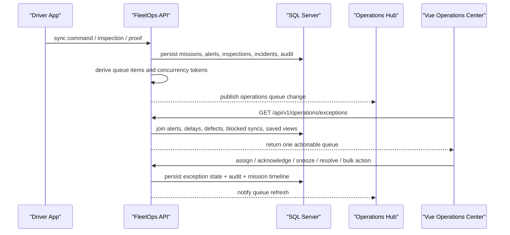
```mermaid
sequenceDiagram
    participant Driver as "Driver App"
    participant API as "FleetOps API"
    participant DB as "SQL Server"
    participant Hub as "Operations Hub"
    participant Web as "Vue Operations Center"

    Driver->>API: sync command / inspection / proof
    API->>DB: persist missions, alerts, inspections, incidents, audit
    API->>API: derive queue items and concurrency tokens
    API-->>Hub: publish operations queue change
    Web->>API: GET /api/v1/operations/exceptions
    API->>DB: join alerts, delays, defects, blocked syncs, saved views
    API-->>Web: return one actionable queue
    Web->>API: assign / acknowledge / snooze / resolve / bulk action
    API->>DB: persist exception state + audit + mission timeline
    API-->>Hub: notify queue refresh
```

### Operations center capabilities

- Operators land on the operations center immediately after sign-in.
- One queue exposes severity, age, owner, workflow status, next action, and linked mission or vehicle context.
- Search, filters, and saved views remain tenant-safe and role-aware.
- Exception actions are optimized for three-step triage on critical cases.
- Realtime notifications keep the queue current without turning every screen into a live stream.

## Tenant Activation Flow

Sprint 15 gives administrators a resumable setup workspace while keeping every sensitive write tenant-scoped and server-authorized.

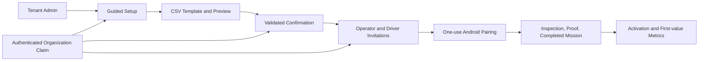
```mermaid
flowchart LR
    Admin["Tenant Admin"] --> Setup["Guided Setup"]
    Setup --> Preview["CSV Template and Preview"]
    Preview --> Confirm["Validated Confirmation"]
    Confirm --> Invite["Operator and Driver Invitations"]
    Invite --> Pair["One-use Android Pairing"]
    Pair --> Mission["Inspection, Proof, Completed Mission"]
    Mission --> Metrics["Activation and First-value Metrics"]
    Claims["Authenticated Organization Claim"] --> Setup
    Claims --> Confirm
    Claims --> Invite
```

The API stores import previews separately from fleet records, so invalid files never write partial fleet data. Confirmations are idempotent and concurrency-checked. Invitation tokens and pairing codes are stored as hashes, expire, and can be consumed only once. Optional sample records retain exact identifiers for deterministic removal before real operations begin.

## Fleet Registry Flow

Sprint 02 adds the operational master data needed before live tracking and dispatch workflows can become meaningful.

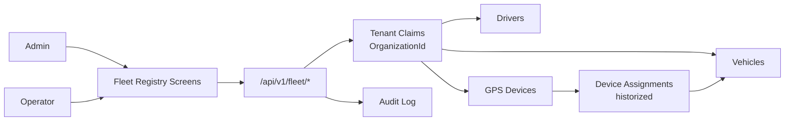
```mermaid
flowchart LR
    Admin["Admin"] --> WebFleet["Fleet Registry Screens"]
    Operator["Operator"] --> WebFleet
    WebFleet --> ApiFleet["/api/v1/fleet/*"]
    ApiFleet --> Tenant["Tenant Claims<br/>OrganizationId"]
    Tenant --> Vehicles["Vehicles"]
    Tenant --> Drivers["Drivers"]
    Tenant --> Devices["GPS Devices"]
    Devices --> Assignments["Device Assignments<br/>historized"]
    Assignments --> Vehicles
    ApiFleet --> Audit["Audit Log"]
```

### Registry capabilities

- `Admin` users can create, update, activate, deactivate, and import vehicles, drivers, and GPS devices.
- `Operator` users can read registry data and manage GPS device assignments without being able to create or deactivate master data.
- CSV imports are idempotent: existing records are updated by natural key and new records are created.
- Device assignments are append-only history records; closing an assignment preserves the previous relationship and enables reassignment.
- All registry queries are scoped by the authenticated tenant and never accept an organization identifier from the client.

## Tracking Flow

Sprint 03 turns the seeded fleet registry into a demonstrable live operations view.

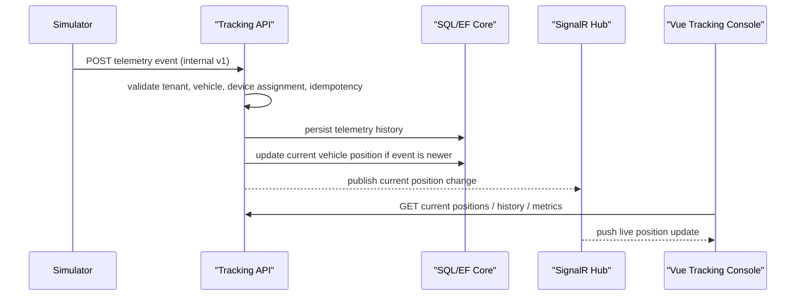
```mermaid
sequenceDiagram
    participant Simulator
    participant API as "Tracking API"
    participant DB as "SQL/EF Core"
    participant Hub as "SignalR Hub"
    participant Web as "Vue Tracking Console"

    Simulator->>API: POST telemetry event (internal v1)
    API->>API: validate tenant, vehicle, device assignment, idempotency
    API->>DB: persist telemetry history
    API->>DB: update current vehicle position if event is newer
    API-->>Hub: publish current position change
    Web->>API: GET current positions / history / metrics
    Hub-->>Web: push live position update
```

### Tracking capabilities

- Internal telemetry ingestion is versioned and idempotent.
- Duplicate events are ignored without creating a second history point.
- Out-of-order events are stored in history without replacing the current vehicle position.
- Operators can inspect current positions, paged history, and tracking metrics inside the same authenticated web console.
- The development simulator can reset a scenario, stream three vehicles at once, and optionally replay duplicates or older events for validation.

## Dispatch Flow

Sprint 04 connects planning and execution on top of the fleet and tracking baseline.

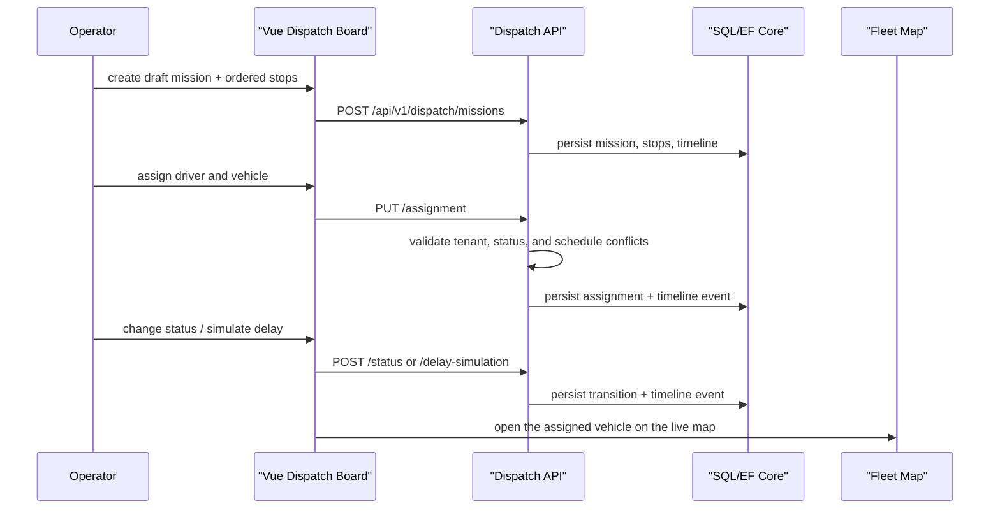
```mermaid
sequenceDiagram
    participant Operator
    participant Web as "Vue Dispatch Board"
    participant API as "Dispatch API"
    participant DB as "SQL/EF Core"
    participant Map as "Fleet Map"

    Operator->>Web: create draft mission + ordered stops
    Web->>API: POST /api/v1/dispatch/missions
    API->>DB: persist mission, stops, timeline
    Operator->>Web: assign driver and vehicle
    Web->>API: PUT /assignment
    API->>API: validate tenant, status, and schedule conflicts
    API->>DB: persist assignment + timeline event
    Operator->>Web: change status / simulate delay
    Web->>API: POST /status or /delay-simulation
    API->>DB: persist transition + timeline event
    Web->>Map: open the assigned vehicle on the live map
```

### Dispatch capabilities

- Missions follow an explicit validated state machine instead of ad-hoc flags.
- Illegal transitions are rejected server-side.
- Assignments stay tenant-scoped and reject inactive or cross-tenant resources.
- Overlapping assignments for the same driver or vehicle are refused.
- Every assignment, status change, and delay appends to an auditable timeline.
- Operators can jump from a mission board entry to the live vehicle map context.

## Driver Mobile Flow

Sprint 05 turns the Android driver app into a real offline-first execution client on top of the dispatch model introduced in Sprint 04.

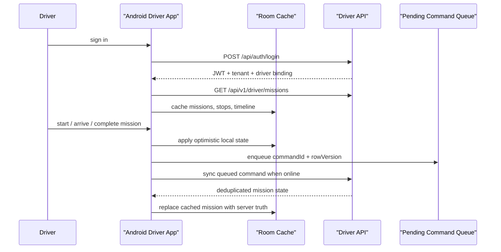
```mermaid
sequenceDiagram
    participant Driver
    participant App as "Android Driver App"
    participant Room as "Room Cache"
    participant API as "Driver API"
    participant Outbox as "Pending Command Queue"

    Driver->>App: sign in
    App->>API: POST /api/auth/login
    API-->>App: JWT + tenant + driver binding
    App->>API: GET /api/v1/driver/missions
    App->>Room: cache missions, stops, timeline
    Driver->>App: start / arrive / complete mission
    App->>Room: apply optimistic local state
    App->>Outbox: enqueue commandId + rowVersion
    App->>API: sync queued command when online
    API-->>App: deduplicated mission state
    App->>Room: replace cached mission with server truth
```

### Mobile capabilities

- Drivers only see missions assigned to their authenticated driver profile.
- Mission data remains available offline after the first successful refresh.
- Route actions are queued locally and replayed with stable `commandId` values.
- Duplicate command submissions are ignored server-side without applying the transition twice.
- Background sync retries automatically when connectivity returns.
- The mobile UI surfaces `Synced`, `Pending sync`, `Offline`, and `Needs reload` states.

## Inspection and POD Flow

Sprint 06 extends the mobile execution flow with pre-departure checks, signed private media access, and stop-level proof of delivery.

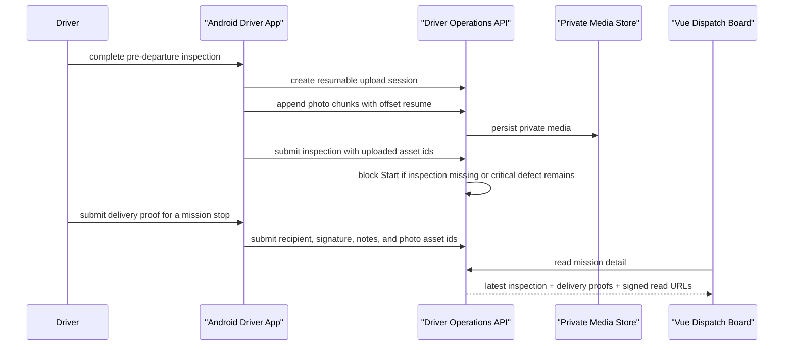
```mermaid
sequenceDiagram
    participant Driver
    participant App as "Android Driver App"
    participant API as "Driver Operations API"
    participant Store as "Private Media Store"
    participant Dispatch as "Vue Dispatch Board"

    Driver->>App: complete pre-departure inspection
    App->>API: create resumable upload session
    App->>API: append photo chunks with offset resume
    API->>Store: persist private media
    App->>API: submit inspection with uploaded asset ids
    API->>API: block Start if inspection missing or critical defect remains
    Driver->>App: submit delivery proof for a mission stop
    App->>API: submit recipient, signature, notes, and photo asset ids
    Dispatch->>API: read mission detail
    API-->>Dispatch: latest inspection + delivery proofs + signed read URLs
```

### Sprint 06 capabilities

- Checklist-based pre-departure inspections bound to a mission.
- Critical defects prevent the mission from starting until a compliant inspection exists.
- Delivery proof is captured per mission stop with recipient name, signature name, notes, and photo references.
- Private media downloads are never exposed as public static files; the API returns short-lived signed URLs.
- The Android repository persists pending workflow operations and resumes media upload from the last acknowledged byte offset.

## Alerting and Maintenance Flow

Sprint 07 turns compliance and maintenance signals into deterministic operational alerts that can be reproduced on demand or by the worker after a restart.

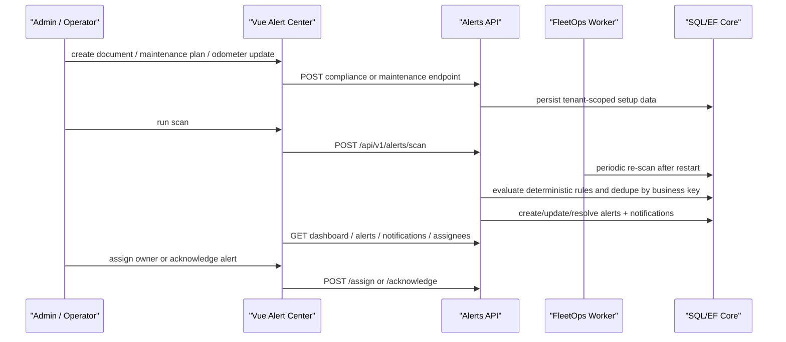
```mermaid
sequenceDiagram
    participant Admin as "Admin / Operator"
    participant Web as "Vue Alert Center"
    participant API as "Alerts API"
    participant Worker as "FleetOps Worker"
    participant DB as "SQL/EF Core"

    Admin->>Web: create document / maintenance plan / odometer update
    Web->>API: POST compliance or maintenance endpoint
    API->>DB: persist tenant-scoped setup data
    Admin->>Web: run scan
    Web->>API: POST /api/v1/alerts/scan
    Worker->>DB: periodic re-scan after restart
    API->>DB: evaluate deterministic rules and dedupe by business key
    API->>DB: create/update/resolve alerts + notifications
    Web->>API: GET dashboard / alerts / notifications / assignees
    Admin->>Web: assign owner or acknowledge alert
    Web->>API: POST /assign or /acknowledge
```

### Sprint 07 capabilities

- Vehicle and driver compliance expirations are stored explicitly and scanned in UTC-safe rules.
- Maintenance plans can trigger by elapsed days, odometer intervals, or both.
- Inactive vehicle alerts are derived from stale or missing latest telemetry snapshots.
- Each alert is deduplicated by a deterministic business key so repeated scans do not multiply incidents.
- Development-email delivery failures are tolerated without losing the in-app alert trace.
- The web console exposes only role-allowed actions: Admin and Operator can triage alerts, while Admin keeps setup-only flows.

## Integration Flow

Sprint 08 opens the platform to controlled external connectivity without giving up tenant safety, delivery traceability, or replay protection.

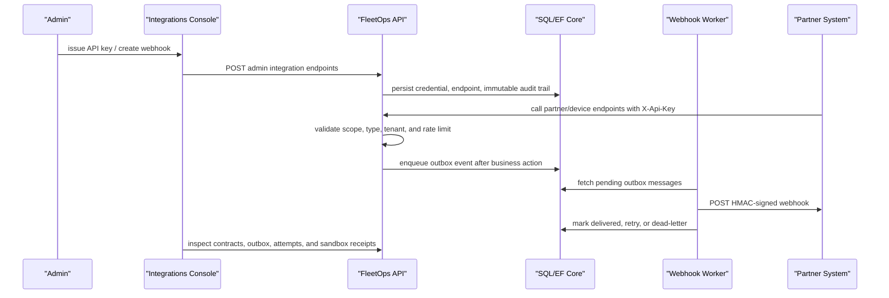
```mermaid
sequenceDiagram
    participant Admin as "Admin"
    participant Web as "Integrations Console"
    participant API as "FleetOps API"
    participant DB as "SQL/EF Core"
    participant Worker as "Webhook Worker"
    participant Partner as "Partner System"

    Admin->>Web: issue API key / create webhook
    Web->>API: POST admin integration endpoints
    API->>DB: persist credential, endpoint, immutable audit trail
    Partner->>API: call partner/device endpoints with X-Api-Key
    API->>API: validate scope, type, tenant, and rate limit
    API->>DB: enqueue outbox event after business action
    Worker->>DB: fetch pending outbox messages
    Worker->>Partner: POST HMAC-signed webhook
    Worker->>DB: mark delivered, retry, or dead-letter
    Web->>API: inspect contracts, outbox, attempts, and sandbox receipts
```

### Sprint 08 capabilities

- Partner and device API keys are isolated by tenant, type, and scope.
- OpenAPI exposes the documented integration routes.
- Webhook signatures use HMAC SHA-256 and forged sandbox requests are rejected.
- Delivery retries are persisted and eventually dead-lettered instead of disappearing in logs.
- Fleet CSV exports complement replayable imports for operational data exchange.
- The web console exposes contracts, credentials, webhooks, outbox state, and CSV operations only to administrators.

## Production Hardening Flow

Sprint 09 turns the MVP into a pilot-ready package with explicit security, observability, packaging, and data-governance controls.

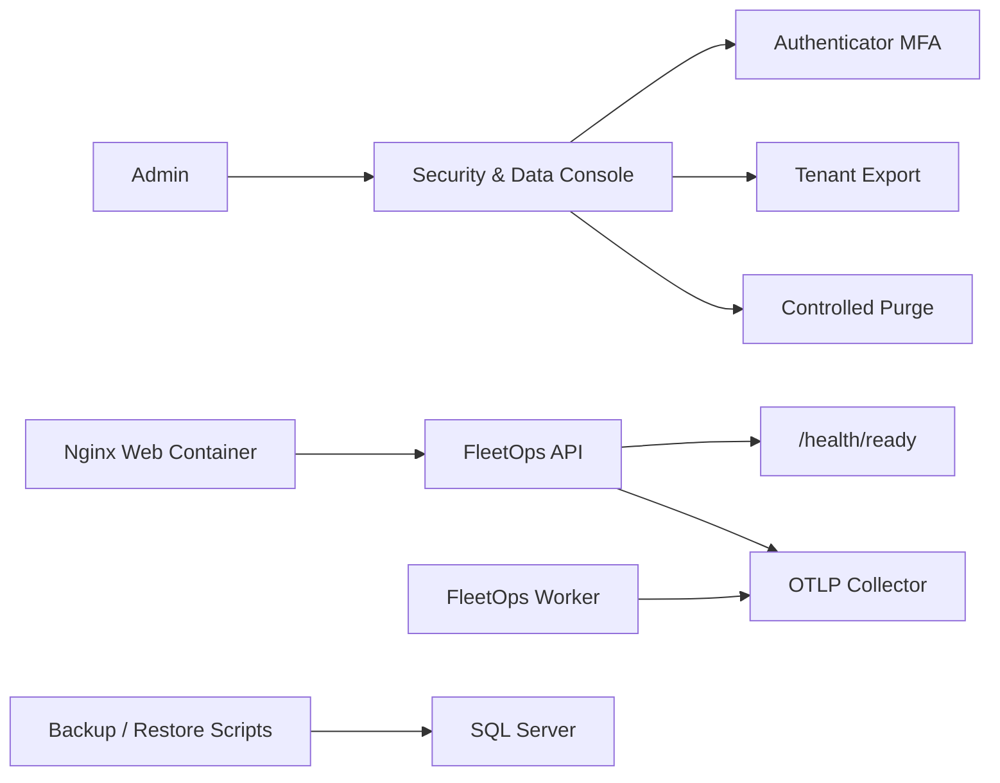
```mermaid
flowchart LR
    Admin["Admin"] --> Security["Security & Data Console"]
    Security --> MFA["Authenticator MFA"]
    Security --> Export["Tenant Export"]
    Security --> Purge["Controlled Purge"]
    Web["Nginx Web Container"] --> Api["FleetOps API"]
    Api --> Ready["/health/ready"]
    Api --> Otlp["OTLP Collector"]
    Worker["FleetOps Worker"] --> Otlp
    Scripts["Backup / Restore Scripts"] --> Sql["SQL Server"]
```

### Sprint 09 capabilities

- administrators can rotate an authenticator secret, verify MFA, receive recovery codes, and must provide a code once MFA is enabled;
- tenant data can be summarized, exported as JSON, and purged selectively for tracking history, integration history, or upload sessions;
- API and worker emit JSON logs and OpenTelemetry telemetry when `OTEL_EXPORTER_OTLP_ENDPOINT` is configured;
- readiness is separated from liveness through `/health/ready`;
- pilot deployments can run from Docker images using `docker-compose.pilot.yml`;
- SQL backup and restore scripts support recovery drills before onboarding pilot users.

## Protected Sessions, Authorization, and Tenant Isolation

Sprint 01 introduced claim-based tenant resolution. Sprint 12 preserves that contract while replacing browser-readable credentials with a protected session boundary and adding immediate server-side revocation.

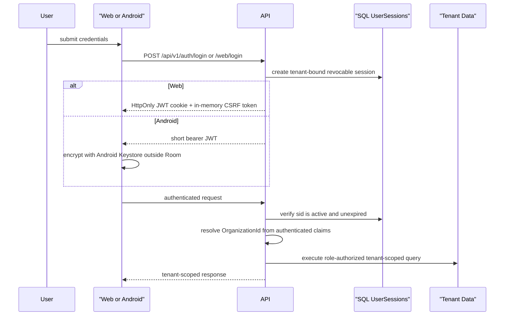
```mermaid
sequenceDiagram
    participant User
    participant Client as "Web or Android"
    participant API
    participant SessionDB as "SQL UserSessions"
    participant TenantDB as "Tenant Data"

    User->>Client: submit credentials
    Client->>API: POST /api/v1/auth/login or /web/login
    API->>SessionDB: create tenant-bound revocable session
    alt Web
        API-->>Client: HttpOnly JWT cookie + in-memory CSRF token
    else Android
        API-->>Client: short bearer JWT
        Client->>Client: encrypt with Android Keystore outside Room
    end
    Client->>API: authenticated request
    API->>SessionDB: verify sid is active and unexpired
    API->>API: resolve OrganizationId from authenticated claims
    API->>TenantDB: execute role-authorized tenant-scoped query
    API-->>Client: tenant-scoped response
```

### Implemented role model

- `Admin`
  - can sign in;
  - can administer users in the current organization;
  - can access tenant-scoped operational data.
- `Operator`
  - can sign in;
  - can access the operational shell and telemetry;
  - cannot administer users.
- `Driver`
  - seeded for backend completeness and future mobile integration;
  - reserved for the Android app evolution.

### Session and authorization guarantees

- two organizations cannot read each other's tenant-scoped data;
- an `Operator` cannot access user administration APIs;
- invalid and expired tokens are rejected;
- login and administrative actions are audited.
- revocation, administrator revocation, and global logout take effect on the next API request because session state is checked during token validation;
- Web mutation requests authenticated by cookie require `X-CSRF-Token`; the JWT is never returned to JavaScript or persisted in `localStorage`;
- Android upgrades preserve the signed-in session while migrating the legacy Room token into Keystore-protected AES-GCM storage and dropping the token column;
- `/api/v1/auth` and `/api/v1/admin` are the supported contracts; historical `/api/auth`, `/api/admin`, and tracking aliases return explicit deprecation metadata;
- CSP, anti-framing, MIME-sniffing, referrer, and permissions headers are emitted by the API;
- role and tenant rejection remain server-side requirements even when the client hides an unavailable action.

## Frontend Architecture

The web console is a Vue 3 application using Composition API, Pinia, and Vue Router.

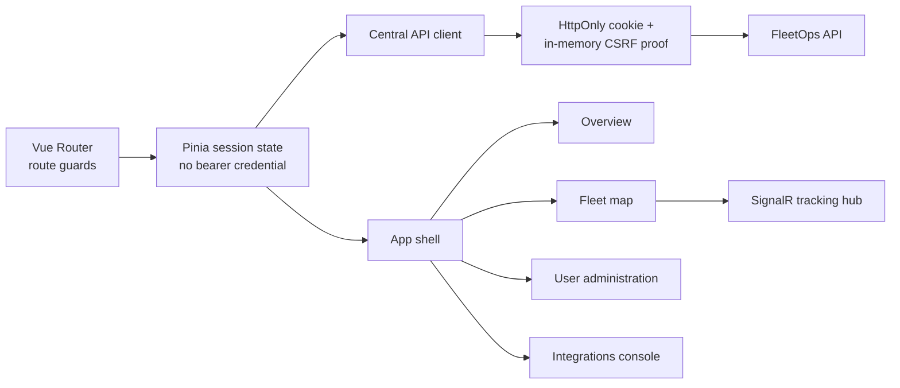
```mermaid
flowchart LR
    Router["Vue Router<br/>route guards"] --> Session["Pinia session state<br/>no bearer credential"]
    Session --> ApiClient["Central API client"]
    Session --> Shell["App shell"]
    Shell --> Dashboard["Overview"]
    Shell --> Map["Fleet map"]
    Shell --> Admin["User administration"]
    Shell --> Integrations["Integrations console"]
    Map --> SignalR["SignalR tracking hub"]
    ApiClient --> Csrf["HttpOnly cookie +<br/>in-memory CSRF proof"]
    Csrf --> Backend["FleetOps API"]
```

### Web responsibilities

- login experience for seeded demo accounts;
- protected cookie-session restoration through `/api/v1/auth/me`, with automatic deletion of the historical local-storage JWT cache;
- role-aware navigation;
- organization-scoped user administration;
- authenticated telemetry fetch and SignalR connection.
- professional fleet registry screens for vehicles, drivers, and GPS devices;
- CSV import panels with success, empty, loading, and error states;
- role-aware controls that hide server-forbidden create/deactivate actions from non-admin users.
- a live fleet map synchronized with a vehicle list, paged history, and connection-state feedback.
- a dispatch board for mission creation, assignment, lifecycle transitions, delay simulation, timeline review, inspection evidence, and delivery proof review.
- an alert center dashboard for scan execution, notifications, ownership assignment, acknowledgment, and admin-only compliance or maintenance setup.
- an integrations console for API credentials, webhook supervision, published contracts, outbox visibility, and CSV exchange operations.

## Technology Stack

### Backend

- `.NET 10`
- `ASP.NET Core`
- `ASP.NET Core Identity`
- `JWT Bearer Authentication` for Android and integration clients
- `HttpOnly / SameSite Web cookies` with double-submit CSRF protection
- server-side revocable sessions and named ASP.NET Core authorization policies
- `SignalR`
- `Entity Framework Core`
- `SQL Server`
- `Minimal APIs`
- `OpenTelemetry OTLP`

### Frontend

- `Vue 3`
- `TypeScript`
- `Pinia`
- `Vue Router`
- `Vite`
- `Vitest`
- `ESLint`
- `Prettier`
- `Bootstrap 5`
- `Leaflet`
- `@microsoft/signalr`

### Mobile

- `Kotlin`
- `Jetpack Compose`
- `Material 3`
- `Room`
- `Android Keystore` with `AES/GCM/NoPadding`
- `Retrofit`
- `OkHttp`
- `WorkManager`
- `KSP`
- `Android Gradle Plugin`

### Storage and Media

- `S3-compatible private object storage in Production; filesystem adapter for development and rollback`
- `Tenant-bound, authenticated download capabilities with a maximum 15-minute lifetime`
- `Idempotent resumable upload sessions with SHA-256 verification and atomic publication`
- `Magic-byte content validation, configurable malware-signature scanning, and quarantine`
- `Worker-backed retention, deferred deletion, and cleanup of abandoned temporary, quarantine, and publication objects`

### Tooling and Infrastructure

- `Docker Compose`
- `SQL Server`
- `MinIO`
- `Mosquitto`
- `Mailpit`
- `dotnet-ef`
- `Nginx`

## Product Surfaces

The simulation captures below were produced from the real applications and APIs on July 18, 2026; no UI network response was mocked. Together they cover Admin, Operator, and Driver surfaces across all three fictitious tenants.

### Northwind administrator pilot review

The review makes the boundary between simulated operational evidence and a real commercial decision explicit.

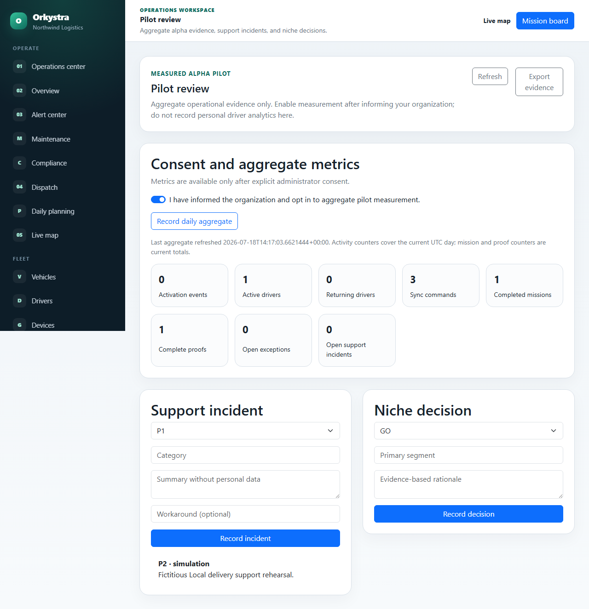

### Southridge live fleet map

Southridge receives its own vehicles, devices, positions, missions, and alerts without Northwind or Westland records.

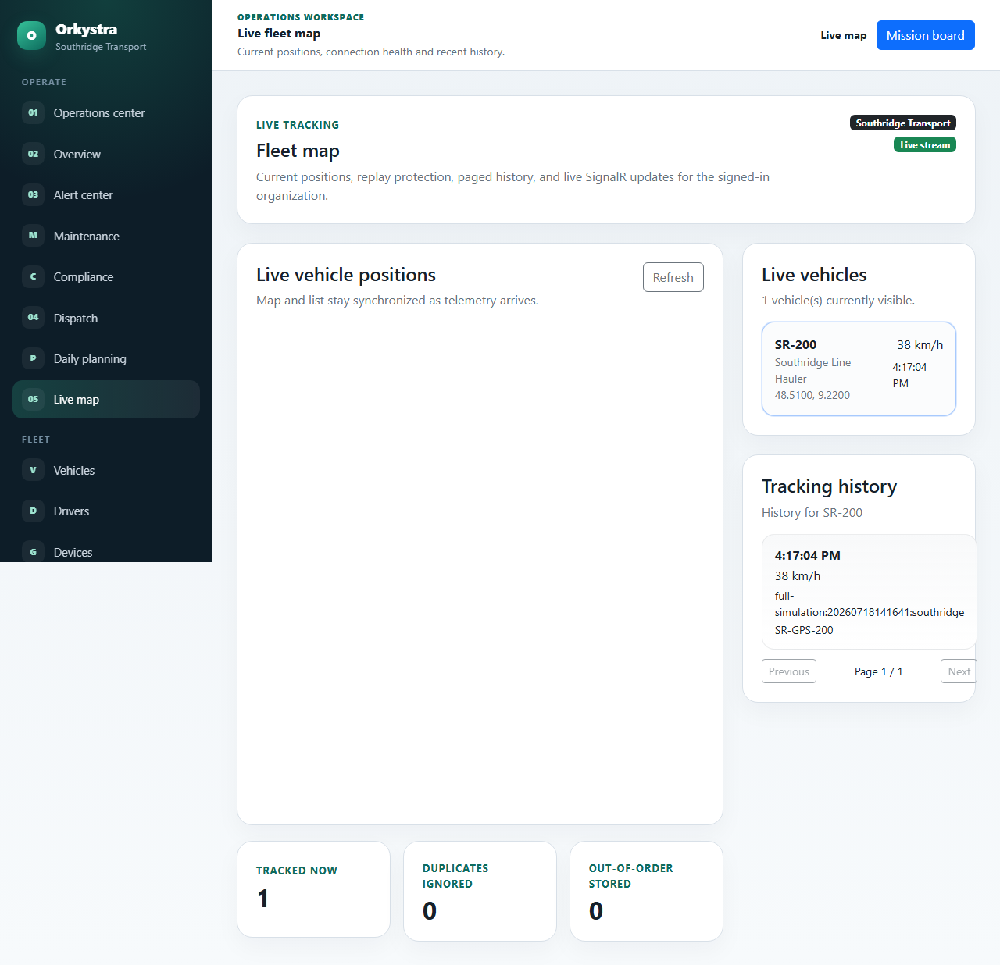

### Westland field-service operations center

The operations queue combines simulated compliance, inactivity, and mission exceptions for the field-service sector.

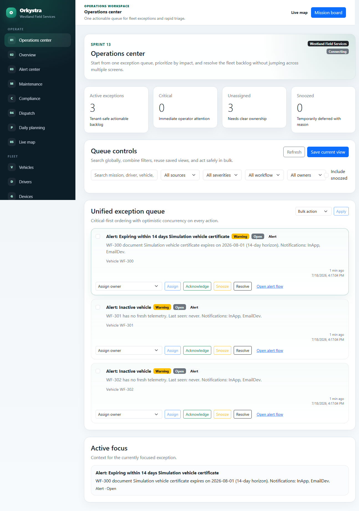

### Connected Android driver session

The physical-device run signs in with the Northwind Driver persona and opens the mission created by the simulator.

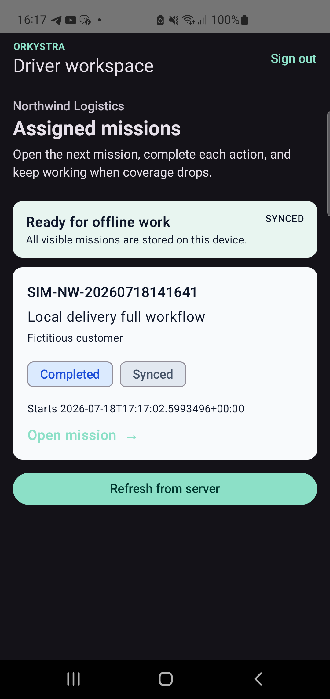

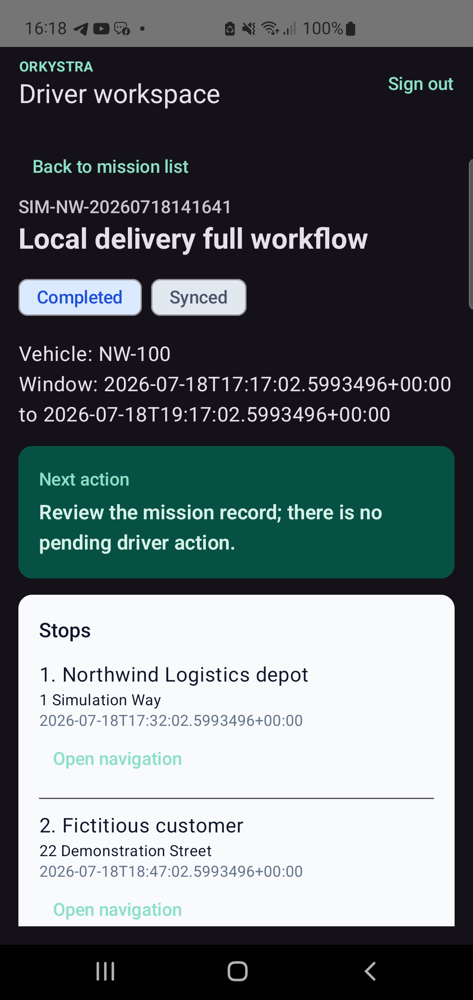

The historical baseline captures that follow remain useful for the security, dashboard, and field-evidence details delivered in earlier sprints.

### Northwind Logistics admin security and governance

Northwind administrators can manage MFA, review tenant lifecycle metrics, export a tenant package, and run controlled purge actions from the same hardened console.

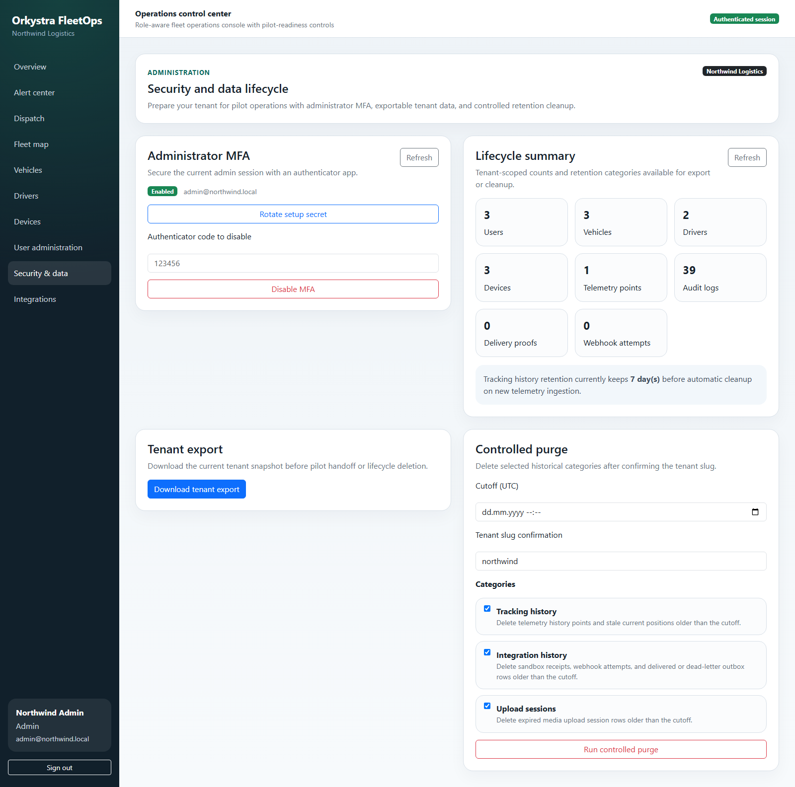

### Northwind Logistics operator dashboard

The operator dashboard consolidates fleet health, alert pressure, maintenance workload, and notification traces in a single operational view.

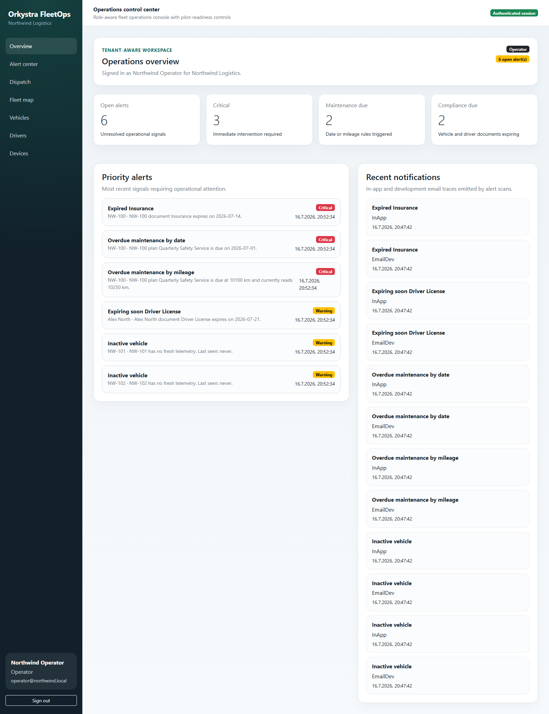

### Northwind Logistics dispatch board

The dispatch board links mission planning, execution status, delay simulation, and route timelines with the same tenant-scoped mission model consumed by the Android driver app.

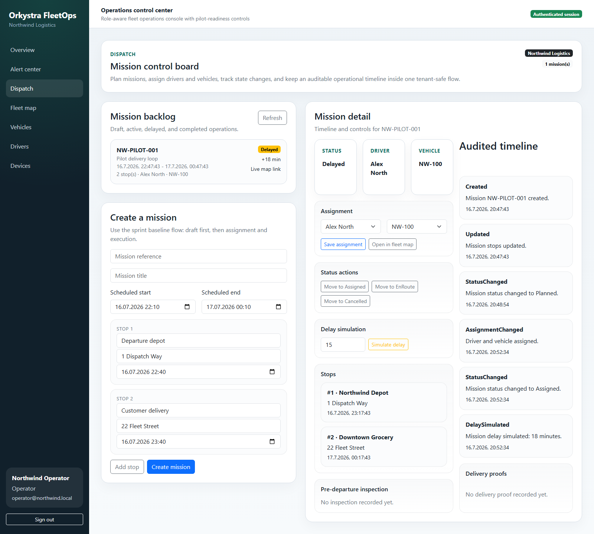

### Southridge Transport isolated tenant view

Southridge starts with its own clean tenant workspace, proving that dashboard data, alerts, and fleet context do not bleed across organizations.

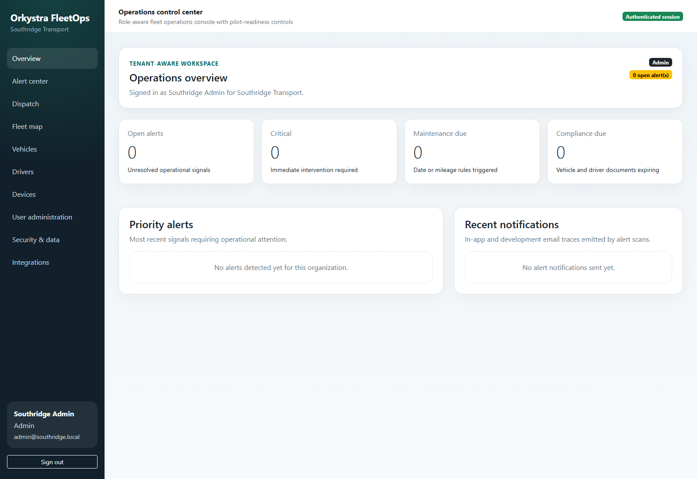

### Android driver app

The native driver surface keeps missions readable offline, reflects sync state explicitly, and exposes the same route context used by dispatch and proof-of-delivery workflows.

### Field evidence flow

Sprint 14 makes the driver home action-oriented while retaining the offline-first contract. Camera access is requested only after the driver selects it; if it is refused or unavailable, Android's photo picker remains usable. Both the delivery photo and the signature are compressed, persisted locally, uploaded through the existing resumable private-media session, and submitted with the same immutable proof command ID.

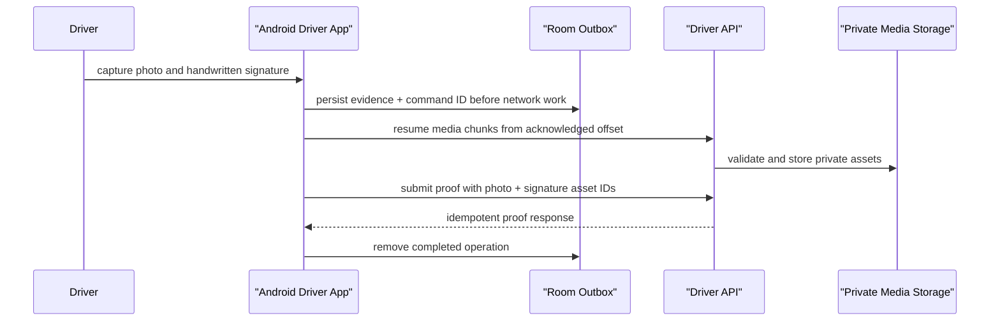
```mermaid
sequenceDiagram
    participant Driver
    participant App as "Android Driver App"
    participant Room as "Room Outbox"
    participant API as "Driver API"
    participant Media as "Private Media Storage"

    Driver->>App: capture photo and handwritten signature
    App->>Room: persist evidence + command ID before network work
    App->>API: resume media chunks from acknowledged offset
    API->>Media: validate and store private assets
    App->>API: submit proof with photo + signature asset IDs
    API-->>App: idempotent proof response
    App->>Room: remove completed operation
```

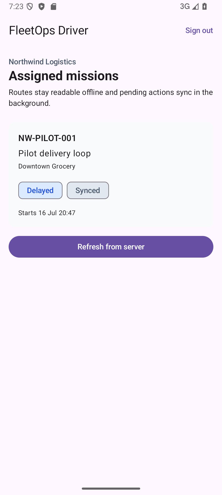

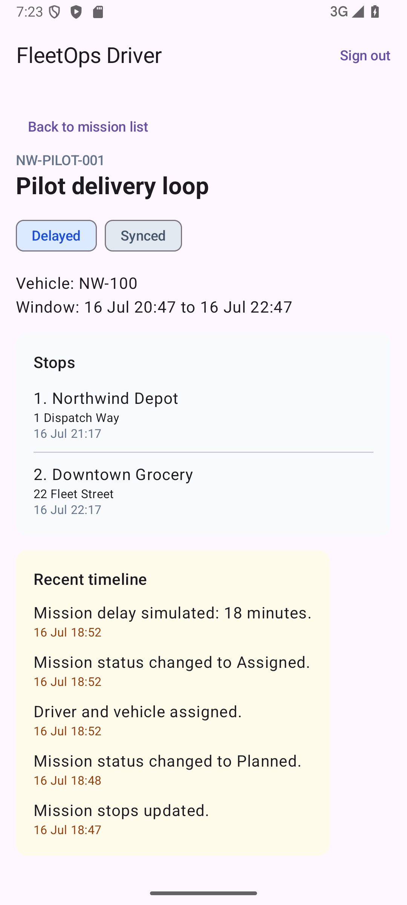

## Demo Accounts

Development mode can explicitly seed isolated demo organizations and users through `Bootstrap:SeedDemoData=true`. Production rejects this setting, and release clients do not expose these credentials.

| Organization | Role | Email | Password |
|---|---|---|---|
| Northwind Logistics | Admin | `admin@northwind.local` | `Admin123!` |
| Northwind Logistics | Operator | `operator@northwind.local` | `Operator123!` |
| Northwind Logistics | Driver | `driver@northwind.local` | `Driver123!` |
| Southridge Transport | Admin | `admin@southridge.local` | `Admin123!` |
| Southridge Transport | Operator | `operator@southridge.local` | `Operator123!` |
| Southridge Transport | Driver | `driver@southridge.local` | `Driver123!` |
| Westland Field Services | Admin | `admin@westland.local` | `Admin123!` |
| Westland Field Services | Operator | `operator@westland.local` | `Operator123!` |
| Westland Field Services | Driver | `driver@westland.local` | `Driver123!` |

## Local Environment

Validated locally on Windows with:

- `.NET SDK 10.0.201`
- `Node.js 24.18.0`
- `npm 11.16.0`
- `Docker Desktop 28.0.1`
- `Android Studio JBR 21`
- `Android SDK platform 35`

Create a local `.env` if needed:

```powershell
Copy-Item .env.example .env
```

## Running the Platform

### 1. Start infrastructure

```powershell
./scripts/dev-up.ps1
docker compose ps
```

### 2. Restore backend tools and packages

```powershell
dotnet tool restore
dotnet restore FleetOps.slnx
```

### 3. Apply the database

```powershell
dotnet dotnet-ef database update --project apps/backend/FleetOps.Infrastructure --startup-project apps/backend/FleetOps.Api
```

### 4. Start the API

```powershell
dotnet run --project apps/backend/FleetOps.Api
```

### 5. Start the web console

```powershell
Set-Location apps/web
npm ci
npm run dev -- --host 127.0.0.1
```

### 6. Optional: run the complete role and tenant simulation

The recommended command needs only the local .NET and Node.js toolchains; it uses an isolated in-memory API and cleans up its processes automatically:

```powershell
powershell -ExecutionPolicy Bypass -File scripts/run-full-simulation.ps1
```

Add `-IncludeAndroid` when exactly one authorized ADB device is connected. The Android helper installs a Debug build configured for the isolated API, clears only the FleetOps Debug app data, creates an ADB reverse port mapping for the run, and removes that mapping afterward.

Use `-SkipScreenshots` for a faster headless API-only scenario, or `-ApiPort` and `-WebPort` when the default simulation ports `5090` and `4174` are occupied.

### 7. Optional: start the GPS simulator

Dry-run:

```powershell
dotnet run --project simulators/GpsSimulator -- --dry-run --once
```

Connected mode:

```powershell
dotnet run --project simulators/GpsSimulator
```

Replay duplicate and out-of-order events:

```powershell
dotnet run --project simulators/GpsSimulator -- --once --replay-duplicate --send-out-of-order
```

### 8. Optional: validate the Android app

```powershell
Set-Location apps/android-driver
.\gradlew.bat testDebugUnitTest assembleDebug --stacktrace
```

If your API is running on a host other than the Android emulator loopback, set:

```powershell
$env:FLEETOPS_API_URL="http://10.0.2.2:5080/"
```

### 9. Pilot container deployment

Before starting a new Production database, replace every placeholder in `.env`. `JWT_SIGNING_KEY` and `MEDIA_SIGNING_KEY` must be independent random values of at least 32 characters; MinIO credentials and `MINIO_KMS_SECRET_KEY` must also be independently generated. The bootstrap organization/admin values are used only when the database has no organization; rotate the temporary administrator password immediately and enable MFA.

```powershell
docker compose --env-file .env -f docker-compose.yml -f docker-compose.pilot.yml up -d --build
```

Existing filesystem media must be copied and checksum-verified before the API switches its reads to S3. The command is replayable and never deletes the filesystem source:

```powershell
docker compose --env-file .env -f docker-compose.yml -f docker-compose.pilot.yml run --rm worker --migrate-media
```

Pilot defaults:

- web console: `http://localhost:8081`
- API: `http://localhost:5080`
- readiness probe: `http://localhost:5080/health/ready`

Optional observability:

```powershell
$env:OTEL_EXPORTER_OTLP_ENDPOINT="http://localhost:4317"
```

### 10. Backup and restore drills

Create a SQL backup:

```powershell
./scripts/sql-backup.ps1
```

Restore a SQL backup:

```powershell
./scripts/sql-restore.ps1 -InputPath backups/fleetops-YYYYMMDD-HHMMSS.bak
```

## Quality Gate

The repository includes a local quality gate that validates recovery, backend, Web, browser, API health, Android, and connected-device proof layers:

```powershell
powershell -NoProfile -ExecutionPolicy Bypass -File scripts\quality-gate.ps1
```

It covers:

- Git status visibility;
- tool restore;
- Docker Compose validation;
- PowerShell recovery-script parsing;
- backend restore, format, build, fast tests, and Docker-backed SQL tests;
- GPS simulator dry-run;
- 33-step full multi-tenant role simulation against an isolated API;
- web install, format, lint, unit tests, build, browser provisioning, and Playwright E2E;
- API health check;
- API readiness check through the production boot path;
- Android wrapper, lint, unit tests, debug build, and instrumentation APK build;
- optional connected Android instrumentation when `FLEETOPS_ENABLE_ANDROID_CONNECTED=1` and an emulator or device is available. On physical devices where OEM or Play Protect verification stalls ADB package installation, `FLEETOPS_MANAGE_ANDROID_ADB_VERIFIER=1` temporarily disables only ADB-install verification for the test step and always restores the original device setting.

## Validation Summary

Current local validation includes:

- backend build in `Release`;
- backend tests including protected-cookie/CSRF behavior, session revocation, role matrix enforcement, tenant isolation, upload quarantine, and Sprint 11 SQL Server scenarios wired through Docker/Testcontainers;
- fleet registry unit and integration tests covering tenant isolation, role permissions, duplicate data, stale updates, CSV idempotency, and assignment invariants;
- tracking unit and integration tests covering duplicate telemetry, out-of-order handling, paged history, tenant isolation, and multi-vehicle visibility;
- dispatch domain and integration tests covering mission lifecycle, illegal transitions, tenant-safe assignment, schedule conflicts, and mission-to-map linkage;
- driver mobile integration tests covering assigned-mission filtering, idempotent command sync, stale row-version conflicts, inspection blocking, resumable uploads, and proof visibility;
- web tests, lint, format, production build, and five Playwright critical-flow scenarios covering login, guided activation, dispatch progression, proof consultation, and tenant isolation with explicit cross-tenant mutation refusal;
- web dispatch board coverage for mission rendering, assignment context, timeline visibility, and map linkage;
- authenticated tracking endpoints, paged history, metrics, and SignalR hub;
- alerting and maintenance tests covering deduplication, UTC handling, notification failure tolerance, role permissions, tenant isolation, and restart-safe re-scans;
- integration tests covering OpenAPI exposure, API key scope isolation, forged webhook rejection, retry/dead-letter handling, and CSV exports;
- integration tests covering administrator MFA enablement and login challenge plus tenant-scoped lifecycle export and controlled purge;
- onboarding integration tests covering invalid and bulk imports, confirmation replay, invitation expiry, driver linkage, one-use pairing, tenant isolation, removable sample data, and PII-free diagnostics;
- alpha-pilot integration tests covering explicit consent, idempotent daily aggregates, three-tenant evidence isolation, administrator-only access, incident lifecycle, and decision/evidence export;
- EF Core migrations for identity, fleet, dispatch, operations, security, and tenant onboarding data;
- OpenTelemetry OTLP wiring and JSON logs for the API and worker runtime;
- pilot Docker packaging plus SQL backup and restore scripts;
- Android unit tests, debug assembly, instrumentation APK compilation, and connected instrumentation execution on a physical Android device for Room-backed offline persistence, Keystore-separated session credentials, and unique WorkManager scheduling tests;
- full local quality gate.

On Saturday, July 18, 2026, the complete gate passed without skips: 142 fast backend tests, one live MinIO contract, three SQL Server/Testcontainers proofs, the 33-step multi-tenant simulation, 20 Web unit tests, five Playwright critical flows, and five connected Android instrumentation tests on a physical Samsung SM-G975F running Android 12.

## Engineering Notes

### How does measured alpha evidence work?

Administrators use **Pilot review** to opt in to privacy-minimal measurement, record one aggregate snapshot per UTC day, track support incidents, and export an organization-scoped evidence package for weekly review. Collection is disabled until explicit consent and never exports raw driver activity, locations, proof media, or command payloads. Re-recording a day refreshes its aggregate rather than duplicating it; a recorded niche decision is a review artifact, not a claim that commercial acceptance criteria have been achieved.

### Why a modular monolith?

The MVP favors speed, simplicity, and operational clarity. The monolith keeps local development, CI, migrations, and observability much easier while still preserving domain boundaries.

### Why a hybrid protected-session model?

The browser never needs direct access to a bearer credential, so it uses an HttpOnly cookie plus CSRF proof. Android must authenticate offline-first synchronization calls and therefore retains bearer compatibility, but encrypts the credential with an Android Keystore key and stores only non-secret profile metadata in Room. Both transports carry a server-side session identifier, so revocation is consistent and immediate without introducing a separate identity microservice.

### Why separate Web and Android apps?

Admin/Operator and Driver workflows have different interaction models, offline requirements, and device constraints. The split keeps each experience focused and technically appropriate.

## Roadmap Snapshot

| Range | Outcome |
|---|---|
| Sprint 00–10 | Functional MVP baseline plus Production truth and UX stabilization |
| Sprint 11 | Completed SQL Server proof, recovery drill, Playwright critical flows, and Android instrumentation baseline |
| Sprint 12 | Completed protected sessions, explicit authorization, Android Keystore migration, and upload quarantine |
| Sprint 13–15 | Exception-driven operations, richer driver field workflow, tenant onboarding |
| Sprint 16–20 | Media lifecycle, maintenance work orders, compliance campaigns, dispatch productivity, measured alpha pilot |
| Sprint 21–25 | Tracking quality, telematics connectors, recipient status, reporting, integration hub |
| Sprint 26–30 | Device support, retention and performance, design system, production assurance, commercial beta |

## Supporting Documentation

- [ROADMAP.md](./ROADMAP.md)
- [VALIDATION.md](./VALIDATION.md)
- [docs/04-audit/2026-07-17-COMPLETE-AUDIT.md](./docs/04-audit/2026-07-17-COMPLETE-AUDIT.md)
- [docs/01-architecture/ARCHITECTURE.md](./docs/01-architecture/ARCHITECTURE.md)
- [docs/01-architecture/DOMAIN_MODEL.md](./docs/01-architecture/DOMAIN_MODEL.md)
- [docs/02-engineering/ENGINEERING_STANDARDS.md](./docs/02-engineering/ENGINEERING_STANDARDS.md)
- [docs/02-engineering/SIMULATION_STRATEGY.md](./docs/02-engineering/SIMULATION_STRATEGY.md)
- [docs/02-engineering/PILOT_RUNBOOK.md](./docs/02-engineering/PILOT_RUNBOOK.md)
- [docs/03-commercial/PILOT_ONBOARDING.md](./docs/03-commercial/PILOT_ONBOARDING.md)
- [sprints/SPRINT-01-IDENTITY-TENANCY.md](./sprints/SPRINT-01-IDENTITY-TENANCY.md)
- [sprints/SPRINT-02-FLEET-REGISTRY.md](./sprints/SPRINT-02-FLEET-REGISTRY.md)
- [sprints/SPRINT-03-TRACKING-SIMULATION.md](./sprints/SPRINT-03-TRACKING-SIMULATION.md)
- [sprints/SPRINT-04-DISPATCH-MISSIONS.md](./sprints/SPRINT-04-DISPATCH-MISSIONS.md)
- [sprints/SPRINT-05-ANDROID-DRIVER.md](./sprints/SPRINT-05-ANDROID-DRIVER.md)
- [sprints/SPRINT-06-INSPECTIONS-POD.md](./sprints/SPRINT-06-INSPECTIONS-POD.md)
- [sprints/SPRINT-07-ALERTS-MAINTENANCE.md](./sprints/SPRINT-07-ALERTS-MAINTENANCE.md)
- [sprints/SPRINT-08-INTEGRATIONS-AUDIT.md](./sprints/SPRINT-08-INTEGRATIONS-AUDIT.md)
- [sprints/SPRINT-09-PRODUCTION-PILOT.md](./sprints/SPRINT-09-PRODUCTION-PILOT.md)
- [sprints/SPRINT-10-PRODUCTION-TRUTH-UX.md](./sprints/SPRINT-10-PRODUCTION-TRUTH-UX.md)
- [sprints/SPRINT-11-SQL-E2E-RECOVERY.md](./sprints/SPRINT-11-SQL-E2E-RECOVERY.md)
