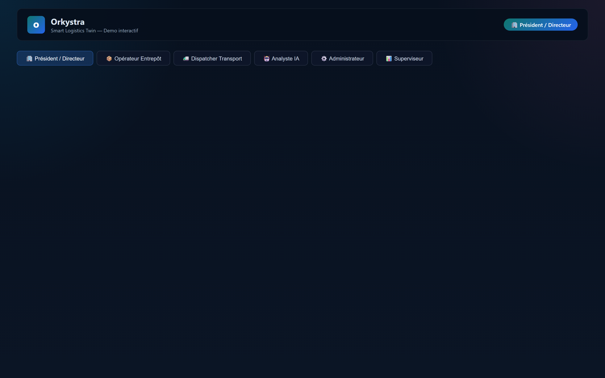
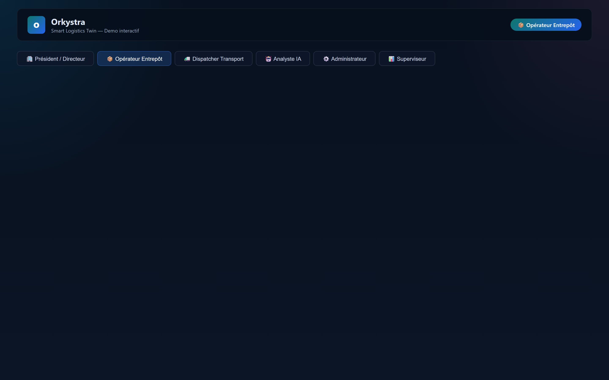
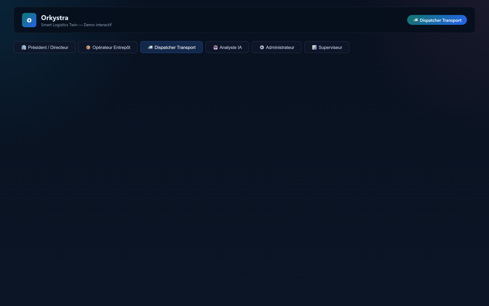
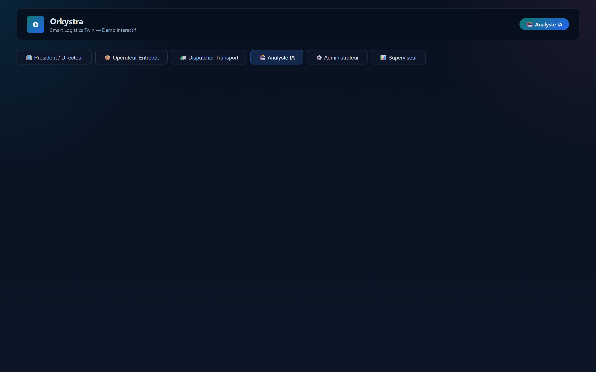
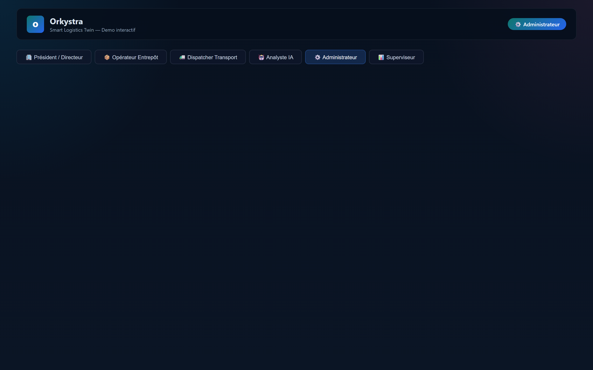
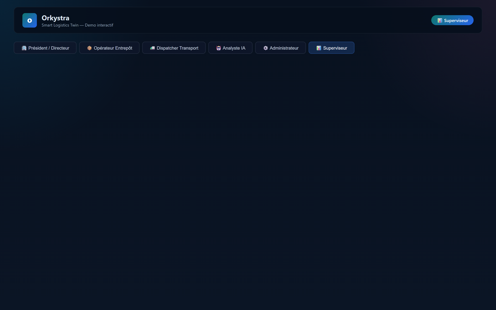

# Orkystra — Smart Logistics Twin

**Orkystra** est un système d'exploitation logistique (Logistics OS) complet avec jumeau numérique d'entrepôt, gestion de transport, simulation événementielle, optimisation de tournées et assistant IA. Plateforme modulaire « simulation-first, reality-ready » construite en .NET, Vue 3, Python/FastAPI et MQTT.

## Démo interactive par rôle — Workflows pas-à-pas

Chaque rôle suit un workflow de 4 étapes (consulter → analyser → décider → suivre). Captures réalisées depuis l'API réelle (3 scénarios, 2 entrepôts, 3 routes, 3 providers).

### 🏢 Président / Directeur — Vue stratégique globale

| Étape | Capture |
|-------|---------|
| ① Vue d'ensemble : KPI, alertes, santé des providers |  |
| ② Analyse des alertes critiques et flux tendus |  |
| ③ Décision : contacter les prestataires dégradés |  |
| ④ Suivi : plan d'action validé pour la journée |  |

### 📦 Opérateur Entrepôt — Gestion des stocks et jumeau 3D

| Étape | Capture |
|-------|---------|
| ① Vue des entrepôts : occupation, zones, quais |  |
| ② Jumeau numérique 3D interactif |  |
| ③ Analyse des capacités et risques de congestion |  |
| ④ Décision : réaffectation des zones de stockage |  |

### 🚛 Dispatcher Transport — Suivi et optimisation des routes

| Étape | Capture |
|-------|---------|
| ① Tableau des routes : statut, arrêts, livraisons |  |
| ② Analyse de la route RT-412 en retard |  |
| ③ Re-routage : optimisation OR-Tools disponible |  |
| ④ Synchro transport : plan de tournée mis à jour |  |

### 🤖 Analyste IA — Recommandations opérationnelles

| Étape | Capture |
|-------|---------|
| ① Assistant IA : recommandations opérationnelles |  |
| ② Preuves, hypothèses, niveau de confiance HIGH |  |
| ③ Trace opérationnelle et historique IA |  |
| ④ Workflow IA : analyse, décision, action |  |

### ⚙️ Administrateur — Configuration et connecteurs

| Étape | Capture |
|-------|---------|
| ① Catalogue des providers connecteurs |  |
| ② Configuration des connecteurs et secrets API |  |
| ③ État des connexions et santé des services |  |
| ④ Configuration runtime et déploiement |  |

### 📊 Superviseur — Observabilité et audit

| Étape | Capture |
|-------|---------|
| ① Piste d'audit et observabilité |  |
| ② Métriques système et backbone événementiel |  |
| ③ Santé du système : API, MQTT, SQLite |  |
| ④ Tableau de bord superviseur : vue consolidée |  |

### Lancement de la démo interactive

```powershell
# 1. Infrastructure (MQTT, PostgreSQL, Qdrant)
cd infrastructure
docker compose up -d

# 2. Backend API
cd backend
dotnet run --project src/Orkystra.Api

# 3. Page démo standalone (port 4180)
cd docs/screenshots
npx http-server . -p 4180 -c-1

# 4. Ouvrir http://127.0.0.1:4180/demo.html
```

Les données sont chargées en direct depuis l'API .NET sur le port 5043 avec les headers `X-Api-Keys` et `X-Tenant-Id`.

---

## Core Documents

- Architecture overview: `docs/architecture/overview.md`
- Connector architecture: `docs/architecture/connector-layer.md`
- Production hardening notes: `docs/architecture/production-hardening.md`
- Development commands: `docs/development.md`

## Repository Layout

```text
Orkystra/
  backend/
    src/
      Orkystra.Api/          # ASP.NET Core API (Minimal API)
      Orkystra.Application/   # Use cases, projections, provider adapters
      Orkystra.Contracts/     # DTOs et read-models
      Orkystra.Domain/        # Modèle métier pur (entités, valeur, événements)
  docs/
    adr/
    architecture/
    blueprints/
    screenshots/             # Captures par rôle (ci-dessus)
  frontend/
    web/                     # Vue 3 + Three.js + TypeScript
  infrastructure/
    docker-compose.yml       # PostgreSQL, Mosquitto MQTT, Qdrant
  python-services/
    ai-service/              # FastAPI + LangGraph (recommandations)
    optimization-service/    # FastAPI + OR-Tools (optimisation tournées)
  tests/
    backend/                 # 95+ tests xUnit
```

## Stack Technique

| Couche | Technologie |
|--------|-------------|
| **Backend** | .NET 9 (C#), Minimal API, Clean Architecture |
| **Frontend** | Vue 3, TypeScript, Vite, Three.js (jumeau 3D) |
| **IA** | Python 3.12+, FastAPI, LangGraph |
| **Optimisation** | Python 3.12+, FastAPI, OR-Tools |
| **Broker événementiel** | MQTT (Mosquitto) via MQTTnet |
| **Base de données** | SQLite (persistance opérationnelle), PostgreSQL (ref) |
| **Vector store** | Qdrant (IA - RAG) |
| **Infrastructure** | Docker Compose |
| **Auth** | API Key + Tenant headers |

## Fonctionnalités clés

- **Jumeau numérique 3D** d'entrepôt (Three.js) avec zones, racks, quais
- **Gestion de transport** avec cycle de vie complet (assignation → livraison)
- **Simulation déterministe** avec horloge virtuelle et semences reproductibles
- **Backbone MQTT** pour publications/consommations événementielles idempotentes
- **IA conversationnelle** avec recommandations « grounded » (preuves, confiance, actions)
- **Optimisation de tournées** (OR-Tools) avec plans alternatifs et explications
- **Connecteurs** (CSV, REST, GPS) avec registry, configuration runtime, gestion de secrets
- **Observabilité** : métriques, audit trail JSONL, santé des providers
- **Multitenant** avec résolution par en-tête HTTP

## Architecture

```
┌──────────────────────────────────────────────────────────┐
│                     Orkystra Control Tower (Vue 3)        │
│            Tableau de bord · Jumeau 3D · Carte GPS        │
└──────────────────────────┬───────────────────────────────┘
                           │ HTTP (API Key + Tenant)
┌──────────────────────────▼───────────────────────────────┐
│                   Orkystra.Api (.NET 9)                   │
│    Contrôleur + Middleware + Projection + Workflows        │
└──────┬──────────────────────────────┬────────────────────┘
       │                              │
┌──────▼────────┐            ┌────────▼──────────┐
│ Orkystra.Domain│            │ Orkystra.Contracts │
│ (Aggregates,   │            │ (DTOs, ReadModels) │
│  Events, VOs)  │            └───────────────────┘
└──────┬────────┘                     
       │
┌──────▼──────────────┐
│ Orkystra.Application │
│ (Projections, Providers Registry, Event Envelopes)
└──────────────────────┘
       │                          ┌─────────────────────┐
       ├── MQTT (Mosquitto) ──────┤  Python AI Service   │
       │                          │  (FastAPI/LangGraph) │
       │                          └─────────────────────┘
       │                          ┌─────────────────────┐
       ├── HTTP ──────────────────┤  Python Optimization │
       │                          │  (FastAPI/OR-Tools) │
       │                          └─────────────────────┘
       │                          ┌─────────────────────┐
       └── Provider Registry ─────┤  CSV / REST / GPS   │
                                  │  Adapters           │
                                  └─────────────────────┘
```

## Démarrer en local

```powershell
# 1. Infrastructure (MQTT, PostgreSQL, Qdrant)
cd infrastructure
docker compose up -d

# 2. Backend API
cd backend
dotnet run --project src/Orkystra.Api

# 3. Frontend
cd frontend/web
npm install
npm run dev

# 4. Services Python (optionnel)
cd python-services
pip install -e .
uvicorn orkystra_ai_service.app:app --port 8001
uvicorn orkystra_optimization_service.app:app --port 8002
```

## Current Verification

```powershell
dotnet build backend/Orkystra.slnx
dotnet test backend/Orkystra.slnx --no-build
Push-Location frontend/web
npm run build
Pop-Location
python -m compileall python-services
```
