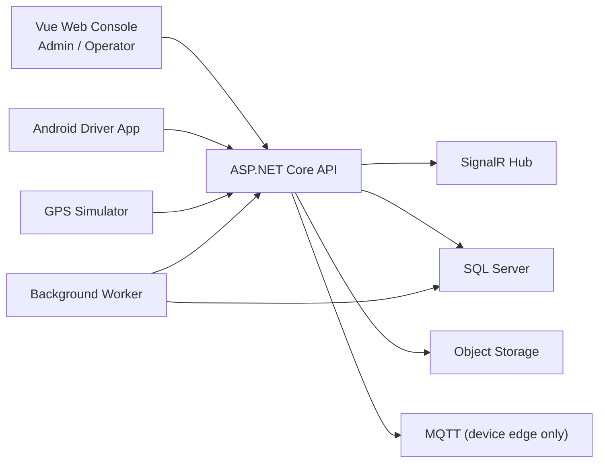
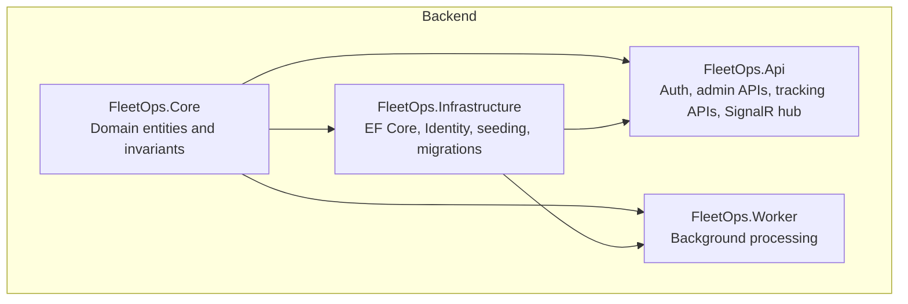
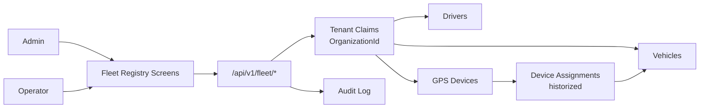
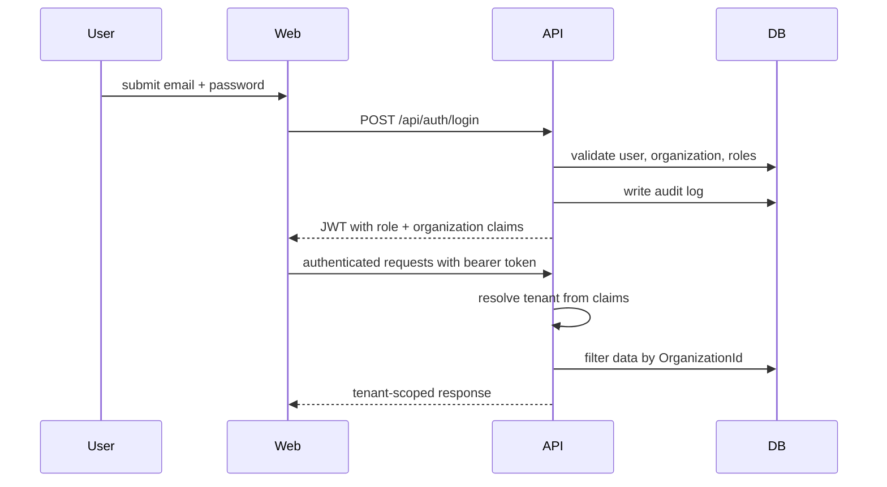
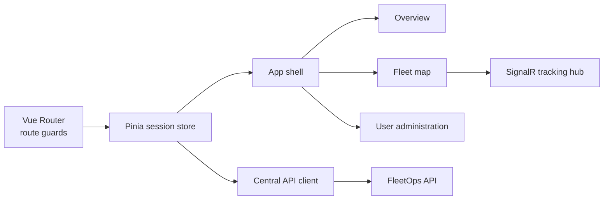

# Orkystra FleetOps

Orkystra FleetOps is a modular fleet operations MVP for small and mid-sized transport businesses. The platform is designed to cover the operational chain from identity and tenant isolation to vehicle tracking, dispatch execution, driver workflows, proof of delivery, alerts, and production readiness.

The repository currently delivers a solid technical foundation, Sprint 01 identity and multi-tenant access control, and Sprint 02 fleet registry capabilities:

- reproducible local environment;
- modular ASP.NET Core backend;
- Vue 3 web console for Admin and Operator roles;
- Android driver app foundation;
- SQL Server persistence with Entity Framework Core migrations;
- tenant-aware authentication and authorization;
- tenant-scoped vehicle, driver, and GPS device registry;
- historized GPS device-to-vehicle assignments;
- idempotent CSV imports for fleet master data;
- live telemetry through SignalR;
- deterministic GPS simulator for demos and validation.

## Product Goal

The product goal is to provide a commercially credible fleet management platform that remains understandable, maintainable, and extensible for a small product team.

The MVP is intentionally staged in vertical sprints:

1. foundation and reproducibility;
2. identity, organizations, and roles;
3. fleet registry and devices;
4. live tracking and simulation;
5. dispatch and mission execution;
6. driver mobile workflows;
7. inspections, POD, alerts, and maintenance;
8. integrations and auditability;
9. production hardening and pilot readiness.

## Core Architecture

FleetOps follows a modular monolith architecture. The goal is to keep deployment and operations simple while preserving clear module boundaries and tenant-safe business flows.



### Architectural principles

- Modular monolith instead of microservices.
- One Web application for Admin and Operator personas.
- One native Android application dedicated to Driver workflows.
- SQL Server as the main transactional store.
- SignalR only for real-time positions, states, and alerts.
- MQTT reserved for direct device or simulator communication.
- Tenant-aware entities carry `OrganizationId`.
- Tenant resolution comes from authenticated claims, never from free-form client input.
- Security-sensitive actions are enforced server-side.

## Solution Structure

```text
apps/
  backend/
    FleetOps.Api/              HTTP API, auth, SignalR, minimal endpoints
    FleetOps.Core/             domain model and business invariants
    FleetOps.Infrastructure/   EF Core, Identity, persistence, migrations, seeding
    FleetOps.Worker/           background services
  web/                         Vue 3 Admin/Operator console
  android-driver/              Android driver application
simulators/
  GpsSimulator/                deterministic telemetry simulator
docs/                          product, architecture, engineering, and commercial docs
scripts/                       local environment and quality-gate automation
tests/
  backend/FleetOps.UnitTests/  domain and integration coverage
```

## Module View



### Current functional slices

- Identity and tenancy
  - organizations;
  - seeded users and roles;
  - JWT-based authentication;
  - claim-based tenant resolution;
  - audit logs for login and administrative actions.
- Tracking bootstrap
  - telemetry contract;
  - in-memory latest position cache;
  - SignalR push updates;
  - development GPS simulator.
- Fleet registry
  - tenant-aware `Vehicle`, `Driver`, `GpsDevice`, and `DeviceAssignment` entities;
  - unique vehicle registrations, driver license numbers, and GPS serial numbers per organization;
  - active/inactive status lifecycle;
  - historized GPS device assignments with a single active assignment per device;
  - CSV imports for vehicles, drivers, and devices;
  - server-side authorization and audit trails for registry operations.

## Fleet Registry Flow

Sprint 02 adds the operational master data needed before live tracking and dispatch workflows can become meaningful.



### Registry capabilities

- `Admin` users can create, update, activate, deactivate, and import vehicles, drivers, and GPS devices.
- `Operator` users can read registry data and manage GPS device assignments without being able to create or deactivate master data.
- CSV imports are idempotent: existing records are updated by natural key and new records are created.
- Device assignments are append-only history records; closing an assignment preserves the previous relationship and enables reassignment.
- All registry queries are scoped by the authenticated tenant and never accept an organization identifier from the client.

## Authentication and Tenant Isolation

Sprint 01 introduces a real authentication and authorization baseline.



### Implemented role model

- `Admin`
  - can sign in;
  - can administer users in the current organization;
  - can access tenant-scoped operational data.
- `Operator`
  - can sign in;
  - can access the operational shell and telemetry;
  - cannot administer users.
- `Driver`
  - seeded for backend completeness and future mobile integration;
  - reserved for the Android app evolution.

### Sprint 01 guarantees

- two organizations cannot read each other's tenant-scoped data;
- an `Operator` cannot access user administration APIs;
- invalid and expired tokens are rejected;
- login and administrative actions are audited.

## Frontend Architecture

The web console is a Vue 3 application using Composition API, Pinia, and Vue Router.



### Web responsibilities

- login experience for seeded demo accounts;
- session persistence in local storage;
- role-aware navigation;
- organization-scoped user administration;
- authenticated telemetry fetch and SignalR connection.
- professional fleet registry screens for vehicles, drivers, and GPS devices;
- CSV import panels with success, empty, loading, and error states;
- role-aware controls that hide server-forbidden create/deactivate actions from non-admin users.

## Technology Stack

### Backend

- `.NET 10`
- `ASP.NET Core`
- `ASP.NET Core Identity`
- `JWT Bearer Authentication`
- `SignalR`
- `Entity Framework Core`
- `SQL Server`
- `Minimal APIs`

### Frontend

- `Vue 3`
- `TypeScript`
- `Pinia`
- `Vue Router`
- `Vite`
- `Vitest`
- `ESLint`
- `Prettier`
- `Bootstrap 5`
- `Leaflet`
- `@microsoft/signalr`

### Mobile

- `Kotlin`
- `Jetpack Compose`
- `Material 3`
- `Android Gradle Plugin`

### Tooling and Infrastructure

- `Docker Compose`
- `SQL Server`
- `MinIO`
- `Mosquitto`
- `Mailpit`
- `dotnet-ef`

## Demo Accounts

The local seed creates isolated demo organizations and users.

| Organization | Role | Email | Password |
|---|---|---|---|
| Northwind Logistics | Admin | `admin@northwind.local` | `Admin123!` |
| Northwind Logistics | Operator | `operator@northwind.local` | `Operator123!` |
| Northwind Logistics | Driver | `driver@northwind.local` | `Driver123!` |
| Southridge Transport | Admin | `admin@southridge.local` | `Admin123!` |
| Southridge Transport | Operator | `operator@southridge.local` | `Operator123!` |

## Local Environment

Validated locally on Windows with:

- `.NET SDK 10.0.201`
- `Node.js 24.18.0`
- `npm 11.16.0`
- `Docker Desktop 28.0.1`
- `Android Studio JBR 21`
- `Android SDK platform 35`

Create a local `.env` if needed:

```powershell
Copy-Item .env.example .env
```

## Running the Platform

### 1. Start infrastructure

```powershell
./scripts/dev-up.ps1
docker compose ps
```

### 2. Restore backend tools and packages

```powershell
dotnet tool restore
dotnet restore FleetOps.slnx
```

### 3. Apply the database

```powershell
dotnet dotnet-ef database update --project apps/backend/FleetOps.Infrastructure --startup-project apps/backend/FleetOps.Api
```

### 4. Start the API

```powershell
dotnet run --project apps/backend/FleetOps.Api
```

### 5. Start the web console

```powershell
Set-Location apps/web
npm ci
npm run dev -- --host 127.0.0.1
```

### 6. Optional: start the GPS simulator

Dry-run:

```powershell
dotnet run --project simulators/GpsSimulator -- --dry-run
```

Connected mode:

```powershell
dotnet run --project simulators/GpsSimulator
```

### 7. Optional: validate the Android app

```powershell
Set-Location apps/android-driver
.\gradlew.bat testDebugUnitTest assembleDebug --stacktrace
```

## Quality Gate

The repository includes a local quality gate that validates the complete Sprint 00/01/02 baseline:

```powershell
powershell -NoProfile -ExecutionPolicy Bypass -File scripts\quality-gate.ps1
```

It covers:

- Git status visibility;
- tool restore;
- Docker Compose validation;
- backend restore, format, build, and tests;
- GPS simulator dry-run;
- web install, format, lint, tests, and build;
- API health check;
- Android wrapper and Android build.

## Validation Summary

Current local validation includes:

- backend build in `Release`;
- backend tests including integration coverage for auth, roles, tokens, and tenant isolation;
- fleet registry unit and integration tests covering tenant isolation, role permissions, duplicate data, stale updates, CSV idempotency, and assignment invariants;
- web tests, lint, format, and production build;
- authenticated tracking endpoints and SignalR hub;
- EF Core migration for Sprint 01;
- Android unit tests and debug assembly;
- full local quality gate.

## Engineering Notes

### Why a modular monolith?

The MVP favors speed, simplicity, and operational clarity. The monolith keeps local development, CI, migrations, and observability much easier while still preserving domain boundaries.

### Why JWT in Sprint 01?

Sprint 01 needs real claim-based tenant resolution and testable token refusal scenarios. JWT bearer auth gives a lightweight, demonstrable baseline while leaving room for future external OIDC federation.

### Why separate Web and Android apps?

Admin/Operator and Driver workflows have different interaction models, offline requirements, and device constraints. The split keeps each experience focused and technically appropriate.

## Roadmap Snapshot

| Sprint | Focus |
|---|---|
| 00 | Foundation, CI, local reproducibility |
| 01 | Identity, organizations, roles, tenant isolation |
| 02 | Fleet registry, drivers, devices |
| 03 | Live tracking and simulation |
| 04 | Dispatch and missions |
| 05 | Android driver workflow |
| 06 | Inspections and proof of delivery |
| 07 | Alerts and maintenance |
| 08 | Integrations and audit |
| 09 | Production hardening and pilot |

## Supporting Documentation

- [ROADMAP.md](./ROADMAP.md)
- [VALIDATION.md](./VALIDATION.md)
- [docs/01-architecture/ARCHITECTURE.md](./docs/01-architecture/ARCHITECTURE.md)
- [docs/01-architecture/DOMAIN_MODEL.md](./docs/01-architecture/DOMAIN_MODEL.md)
- [docs/02-engineering/ENGINEERING_STANDARDS.md](./docs/02-engineering/ENGINEERING_STANDARDS.md)
- [sprints/SPRINT-01-IDENTITY-TENANCY.md](./sprints/SPRINT-01-IDENTITY-TENANCY.md)
- [sprints/SPRINT-02-FLEET-REGISTRY.md](./sprints/SPRINT-02-FLEET-REGISTRY.md)
