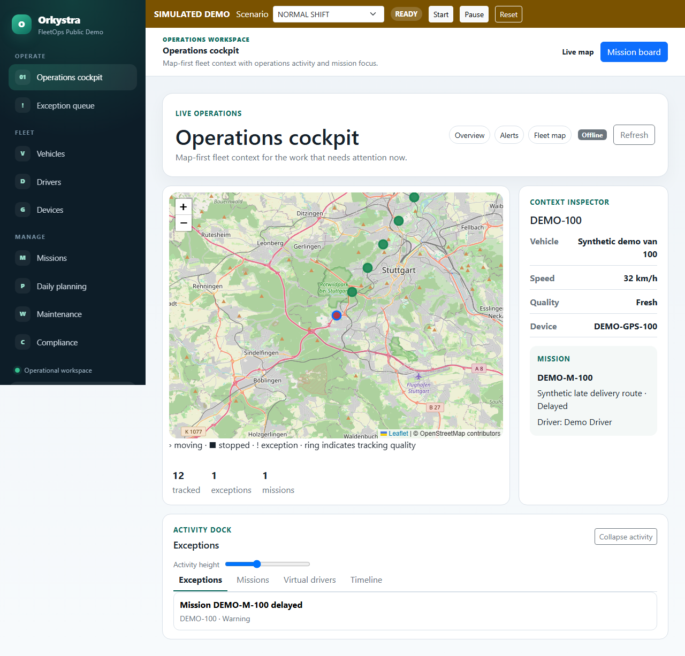
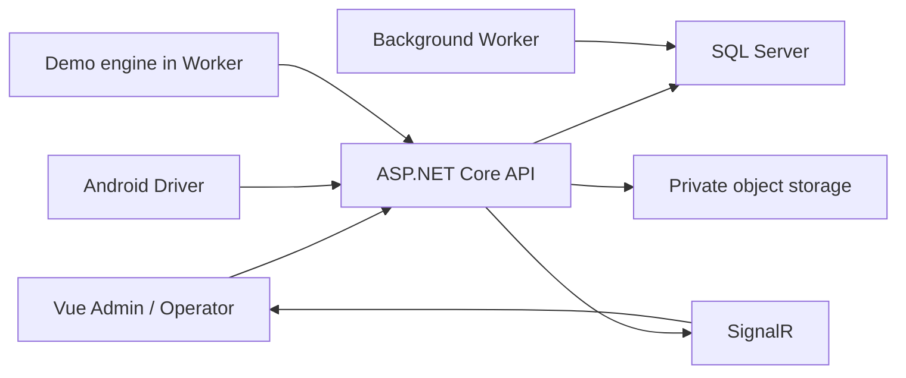

# Orkystra FleetOps

FleetOps is a portfolio SaaS project for small delivery and field-service fleets: a complete operational chain, not GPS alone.

```text
Mission → offline driver workflow → inspection/proof → exception → operator action
```

Administrators and operators use a Vue 3 console; drivers use a native Android app. The backend is an ASP.NET Core modular monolith with SQL Server/EF Core, SignalR, private object media, auditability, and a Worker that runs background jobs and the deterministic Demo engine.



*SIMULATED DEVELOPMENT EVIDENCE — NOT PILOT OR COMMERCIAL PROOF.*

## Try the Demo path

1. Launch the public Demo (`/demo`) into a short-lived, read-only synthetic workspace.
2. Watch the deterministic fleet move on the map-first cockpit.
3. Select a vehicle to inspect driver, mission, tracking quality, and exceptions.
4. Observe virtual-driver activity recorded through real application contracts.
5. Follow the deeper evidence: reliability, security, architecture, release checklist.

Full scenario and captures: [Demo walkthrough](docs/00-product/DEMO_WALKTHROUGH.md).

```powershell
pwsh -File scripts/demo-up.ps1      # hosted Demo profile (API, Worker engine, Web, SQL Server, MinIO)
pwsh -File scripts/demo-smoke.ps1   # readiness, launch, sandbox, reset, animated fleet
pwsh -File scripts/demo-down.ps1
```

## What is implemented

- multi-tenant identity, roles, fleet registry, devices, and audited administration;
- live tracking with history, quality diagnostics, replay/out-of-order protection, Leaflet map, and SignalR;
- dispatch, missions, assignments, offline Android execution, inspections, photo/signature proof, and private media;
- exception operations, maintenance work orders, compliance campaigns, integrations/webhooks, onboarding, and recipient-status links;
- deterministic virtual fleet and autonomous virtual-driver agents in a safe Demo runtime;
- SQL migrations, Docker pilot/Demo packaging, CI release validation, and Web/Android/backend tests.

## Architecture


```mermaid
flowchart LR
  Web[Vue Admin / Operator] --> API[ASP.NET Core API]
  Android[Android Driver] --> API
  Demo[Demo engine in Worker] --> API
  API --> SQL[SQL Server]
  API --> Realtime[SignalR]
  API --> Media[Private object storage]
  Worker[Background Worker] --> SQL
  Realtime --> Web
```

FleetOps intentionally stays a modular monolith: no microservices, distributed event bus, second database, proprietary routing, or LLM dependency.

## Engineering evidence

| Area | Document |
|---|---|
| Architecture | [Architecture](docs/01-architecture/ARCHITECTURE.md) · [Deployment topology](docs/01-architecture/DEPLOYMENT_TOPOLOGY.md) · [Domain model](docs/01-architecture/DOMAIN_MODEL.md) |
| Demo | [Demo readiness](docs/01-architecture/DEMO_READINESS.md) · [Hosted engine](docs/01-architecture/HOSTED_DEMO_ENGINE.md) · [Demo security](docs/01-architecture/DEMO_MODE_SECURITY.md) · [Virtual drivers](docs/01-architecture/VIRTUAL_DRIVER_AGENTS.md) |
| Reliability | [Reliability report](docs/02-engineering/RELIABILITY_REPORT.md) · [Tracking load baseline](docs/02-engineering/TRACKING_LOAD_BASELINE.md) · [Observability](docs/02-engineering/OBSERVABILITY.md) |
| Release | [Release checklist](docs/02-engineering/RELEASE_CHECKLIST.md) · [Sprint autopilot](docs/02-engineering/SPRINT_AUTOPILOT.md) |
| Product | [Vision](docs/00-product/PRODUCT_VISION.md) · [Personas and journeys](docs/00-product/PERSONAS_AND_JOURNEYS.md) · [MVP scope](docs/00-product/MVP_SCOPE.md) |

## Local validation

Copy `.env.example` to `.env` with local-only values, then:

```powershell
powershell -ExecutionPolicy Bypass -File scripts/quality-gate.ps1
powershell -ExecutionPolicy Bypass -File scripts/run-full-simulation.ps1
```

CI mirrors a bounded subset on every push and pull request: [release validation](.github/workflows/release-validation.yml) runs backend format/build/tests, Web format/lint/tests/build, the Playwright public and operations journeys, and all compose configuration checks. It never deploys or pushes.

## Sprint execution

`Start Next Sprint` runs exactly one eligible sprint through the documented lock/state workflow. `Start Next Sprints N` is limited to `1..10`, and every sprint still runs in its own context. See [Sprint autopilot](docs/02-engineering/SPRINT_AUTOPILOT.md) and the [roadmap](ROADMAP.md).

## Important limits

FleetOps is a portfolio project, not a deployed commercial service. The commercial name, public map-tile policy, legal documentation, external hosting, and hosted virtual-driver provisioning remain explicit human decisions. No real customer data, credentials, or production deployment are introduced by the Demo roadmap.
