# Orkystra — Smart Logistics Twin

**Orkystra** is a modular, simulation-first logistics control tower with warehouse digital twin, transport management, event-driven simulation, route optimization, and AI assistance. Built with .NET 9, Vue 3, Python/FastAPI, and MQTT.

> 🇬🇧 [English docs](INSTALL.md) · 🇫🇷 Documentation française ci-dessous

---

## Quick Start

```powershell
# Prerequisites: .NET 9 SDK, Node.js 20+, Docker
cp .env.example .env
docker compose -f infrastructure/docker-compose.yml up -d
dotnet run --project backend/src/Orkystra.Api
cd frontend/web && npm install && npm run dev
```

See [INSTALL.md](INSTALL.md) for detailed installation and deployment instructions. See [CONTRIBUTING.md](CONTRIBUTING.md) for how to contribute.

For the fastest packaged self-host evaluation path, run:

```powershell
powershell -ExecutionPolicy Bypass -File infrastructure/scripts/bring-up-selfhost.ps1
```

That script starts the Docker Compose stack, waits for the API health endpoint, and bootstraps the demo data automatically.

To reset the local demo state and rebuild it cleanly, run:

```powershell
powershell -ExecutionPolicy Bypass -File infrastructure/scripts/reset-demo-state.ps1 -Rebootstrap
```

---

**Orkystra** est un système d'exploitation logistique (Logistics OS) complet avec jumeau numérique d'entrepôt, gestion de transport, simulation événementielle, optimisation de tournées et assistant IA. Plateforme modulaire « simulation-first, reality-ready » construite en .NET, Vue 3, Python/FastAPI et MQTT.

## État actuel du projet

- Sprint courant : ✅ Sprint 184 (documentation evidence-gap), conforme a [PROJECT_STATUS.md](PROJECT_STATUS.md)
- Build backend : ✅ `dotnet build backend/Orkystra.slnx --configuration Release /p:UseSharedCompilation=false /nodeReuse:false`
- Build frontend : ✅ `cd frontend/web && npm install && npm run build`
- Compilation Python : ✅ `python -m compileall python-services`
- Tests backend : ✅ `dotnet test backend/Orkystra.slnx --configuration Release /p:UseSharedCompilation=false /nodeReuse:false` (143 tests reussis)
- Tests Python : ✅ `pytest` dans `python-services/tests` (17 tests reussis)
- Verification consolidee : ✅ `infrastructure/scripts/verify-oss-readiness.ps1` executee avec succes
- Simulation role-based executee : ✅ API locale active sur `http://localhost:5043`, demo role-play active sur `http://127.0.0.1:4180/demo.html`, endpoints metier verifies (`/api/control-tower/overview`, `/api/providers/catalog`)
- Contrainte d'environnement : ⚠️ Docker Engine indisponible pendant cette passe, donc MQTT et stack compose complete non demarres dans cette execution.

## Architecture & médias disponibles

- Schémas d'architecture et détails d'intégration : [docs/architecture/overview.md](docs/architecture/overview.md), [docs/architecture/connector-layer.md](docs/architecture/connector-layer.md), [docs/architecture/optimization-layer.md](docs/architecture/optimization-layer.md), [docs/architecture/production-hardening.md](docs/architecture/production-hardening.md)
- Captures par role : [docs/screenshots/01-president](docs/screenshots/01-president), [docs/screenshots/02-warehouse-operator](docs/screenshots/02-warehouse-operator), [docs/screenshots/03-transport-dispatcher](docs/screenshots/03-transport-dispatcher), [docs/screenshots/04-ai-analyst](docs/screenshots/04-ai-analyst), [docs/screenshots/05-admin](docs/screenshots/05-admin), [docs/screenshots/06-supervisor](docs/screenshots/06-supervisor)
- Videos WebM generees : [docs/screenshots/videos](docs/screenshots/videos)
- Scripts media : [docs/screenshots/capture-screenshots.mjs](docs/screenshots/capture-screenshots.mjs), [docs/screenshots/capture-role-videos.mjs](docs/screenshots/capture-role-videos.mjs)

## Videos de demonstration par role (compatibles README GitHub)

| Role | Video courte (WebM) | Vignette |
| ---- | ------------------- | -------- |
| President / Directeur | [Voir la video](docs/screenshots/videos/president.webm) | 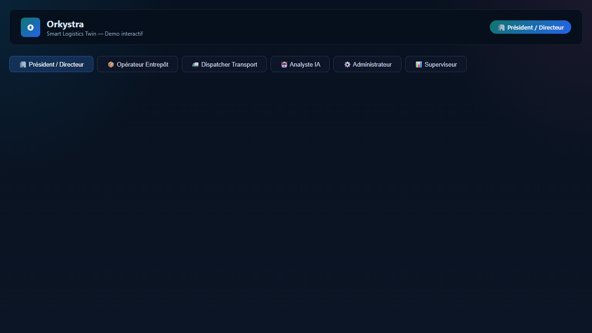 |
| Operateur Entrepot | [Voir la video](docs/screenshots/videos/warehouse-operator.webm) | 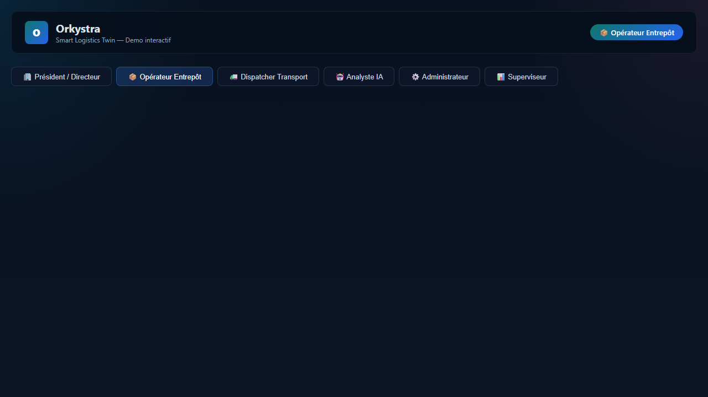 |
| Dispatcher Transport | [Voir la video](docs/screenshots/videos/transport-dispatcher.webm) | 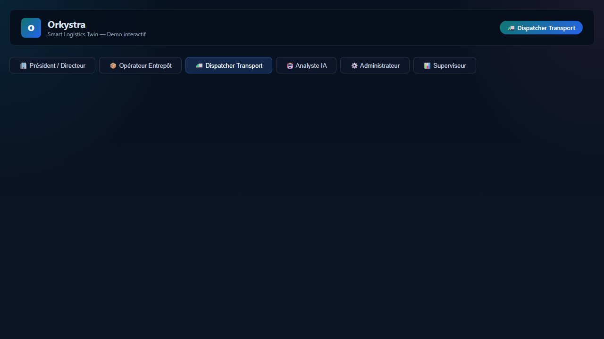 |
| Analyste IA | [Voir la video](docs/screenshots/videos/ai-analyst.webm) | 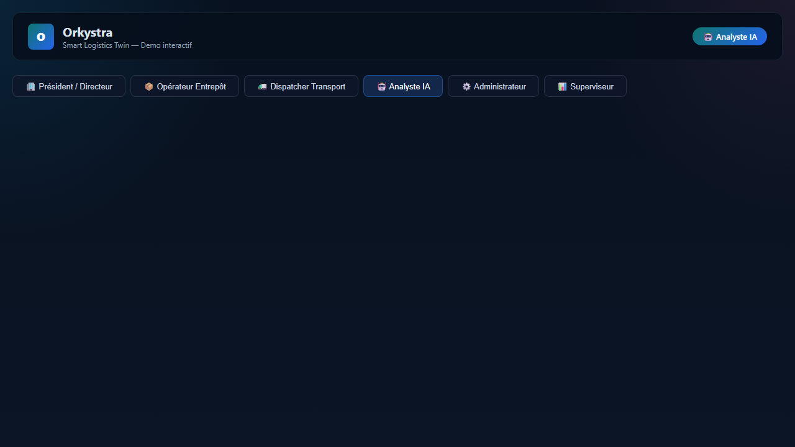 |
| Administrateur | [Voir la video](docs/screenshots/videos/administrator.webm) | 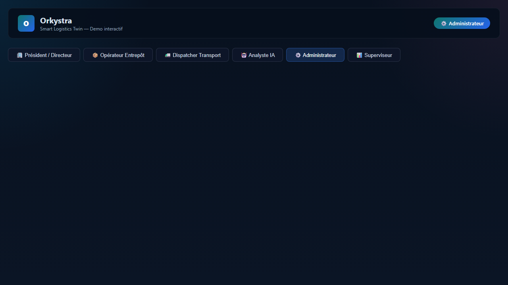 |
| Superviseur | [Voir la video](docs/screenshots/videos/supervisor.webm) |  |
| Controleur (audit) | [Voir la video](docs/screenshots/videos/controller.webm) |  |
| Commissaire aux comptes (audit) | [Voir la video](docs/screenshots/videos/auditor.webm) | 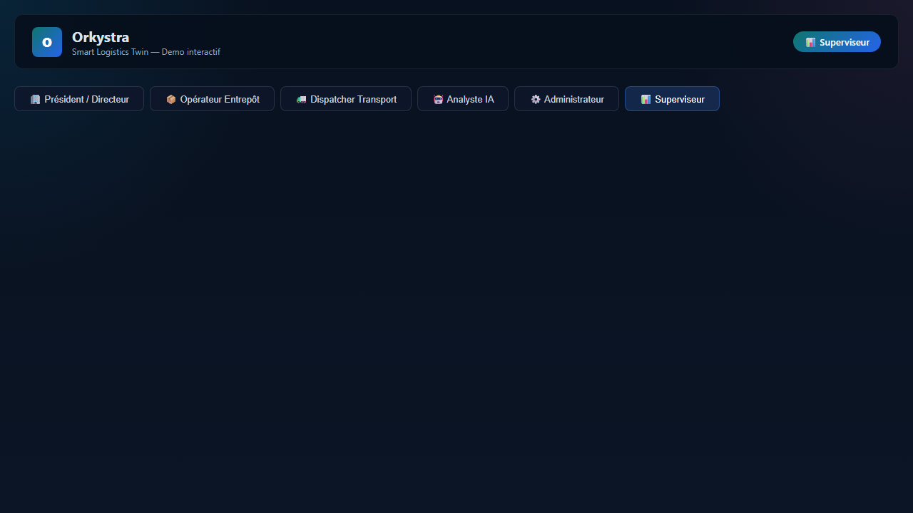 |

Note role-mapping: les parcours "Controleur" et "Commissaire aux comptes" sont actuellement derives du role Superviseur (audit, observabilite, evidence trail), qui est la surface produit la plus proche de ces responsabilites dans l'etat actuel.

## Démo interactive par rôle — Workflows pas-à-pas

Chaque rôle suit un workflow de 4 étapes (consulter → analyser → décider → suivre). Captures réalisées depuis l'API réelle (3 scénarios, 2 entrepôts, 3 routes, 3 providers).

### 🏢 Président / Directeur — Vue stratégique globale

| Étape                                                | Capture                                                                      |
| ---------------------------------------------------- | ---------------------------------------------------------------------------- |
| ① Vue d'ensemble : KPI, alertes, santé des providers |     |
| ② Analyse des alertes critiques et flux tendus       | 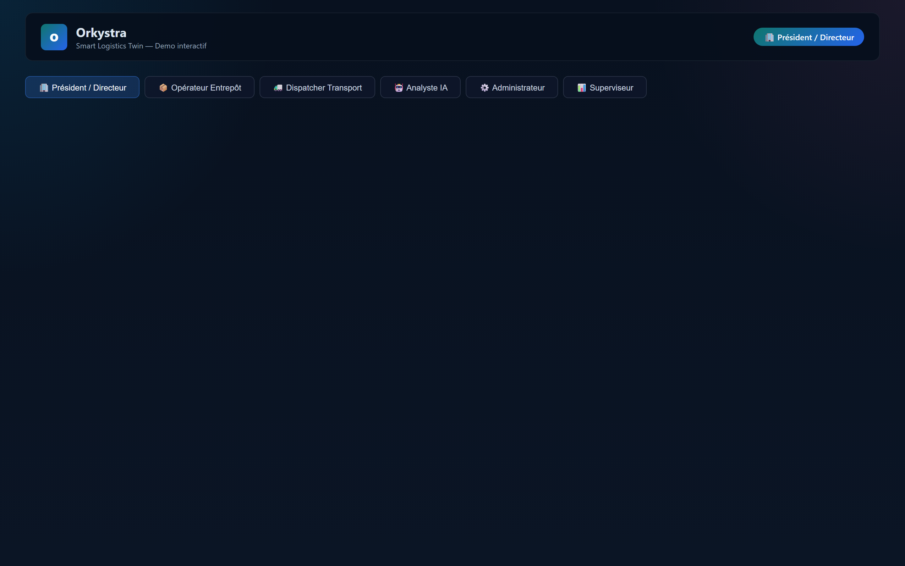 |
| ③ Décision : contacter les prestataires dégradés     |  |
| ④ Suivi : plan d'action validé pour la journée       |        |

### 📦 Opérateur Entrepôt — Gestion des stocks et jumeau 3D

| Étape                                            | Capture                                                                                |
| ------------------------------------------------ | -------------------------------------------------------------------------------------- |
| ① Vue des entrepôts : occupation, zones, quais   | 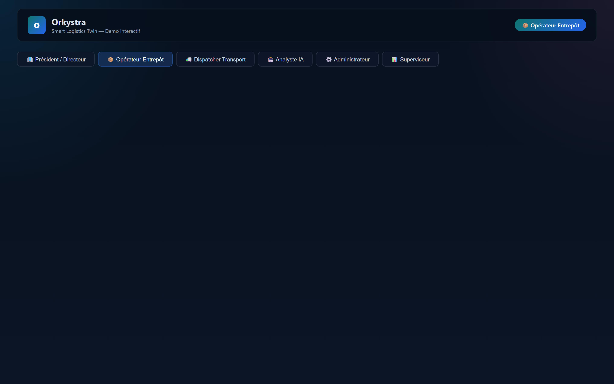        |
| ② Jumeau numérique 3D interactif                 |  |
| ③ Analyse des capacités et risques de congestion |  |
| ④ Décision : réaffectation des zones de stockage |     |

### 🚛 Dispatcher Transport — Suivi et optimisation des routes

| Étape                                             | Capture                                                                                 |
| ------------------------------------------------- | --------------------------------------------------------------------------------------- |
| ① Tableau des routes : statut, arrêts, livraisons |   |
| ② Analyse de la route RT-412 en retard            | 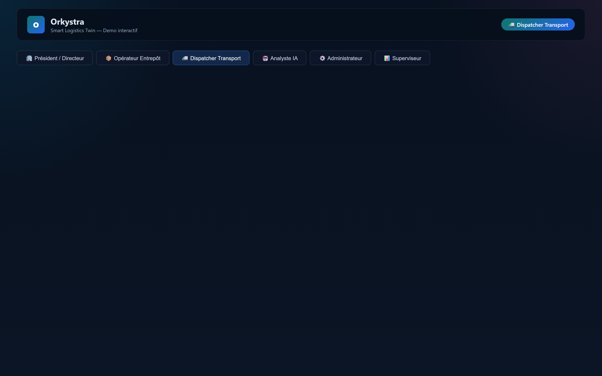    |
| ③ Re-routage : optimisation OR-Tools disponible   |     |
| ④ Synchro transport : plan de tournée mis à jour  |  |

### 🤖 Analyste IA — Recommandations opérationnelles

| Étape                                            | Capture                                                                            |
| ------------------------------------------------ | ---------------------------------------------------------------------------------- |
| ① Assistant IA : recommandations opérationnelles |          |
| ② Preuves, hypothèses, niveau de confiance HIGH  |     |
| ③ Trace opérationnelle et historique IA          | 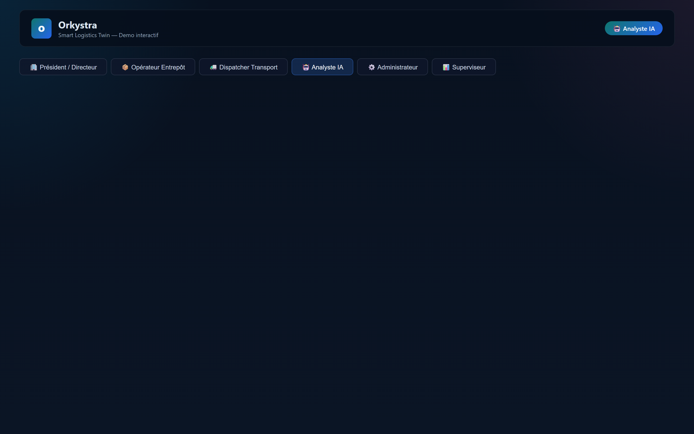 |
| ④ Workflow IA : analyse, décision, action        |           |

### ⚙️ Administrateur — Configuration et connecteurs

| Étape                                          | Capture                                                                      |
| ---------------------------------------------- | ---------------------------------------------------------------------------- |
| ① Catalogue des providers connecteurs          |  |
| ② Configuration des connecteurs et secrets API | 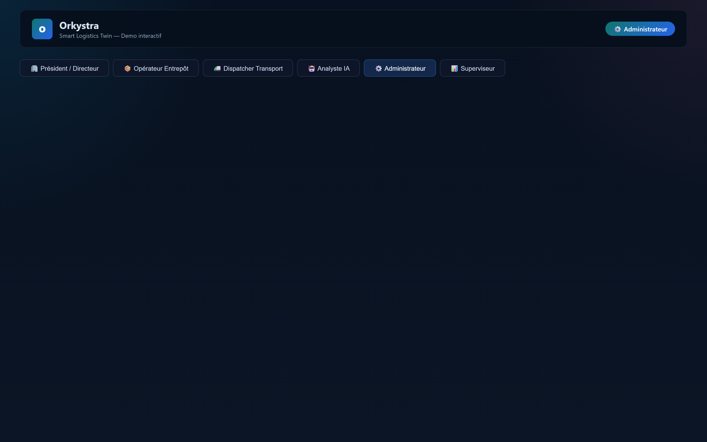       |
| ③ État des connexions et santé des services    |      |
| ④ Configuration runtime et déploiement         |       |

### 📊 Superviseur — Observabilité et audit

| Étape                                          | Capture                                                                     |
| ---------------------------------------------- | --------------------------------------------------------------------------- |
| ① Piste d'audit et observabilité               | 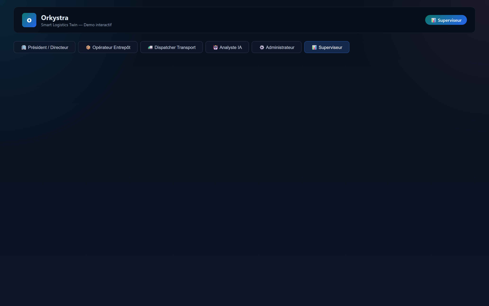         |
| ② Métriques système et backbone événementiel   |      |
| ③ Santé du système : API, MQTT, SQLite         |  |
| ④ Tableau de bord superviseur : vue consolidée |   |

### Lancement de la démo interactive

```powershell
# 1. Infrastructure (MQTT, PostgreSQL, Qdrant)
cd infrastructure
docker compose up -d

# 2. Backend API
cd backend
dotnet run --project src/Orkystra.Api

# 3. Page démo standalone (port 4180)
cd docs/screenshots
python -m http.server 4180

# 4. Ouvrir http://127.0.0.1:4180/demo.html
```

Les donnees sont chargees en direct depuis l'API .NET sur le port 5043 avec les headers `X-Api-Key` et `X-Tenant-Id`.

---

## Core Documents

- Installation & deployment: [INSTALL.md](INSTALL.md)
- Contributing & architecture: [CONTRIBUTING.md](CONTRIBUTING.md)
- Changelog: [CHANGELOG.md](CHANGELOG.md)
- Release candidate guide: [docs/operations/release-candidate.md](docs/operations/release-candidate.md)
- Post-release-candidate maturity checkpoint: [docs/operations/post-release-candidate-checkpoint.md](docs/operations/post-release-candidate-checkpoint.md)
- Support handoff and issue reproduction: [docs/operations/support-handoff-and-reproduction.md](docs/operations/support-handoff-and-reproduction.md)
- Current release notes: [docs/operations/releases/v0.1.0-rc.1.md](docs/operations/releases/v0.1.0-rc.1.md)
- Current release manifest: [docs/operations/releases/v0.1.0-rc.1-manifest.json](docs/operations/releases/v0.1.0-rc.1-manifest.json)
- Current publish checklist: [docs/operations/releases/v0.1.0-rc.1-publish-checklist.md](docs/operations/releases/v0.1.0-rc.1-publish-checklist.md)
- Recommended universal AI agent prompt: [prompts/ORKYSTRA_UNIVERSAL_AGENT_PROMPT_FR.md](prompts/ORKYSTRA_UNIVERSAL_AGENT_PROMPT_FR.md)
- Codex / Copilot autopilot prompt: [prompts/CODEX_AUTOPILOT.md](prompts/CODEX_AUTOPILOT.md)
- Architecture overview: [docs/architecture/overview.md](docs/architecture/overview.md)
- Connector architecture: [docs/architecture/connector-layer.md](docs/architecture/connector-layer.md)
- Production hardening notes: [docs/architecture/production-hardening.md](docs/architecture/production-hardening.md)
- Development commands: [docs/development.md](docs/development.md)
- Constitution (product & architecture source of truth): [constitution/SMART_LOGISTICS_TWIN_CONSTITUTION_v2.md](constitution/SMART_LOGISTICS_TWIN_CONSTITUTION_v2.md)
- Sprint roadmap: [IMPLEMENTATION_ROADMAP.md](IMPLEMENTATION_ROADMAP.md)
- Project status: [PROJECT_STATUS.md](PROJECT_STATUS.md)

## AI Agent Continuation

For any IDE or agentic IDE, the recommended entrypoint is the repository prompt:

- `prompts/ORKYSTRA_UNIVERSAL_AGENT_PROMPT_FR.md`

For Codex or GitHub Copilot chat sessions, you can then use the short command:

```text
Smart Logistic continue
```

That alias is expected to reload the source-of-truth files, continue from the next unfinished sprint, verify the touched slices, then update the roadmap and status before stopping.

For a consolidated maturity check, the repo also ships:

```powershell
powershell -ExecutionPolicy Bypass -File infrastructure/scripts/verify-oss-readiness.ps1
```

That script runs the release-grade build and test pass across backend, frontend, and Python services, and it is the practical gate for the current post-release-candidate checkpoint.

When you need to file an issue, start with:

- [docs/operations/support-handoff-and-reproduction.md](docs/operations/support-handoff-and-reproduction.md)
- [docs/operations/support-packet-review.md](docs/operations/support-packet-review.md)
- [docs/operations/support-packet-refresh-loop.md](docs/operations/support-packet-refresh-loop.md)
- [docs/operations/support-packet-archive-hygiene.md](docs/operations/support-packet-archive-hygiene.md)
- [docs/operations/support-packet-lifecycle-summary.md](docs/operations/support-packet-lifecycle-summary.md)
- [.github/ISSUE_TEMPLATE/bug_report.md](.github/ISSUE_TEMPLATE/bug_report.md)
- `powershell -ExecutionPolicy Bypass -File infrastructure/scripts/package-support-issue.ps1 -ApiKey <api-key>`
- `powershell -ExecutionPolicy Bypass -File infrastructure/scripts/validate-support-issue.ps1 -PacketDirectory <packet-folder>`
- `powershell -ExecutionPolicy Bypass -File infrastructure/scripts/refresh-support-issue.ps1 -PacketDirectory <packet-folder> -ApiKey <api-key> -RefreshReason "retry-after-reset"`
- `powershell -ExecutionPolicy Bypass -File infrastructure/scripts/prune-support-issue-archives.ps1 -PacketDirectory <packet-folder> -KeepLatest 3`
- `powershell -ExecutionPolicy Bypass -File infrastructure/scripts/summarize-support-issue.ps1 -PacketDirectory <packet-folder>`

## Repository Layout

```text
Orkystra/
  backend/
    src/
      Orkystra.Api/          # ASP.NET Core API (Minimal API)
      Orkystra.Application/   # Use cases, projections, provider adapters
      Orkystra.Contracts/     # DTOs et read-models
      Orkystra.Domain/        # Modèle métier pur (entités, valeur, événements)
  docs/
    adr/
    architecture/
    blueprints/
    screenshots/             # Captures par rôle (ci-dessus)
  frontend/
    web/                     # Vue 3 + Three.js + TypeScript
  infrastructure/
    docker-compose.yml       # PostgreSQL, Mosquitto MQTT, Qdrant
  python-services/
    ai-service/              # FastAPI + LangGraph (recommandations)
    optimization-service/    # FastAPI + OR-Tools (optimisation tournées)
  tests/
    backend/                 # 138+ tests xUnit
```

## Stack Technique

| Couche                  | Technologie                                           |
| ----------------------- | ----------------------------------------------------- |
| **Backend**             | .NET 9 (C#), Minimal API, Clean Architecture          |
| **Frontend**            | Vue 3, TypeScript, Vite, Three.js (jumeau 3D)         |
| **IA**                  | Python 3.12+, FastAPI, LangGraph                      |
| **Optimisation**        | Python 3.12+, FastAPI, OR-Tools                       |
| **Broker événementiel** | MQTT (Mosquitto) via MQTTnet                          |
| **Base de données**     | SQLite (persistance opérationnelle), PostgreSQL (ref) |
| **Vector store**        | Qdrant (IA - RAG)                                     |
| **Infrastructure**      | Docker Compose                                        |
| **Auth**                | API Key + Tenant headers                              |

## Fonctionnalités clés

- **Jumeau numérique 3D** d'entrepôt (Three.js) avec zones, racks, quais
- **Gestion de transport** avec cycle de vie complet (assignation → livraison)
- **Simulation déterministe** avec horloge virtuelle et semences reproductibles
- **Backbone MQTT** pour publications/consommations événementielles idempotentes
- **IA conversationnelle** avec recommandations « grounded » (preuves, confiance, actions)
- **Optimisation de tournées** (OR-Tools) avec plans alternatifs et explications
- **Connecteurs** (CSV, REST, GPS) avec registry, configuration runtime, gestion de secrets
- **Observabilité** : métriques, audit trail JSONL, santé des providers
- **Multitenant** avec résolution par en-tête HTTP

## Architecture

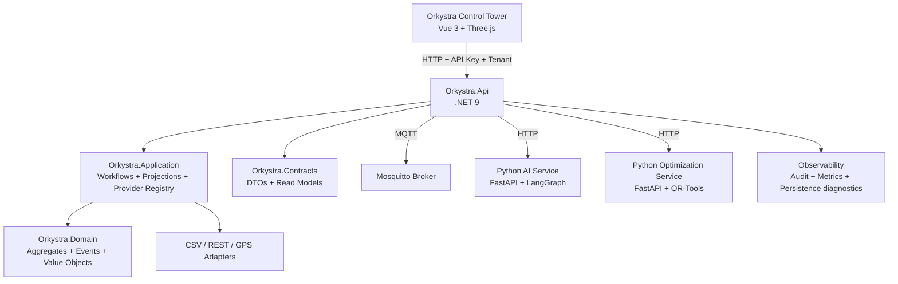
```mermaid
flowchart TD
    UI[Orkystra Control Tower\nVue 3 + Three.js] -->|HTTP + API Key + Tenant| API[Orkystra.Api\n.NET 9]
    API --> APP[Orkystra.Application\nWorkflows + Projections + Provider Registry]
    APP --> DOM[Orkystra.Domain\nAggregates + Events + Value Objects]
    API --> CTR[Orkystra.Contracts\nDTOs + Read Models]

    API -->|MQTT| MQTT[Mosquitto Broker]
    API -->|HTTP| AI[Python AI Service\nFastAPI + LangGraph]
    API -->|HTTP| OPT[Python Optimization Service\nFastAPI + OR-Tools]
    APP --> ADP[CSV / REST / GPS Adapters]

    API --> OBS[Observability\nAudit + Metrics + Persistence diagnostics]
```

Voir aussi les docs d'architecture detaillees : [docs/architecture/overview.md](docs/architecture/overview.md), [docs/architecture/connector-layer.md](docs/architecture/connector-layer.md), [docs/architecture/ai-layer.md](docs/architecture/ai-layer.md), [docs/architecture/optimization-layer.md](docs/architecture/optimization-layer.md), [docs/architecture/production-hardening.md](docs/architecture/production-hardening.md).

## Démarrer en local

```powershell
# 1. Infrastructure (MQTT, PostgreSQL, Qdrant)
cd infrastructure
docker compose up -d

# 2. Backend API
cd backend
dotnet run --project src/Orkystra.Api

# 3. Frontend
cd frontend/web
npm install
npm run dev

# 4. Services Python (optionnel)
cd python-services
pip install -e ".[dev]"
uvicorn orkystra_ai_service.app:app --port 8001
uvicorn orkystra_optimization_service.app:app --port 8002
```

## Current Verification

```powershell
dotnet build backend/Orkystra.slnx
dotnet test backend/Orkystra.slnx --no-build
Push-Location frontend/web
npm run build
Pop-Location
python -m compileall python-services
python -m pytest python-services
```
