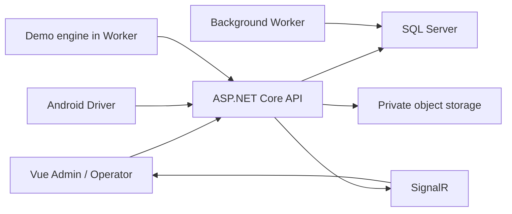

# Orkystra FleetOps

FleetOps is a modular fleet-operations SaaS portfolio project for small delivery and field-service fleets. Its differentiator is a complete operational chain—not GPS alone:

```text
Mission → offline driver workflow → inspection/proof → exception → operator action
```

Administrators and operators use a Vue 3 console; drivers use a native Android app. The backend is an ASP.NET Core modular monolith with SQL Server/EF Core, SignalR, private object media, auditability, and a Worker for background work.

## What is already implemented

- multi-tenant identity, roles, fleet registry, devices, and audited administration;
- live tracking with history, quality diagnostics, replay/out-of-order protection, Leaflet map, and SignalR;
- dispatch, missions, assignments, offline Android execution, inspections, photo/signature proof, and private media;
- exception operations, maintenance work orders, compliance campaigns, integrations/webhooks, onboarding, and recipient-status links;
- SQL migrations, security controls, Docker pilot packaging, deterministic multi-tenant simulation, and Web/Android/backend tests.

The current roadmap turns these capabilities into a public, interactive portfolio demonstration: a map-first cockpit, deterministic virtual fleet, autonomous virtual drivers, and a safe Demo runtime. It does not claim customer or commercial-pilot proof.

## Architecture


```mermaid
flowchart LR
  Web[Vue Admin / Operator] --> API[ASP.NET Core API]
  Android[Android Driver] --> API
  Demo[Demo engine in Worker] --> API
  API --> SQL[SQL Server]
  API --> Realtime[SignalR]
  API --> Media[Private object storage]
  Worker[Background Worker] --> SQL
  Realtime --> Web
```

The architecture is intentionally a modular monolith. FleetOps does not use microservices, a distributed event bus, a second database, proprietary routing, or an LLM dependency.

## Demonstration direction

The target public journey is:

1. Launch a synthetic live demo.
2. Observe multiple moving vehicles on the operations map.
3. Select a vehicle to inspect driver, mission, tracking quality, and exception context.
4. Observe a deterministic virtual driver react to a scenario.
5. Review safe agent activity, audit, and reliability evidence.

See [Demo Readiness architecture](docs/01-architecture/DEMO_READINESS.md), [Demo engine](docs/01-architecture/HOSTED_DEMO_ENGINE.md), and [Demo mode security](docs/01-architecture/DEMO_MODE_SECURITY.md).

## Local validation

Copy `.env.example` to `.env` with local-only values, then run the full quality gate:

```powershell
powershell -ExecutionPolicy Bypass -File scripts/quality-gate.ps1
```

For the deterministic development walkthrough:

```powershell
powershell -ExecutionPolicy Bypass -File scripts/run-full-simulation.ps1
```

The simulator uses fictitious tenants and data. Its reports are **SIMULATED DEVELOPMENT EVIDENCE — NOT PILOT OR COMMERCIAL PROOF**.

## Sprint execution

`Start Next Sprint` runs exactly one eligible sprint through the documented lock/state workflow. `Start Next Sprints N` is limited to `1..10`, and every sprint still runs in its own context.

Read [Sprint Autopilot](docs/02-engineering/SPRINT_AUTOPILOT.md), [Roadmap](ROADMAP.md), and the active sprint contract before implementation.

## Important limits

FleetOps is a portfolio project, not a deployed commercial service. The final commercial name, public map-tile policy, legal documentation, and external hosting remain explicit human decisions. No real customer data, credentials, outbound notification, or production deployment should be introduced through the Demo roadmap.
