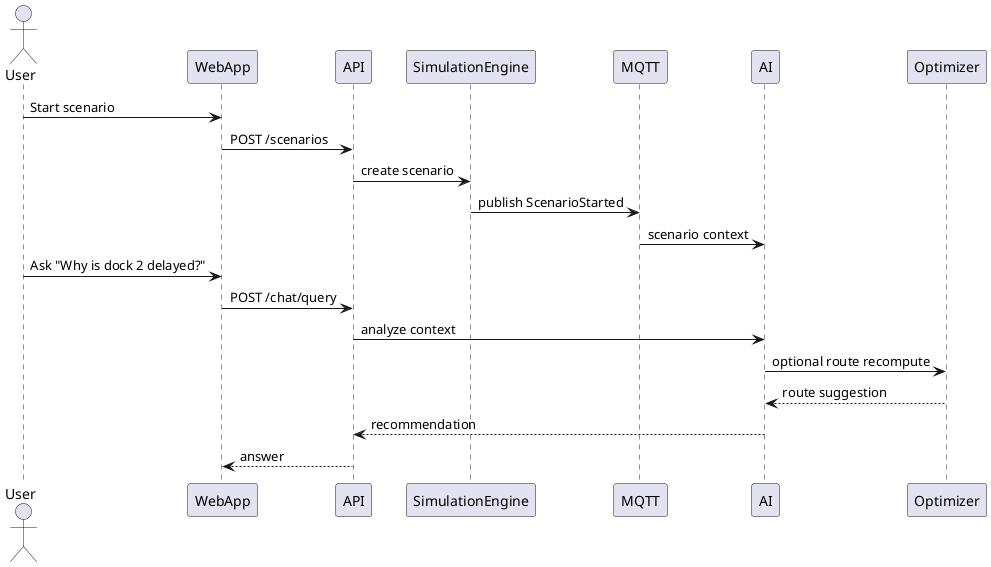
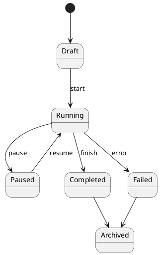

# Smart Logistics Twin Constitution v2.0
Source of Truth for the assistant Implementation

Version: 2.0
Status: Exhaustive Constitution
Scope: Simulation-first logistics operating system with reality-ready connectors
Primary implementation strategy: incremental the assistant-driven delivery
Target outcome: a modular, event-driven, AI-assisted logistics platform that starts as a full simulator and can evolve into a real warehouse / transport / ERP control tower without rewriting the domain model.

---

## Table of Contents

1. Mission and product intent
2. Product definition and non-goals
3. Personas and operational jobs-to-be-done
4. System principles and governance rules
5. Target capabilities by maturity stage
6. Business architecture and value streams
7. C4 architecture
8. Domain Driven Design blueprint
9. Bounded contexts and ubiquitous language
10. Aggregates, entities, value objects, domain services
11. Domain events and event catalog
12. Event-driven architecture and MQTT contracts
13. PostgreSQL logical model and physical schema
14. Simulation engine design
15. Digital Twin 3D and UI architecture
16. AI architecture and LangGraph orchestration
17. OR-Tools optimization architecture
18. Integration architecture and provider pattern
19. API contract strategy
20. Security, tenancy, audit and compliance
21. Testing strategy and quality gates
22. CI/CD and release engineering
23. ADR catalogue
24. Roadmap from MVP to SaaS
25. Backlog with epics and sprint slices
26. Code standards for the assistant
27. Operational playbooks
28. Appendices

---

# 1. Mission and product intent

Smart Logistics Twin is a logistics operating system whose first version must behave like a living simulator of warehouse and transport operations, and whose later versions must connect to real-world systems with minimal architectural disturbance.

The product exists to solve a practical operational problem:

- planning is fragmented across WMS, TMS, ERP, spreadsheets and human memory
- supervisors lack one unified, visual, predictive operational picture
- exceptions are detected too late
- decisions are often reactive rather than anticipatory
- the knowledge of experienced dispatchers, warehouse managers and planners is rarely encoded into software

This platform must unify:

- warehouse supervision
- fleet dispatching
- order and stock flow
- exception monitoring
- predictive analysis
- decision support
- what-if simulation
- 3D digital twin visualization
- future real-system integration

The decisive design constraint is the following:

> The domain model must be simulation-first and reality-ready.

This means that the exact same domain concepts, events, workflows and business logic must work whether the source of truth is a simulator or a real connector.

The simulator is not a demo-only toy. It is the first production-grade implementation of the domain interfaces.

---

# 2. Product definition and non-goals

## 2.1 Product definition

The product is a modular logistics control tower with four layers of interaction:

1. Operational data layer
2. Decision intelligence layer
3. Simulation and what-if layer
4. Visualization and collaboration layer

It combines:

- ERP-style order flow
- WMS-style warehouse flow
- TMS-style transport flow
- AI agent reasoning
- 3D scene representation
- event-driven telemetry
- optimization engines
- scenario simulation

## 2.2 Explicit non-goals for the first release

The first major release must not attempt to solve all logistics problems.

Out of scope for MVP:

- customs and international trade compliance
- complex multimodal shipping networks
- advanced yard management with hardware integrations
- full invoicing and accounting
- route planning over global carrier networks
- robotics orchestration
- computer vision in production with real cameras
- full SAP parity
- advanced procurement and MRP

These can become future modules, but they must not block the core product.

## 2.3 Product promise

The platform must enable the following user promise:

> "I can see the state of my logistics operation in real time, simulate future scenarios, ask the system why something is happening, and get an operationally relevant answer."

---

# 3. Personas and jobs-to-be-done

## 3.1 Primary personas

### Warehouse manager
Needs:
- live view of occupancy, congestion and dock usage
- stock placement recommendations
- fast recognition of bottlenecks
- exception handling

### Transport dispatcher
Needs:
- route and vehicle assignment
- delay impact analysis
- fleet visibility
- scenario re-planning

### Logistics supervisor / control tower operator
Needs:
- unified view of warehouse and transport
- KPI trends
- exception prioritization
- operational explanations

### Operations analyst
Needs:
- historical replay
- scenario comparison
- root-cause analysis
- improvement tracking

### Executive stakeholder
Needs:
- summary dashboards
- SLA risk visibility
- cost and service trade-offs
- decision support, not raw data

## 3.2 Jobs-to-be-done

The user must be able to:
- ask what is currently happening
- ask why it is happening
- ask what will likely happen
- ask what if a parameter changes
- execute or recommend a corrective action
- replay the operational history
- export reports and evidence

---

# 4. System principles and governance rules

## 4.1 Foundational principles

1. Simulation first
2. Reality ready
3. Domain first, UI second
4. Event-driven by default
5. Provider abstraction everywhere
6. AI assists, it does not replace the domain
7. The simulator must be deterministic when seeded
8. Every state change must be traceable
9. Every operational decision must be explainable
10. Every real connector must implement the same interface as the simulator

## 4.2 Hard architectural rules

- No business logic in Vue components
- No direct database access from UI
- No conditional branching on "simulation vs real" inside domain services
- No direct calls from AI agents to infrastructure without a port
- No UI state as source of truth for domain state
- No vendor lock-in inside the core domain
- No silent state mutation without an event
- No optimization that cannot be explained
- No agent that can act without auditable steps

## 4.3 Governance of change

Any structural change must be accompanied by:
- an ADR
- a schema update if needed
- an event catalog update if needed
- tests
- updated diagrams if the architecture changed
- a migration note for future real connectors

---

# 5. Target capabilities by maturity stage

## Stage 0 - Simulation skeleton

Purpose:
- establish domain primitives
- render a minimal 3D control tower
- generate synthetic warehouses, fleets and orders
- publish domain events
- show live KPIs

Success criteria:
- the system runs end-to-end with no external dependencies
- the UI refreshes on real-time events
- the simulator can produce meaningful exceptions

## Stage 1 - Decision intelligence MVP

Purpose:
- introduce AI agents
- add OR-Tools-based routing
- provide explainable recommendations
- support what-if scenarios

Success criteria:
- dispatcher agent can optimize routes
- warehouse agent can recommend slotting
- supervisor agent can summarize risk and action plan

## Stage 2 - Operational dual mode

Purpose:
- add real connectors
- integrate CSV / REST / MQTT / GPS / ERP
- keep same domain model

Success criteria:
- simulator and real provider are interchangeable
- event streams from connectors flow through the same pipeline
- no domain logic rewrite is needed

## Stage 3 - SaaS hardening

Purpose:
- multi-tenancy
- audit and permissions
- organization-level settings
- billing hooks
- observability and scaling

Success criteria:
- deployable to multiple clients
- safe tenant isolation
- reproducible builds and migrations

---

# 6. Business architecture and value streams

## 6.1 Core value streams

### Inbound flow
- orders arrive
- supplier stock is received
- dock is assigned
- pallets are stored

### Warehouse flow
- stock is located
- items are picked
- pallets are moved
- exceptions are handled

### Transport flow
- shipments are grouped
- vehicles are assigned
- routes are optimized
- deliveries are executed

### Control tower flow
- events are collected
- anomalies are detected
- AI explains causes
- corrective actions are suggested

## 6.2 Business value

The product must provide:
- reduced planning time
- improved stock accuracy
- fewer dock conflicts
- improved delivery predictability
- better visibility into exceptions
- more actionable data for managers
- lower operational chaos

## 6.3 Economic value proposition

The software should sell as:
- a premium operations dashboard
- a simulation and planning tool
- a logistics intelligence layer
- a warehouse and transport control tower
- a configurable SaaS for SMEs and mid-market customers

---

# 7. C4 architecture

This section defines the architecture at C4 levels. The diagrams are text-based and should be translated into PlantUML in implementation.

## 7.1 C4 Level 1 - System context

```plantuml
@startuml
!include C4_Context.puml
Person(user, "Operations User", "Warehouse manager, dispatcher, supervisor")
System(slt, "Smart Logistics Twin", "Simulation-first logistics operating system")
System_Ext(erp, "ERP", "Orders, products, invoices")
System_Ext(wms, "WMS", "Warehouse system")
System_Ext(tms, "TMS", "Transport system")
System_Ext(iot, "IoT / MQTT Devices", "Sensors and telemetry")
System_Ext(gps, "GPS Provider", "Truck positions")
System_Ext(weather, "Weather Provider", "Forecast and alerts")

Rel(user, slt, "Uses")
Rel(erp, slt, "Imports / syncs orders and inventory")
Rel(wms, slt, "Syncs stock and warehouse events")
Rel(tms, slt, "Syncs transport plans and execution")
Rel(iot, slt, "Publishes telemetry")
Rel(gps, slt, "Publishes locations")
Rel(weather, slt, "Provides conditions")
@enduml
```

## 7.2 C4 Level 2 - Container view

```plantuml
@startuml
!include C4_Container.puml
Person(user, "Operations User")
System_Boundary(slt, "Smart Logistics Twin") {
  Container(web, "Web App", "Vue 3 + TypeScript", "3D UI, dashboards, control tower, chat")
  Container(api, "Backend API", "ASP.NET Core", "Domain orchestration, APIs, auth")
  Container(sim, "Simulation Engine", "C# / Python", "Synthetic world, events, scenarios")
  Container(ai, "AI Services", "Python + FastAPI + LangGraph", "Agents, RAG, reasoning")
  Container(opt, "Optimization Service", "Python + OR-Tools", "Routing and allocation")
  ContainerDb(db, "PostgreSQL", "PostgreSQL", "Operational persistence")
  ContainerDb(vdb, "Qdrant", "Vector DB", "Knowledge and retrieval")
  Container(mqtt, "MQTT Broker", "Mosquitto", "Event backbone")
  Container(digitaltwin, "3D Scene Model", "Three.js", "Warehouse and fleet visualization")
}
Rel(user, web, "Uses")
Rel(web, api, "Calls")
Rel(api, db, "Reads/writes")
Rel(api, mqtt, "Publishes/subscribes")
Rel(sim, mqtt, "Publishes events")
Rel(ai, db, "Reads operational snapshots")
Rel(ai, vdb, "Retrieves knowledge")
Rel(opt, api, "Receives optimization jobs")
Rel(web, digitaltwin, "Renders")
@enduml
```

## 7.3 C4 Level 3 - Component view for backend API

Backend API components:

- Auth module
- Control tower query API
- Simulation control API
- Event ingestion API
- Provider registry
- Projection readers
- Command handlers
- Integration adapters
- Audit writer
- Notification dispatcher

```plantuml
@startuml
!include C4_Component.puml
Container(api, "Backend API", "ASP.NET Core") {
  Component(auth, "Auth Module", "Identity", "Authentication and authorization")
  Component(ctq, "Control Tower Query API", "Query", "Read models and KPIs")
  Component(cmd, "Command Handlers", "Application", "Mutations and business workflows")
  Component(reg, "Provider Registry", "Application", "Resolves simulation or real providers")
  Component(ingest, "Event Ingestion", "Application", "Consumes MQTT and adapter events")
  Component(proj, "Projection Updaters", "Application", "Builds read models")
  Component(audit, "Audit Writer", "Infrastructure", "Traceability")
  Component(notif, "Notification Dispatcher", "Infrastructure", "Alerts and notifications")
}
@enduml
```

## 7.4 C4 Level 4 - Code level expectation

Each module must contain:
- domain layer
- application layer
- infrastructure layer
- tests
- fixtures
- contracts
- mapping profiles
- migrations if needed

---

# 8. Domain Driven Design blueprint

## 8.1 Ubiquitous language

The domain language must remain stable and consistent.

Core terms:
- warehouse
- dock
- rack
- location
- pallet
- shipment
- truck
- route
- delivery
- order
- stock reservation
- picking
- loading
- unloading
- exception
- scenario
- projection
- provider
- agent
- recommendation

Terms that must not be used loosely:
- job
- task
- item
- thing
- data
- object
- record

If a term is used in the product and in code, it must mean the same thing everywhere.

## 8.2 DDD structure

### Aggregates
An aggregate is the consistency boundary for a group of entities and value objects.

### Entities
An entity has identity and lifecycle.

### Value Objects
A value object has no identity and is immutable.

### Domain Events
A domain event records that something meaningful happened.

### Domain Services
A domain service contains logic that does not naturally belong to a single entity.

### Application Services
Application services orchestrate use cases and transactions.

### Repositories
Repositories abstract persistence for aggregates.

## 8.3 Aggregate design rule

Every aggregate must:
- protect invariants
- emit domain events
- expose minimal mutation methods
- prevent invalid states
- be small enough to reason about
- not depend on infrastructure

---

# 9. Bounded contexts and context map

## 9.1 Warehouse Context

Responsibilities:
- inventory location
- dock management
- picking support
- pallet lifecycle
- forklift movement
- stock reservation
- replenishment
- congestion detection

## 9.2 Transport Context

Responsibilities:
- fleet management
- driver assignment
- route planning
- delivery tracking
- ETA forecasting
- delay management
- route re-optimization

## 9.3 Order / ERP Context

Responsibilities:
- order intake
- order validation
- product master data
- customer data
- supplier data
- invoices as future extension
- business order states

## 9.4 Simulation Context

Responsibilities:
- virtual time
- synthetic world state
- scenario generation
- random event injection
- deterministic replay
- stress tests

## 9.5 AI Context

Responsibilities:
- agent orchestration
- reasoning
- summarization
- explanation
- retrieval
- recommendation generation

## 9.6 Integration Context

Responsibilities:
- adapters
- import/export
- external systems
- connector lifecycle
- real-world synchronization

## 9.7 Analytics Context

Responsibilities:
- KPI definitions
- dashboards
- trend analysis
- root-cause analysis
- reports
- replay summaries

## 9.8 Context map relationships

- Warehouse consumes order and transport decisions
- Transport consumes warehouse readiness and order priority
- Simulation emits synthetic events to all contexts
- AI reads projections from all contexts
- Integration feeds external events into the same contracts
- Analytics subscribes to all event streams

---

# 10. Aggregates, entities, value objects, domain events

## 10.1 Warehouse aggregate examples

### Warehouse aggregate
Identity:
- WarehouseId

Contains:
- zones
- docks
- locations
- operational policies

Invariants:
- dock capacity cannot be exceeded
- a location can hold only compatible inventory types
- a pallet cannot be in two places simultaneously

### Pallet aggregate
Identity:
- PalletId

Contains:
- SKU lines
- weight
- volume
- status
- current location

Invariants:
- weight must not exceed location or vehicle constraints
- status transitions must be valid
- reservation and physical movement must be consistent

### Dock aggregate
Identity:
- DockId

Contains:
- availability
- assigned shipment
- schedule
- status

Invariants:
- only one active load/unload operation per dock at a time
- a dock cannot be occupied and released simultaneously
- assigned truck and shipment must be compatible

## 10.2 Transport aggregate examples

### Truck aggregate
Identity:
- TruckId

Contains:
- capacity
- current route
- current status
- driver assignment
- position snapshot

Invariants:
- assigned load must respect capacity and constraints
- route state transitions must be valid
- truck cannot depart without mandatory readiness checks

### Route aggregate
Identity:
- RouteId

Contains:
- stops
- depot
- planned duration
- route constraints
- optimization result

Invariants:
- stop sequence must satisfy precedence rules
- pickup and delivery constraints must be respected
- time windows must not be violated except when explicitly marked as infeasible scenario

## 10.3 Order aggregate examples

### Order aggregate
Identity:
- OrderId

Contains:
- customer
- order lines
- requested ship date
- priority
- fulfillment status

Invariants:
- order lines must reference valid products
- order cannot be shipped if not reserved or released by business rule
- order state transitions must be valid

## 10.4 Value objects

Examples:
- Money
- Weight
- Volume
- Quantity
- GeoCoordinate
- TimeWindow
- Address
- PalletDimensions
- VehicleCapacity
- RouteConstraint
- ETA
- RiskScore

Value objects must:
- be immutable
- validate themselves
- be compared by value only

## 10.5 Domain event catalogue

### Warehouse events
- WarehouseCreated
- ZoneCreated
- RackAllocated
- LocationReserved
- PalletReceived
- PalletStored
- StockReserved
- StockReleased
- PickingStarted
- PickingCompleted
- DockOccupied
- DockReleased
- ForkliftMoved

### Transport events
- TruckRegistered
- DriverAssigned
- RouteCreated
- RouteOptimized
- TruckDeparted
- TruckDelayed
- TruckArrived
- ShipmentLoaded
- ShipmentUnloaded
- DeliveryCompleted

### ERP / order events
- CustomerCreated
- ProductRegistered
- OrderCreated
- OrderConfirmed
- OrderCancelled
- OrderAllocated
- OrderPicked
- OrderShipped
- InvoiceIssued

### Simulation events
- ScenarioStarted
- ScenarioPaused
- ScenarioResumed
- ScenarioCompleted
- TimeAdvanced
- RandomEventInjected

### AI events
- RecommendationRequested
- RecommendationGenerated
- ExceptionExplained
- WhatIfScenarioAnalysed
- RiskForecastGenerated

---

# 11. Event-driven architecture and MQTT contracts

## 11.1 Event backbone

MQTT is the primary low-latency event bus for operational telemetry and simulator signals.

Rules:
- MQTT is used for event distribution, not for storing truth
- the database is not the event bus
- event handlers consume and project events
- every event has a schema version
- every event must be idempotent where possible

## 11.2 Topic design

Use hierarchical topics with semantic meaning.

Examples:

```text
slt/{tenantId}/warehouse/{warehouseId}/events
slt/{tenantId}/transport/{fleetId}/events
slt/{tenantId}/erp/{scope}/events
slt/{tenantId}/simulation/{scenarioId}/events
slt/{tenantId}/ai/{agentId}/events
slt/{tenantId}/telemetry/{assetType}/{assetId}
```

## 11.3 Topic subtrees

Warehouse:
- docks
- pallets
- inventory
- forklifts
- zones

Transport:
- trucks
- routes
- deliveries
- drivers

Simulation:
- clock
- scenario
- random-events

AI:
- recommendations
- explanations
- alerts

## 11.4 Payload contract rules

Every payload must contain:
- eventId
- eventType
- schemaVersion
- occurredAt
- tenantId
- correlationId
- causationId
- source
- payload

Example JSON contract:

```json
{
  "eventId": "1d3f7d34-27a2-4d75-8f47-7b5d9f1e8a24",
  "eventType": "TruckDelayed",
  "schemaVersion": 1,
  "occurredAt": "2026-06-20T12:34:56Z",
  "tenantId": "demo",
  "correlationId": "corr-001",
  "causationId": "evt-000120",
  "source": "simulation",
  "payload": {
    "truckId": "truck-07",
    "delayMinutes": 42,
    "reason": "traffic",
    "routeId": "route-12"
  }
}
```

## 11.5 Event schema versioning

- additive changes are preferred
- breaking changes require version increment and migration path
- deprecated events remain readable until all consumers are migrated

## 11.6 Replay and projection

The system must support:
- event replay
- filtered replay by context
- scenario replay
- projection rebuild
- time-travel queries for audits

---

# 12. PostgreSQL logical model and physical schema

## 12.1 Design principles

- PostgreSQL is the system of record for operational state and projections
- UUIDs are used as primary identifiers
- every aggregate has created_at, updated_at, deleted_at or soft-delete semantics where relevant
- event tables are append-only
- read models are optimized for query, not write
- JSONB can be used for flexible payloads, but the canonical domain model remains explicit

## 12.2 Core tables

### Identity and tenancy
- tenants
- users
- roles
- user_roles
- permissions
- audit_logs

### Master data
- warehouses
- zones
- racks
- locations
- products
- customers
- suppliers
- drivers
- trucks

### Operational tables
- pallets
- inventory_items
- dock_slots
- orders
- order_lines
- shipments
- deliveries
- routes
- route_stops
- reservations

### Simulation tables
- scenarios
- scenario_events
- simulation_clocks
- random_event_templates
- simulation_runs

### AI tables
- ai_agents
- agent_runs
- recommendations
- explanations
- rag_sources
- vector_documents

### Event tables
- domain_events
- integration_events
- projection_versions
- outbox_messages
- inbox_messages

## 12.3 Suggested key columns

All operational tables should use a common set where appropriate:
- id uuid primary key
- tenant_id uuid not null
- created_at timestamptz not null
- updated_at timestamptz not null
- deleted_at timestamptz null
- version integer not null
- status text not null
- metadata jsonb null

## 12.4 Example schema snippets

```sql
create table warehouses (
  id uuid primary key,
  tenant_id uuid not null,
  code text not null,
  name text not null,
  timezone text not null,
  status text not null,
  metadata jsonb not null default '{}'::jsonb,
  created_at timestamptz not null,
  updated_at timestamptz not null
);
```

```sql
create table domain_events (
  id uuid primary key,
  tenant_id uuid not null,
  aggregate_type text not null,
  aggregate_id uuid not null,
  event_type text not null,
  schema_version integer not null,
  occurred_at timestamptz not null,
  correlation_id text null,
  causation_id text null,
  source text not null,
  payload jsonb not null
);
```

```sql
create table routes (
  id uuid primary key,
  tenant_id uuid not null,
  code text not null,
  depot_id uuid not null,
  status text not null,
  planned_start timestamptz null,
  planned_end timestamptz null,
  total_distance_km numeric(12,2) null,
  total_duration_minutes integer null,
  optimization_score numeric(12,4) null,
  metadata jsonb not null default '{}'::jsonb
);
```

## 12.5 Indexing strategy

- unique indexes on natural codes where business meaning requires it
- B-tree indexes on status, tenant_id, created_at
- GIN indexes on JSONB when query patterns require it
- partial indexes for hot statuses
- composite indexes for common dashboard filters

## 12.6 Read model strategy

Read models should include:
- warehouse occupancy summary
- dock congestion summary
- transport ETA board
- exception timeline
- AI recommendation queue
- scenario outcome comparison

---

# 13. Simulation engine design

## 13.1 Purpose

The simulation engine generates a fully synthetic logistics world that behaves plausibly enough for product development, user demos, stress tests and scenario planning.

## 13.2 Simulation objects

- warehouses
- zones
- racks
- locations
- pallets
- trucks
- drivers
- routes
- shipments
- orders
- delays
- weather conditions
- traffic states
- random failures

## 13.3 Simulation modes

### Deterministic mode
- seeded random generation
- reproducible runs
- used for testing and demos

### Stochastic mode
- pseudo-realistic randomness
- used for exploratory scenarios

### Stress mode
- high event frequency
- congestion and failures
- used for performance testing

### Replay mode
- event sequence playback
- used for incident analysis

## 13.4 Time model

The simulation clock must support:
- pause
- resume
- step
- accelerate
- rewind through event history when using replay, not in operational truth
- scenario branching from a given point

## 13.5 Synthetic event injectors

Examples:
- truck breakdown
- dock blockage
- stock shortage
- demand spike
- weather disruption
- driver unavailability
- route closure
- late inbound delivery

## 13.6 Simulation quality goals

The simulator must be:
- believable
- repeatable
- configurable
- inspectable
- fast enough for real-time UI updates

## 13.7 Simulation output

The simulation engine produces:
- event streams
- state snapshots
- KPI snapshots
- scenario diffs
- anomaly records

---

# 14. Digital Twin 3D and UI architecture

## 14.1 Purpose

The 3D layer is not decoration. It is the spatial decision interface for logistics supervision.

## 14.2 Visual entities

Warehouse scene:
- building shells
- docks
- zones
- racks
- locations
- pallets
- forklifts

Transport scene:
- depot
- trucks
- routes
- delivery nodes
- congestion markers

Control tower scene:
- KPI wall
- live alerts
- exception cards
- timeline
- scenario controls

## 14.3 UI layout

Recommended layout:
- left panel: context and filters
- center panel: 3D scene
- right panel: AI chat and recommendations
- bottom panel: event timeline and exceptions
- top bar: tenant, scenario, time controls, search, global actions

## 14.4 Interaction model

The user must be able to:
- click a pallet and see its story
- click a truck and see route status
- click a dock and see occupancy history
- ask questions in natural language
- trigger scenario simulations
- compare current and hypothetical outcomes
- highlight a risk in 3D and on the map simultaneously

## 14.5 3D state synchronization

3D objects are projections of domain state.
The 3D layer must never become the source of truth.

## 14.6 Visual semantics

Colors and states should be consistent:
- green = normal / healthy
- amber = warning
- red = exception / action required
- blue = informational / planned
- gray = inactive / completed

---

# 15. AI architecture and LangGraph orchestration

## 15.1 Purpose of AI

The AI layer transforms events and projections into:
- explanations
- recommendations
- forecasts
- what-if analyses
- summaries
- checklists
- alerts

The AI is not allowed to invent domain state. It may only reason over inputs from domain projections, knowledge sources and optimization outputs.

## 15.2 Agent graph

Recommended agents:
- Supervisor Agent
- Warehouse Agent
- Dispatcher Agent
- Risk Agent
- Cost Agent
- Knowledge Agent
- Scenario Analyst Agent
- Incident Triage Agent

## 15.3 Supervisor Agent

Responsibilities:
- route the request to the correct specialist agent
- merge outputs
- enforce response format
- request evidence
- prevent unsupported assertions

## 15.4 Warehouse Agent

Inputs:
- inventory projections
- dock status
- slot occupancy
- congestion patterns
- warehouse rules

Outputs:
- slotting suggestions
- bottleneck analysis
- picking recommendations
- storage conflict explanation

## 15.5 Dispatcher Agent

Inputs:
- route candidates
- vehicle capacities
- time windows
- driver availability
- delivery priorities

Outputs:
- recommended route plan
- explanation of trade-offs
- exception-sensitive alternatives

## 15.6 Risk Agent

Inputs:
- weather
- traffic
- delays
- operational exceptions
- historical patterns

Outputs:
- risk score
- predicted delay
- failure probability
- mitigation suggestion

## 15.7 Cost Agent

Inputs:
- fleet cost assumptions
- warehouse handling costs
- distance and fuel estimates
- service level penalties

Outputs:
- cost estimate
- scenario comparison
- cost-risk balance

## 15.8 Knowledge Agent

Inputs:
- SOPs
- manuals
- operational rules
- incident playbooks
- product documentation

Outputs:
- grounded explanations
- retrieval-backed answers
- cited operational steps

## 15.9 LangGraph architecture

The AI flow should be represented as a state graph:
- classify intent
- gather context
- call specialist agents
- optionally call optimization service
- combine answer
- validate response against domain state
- emit recommendation event

### Pseudocode state flow

```text
User Question
 -> Intent Classification
 -> Context Assembly
 -> Specialist Agent(s)
 -> Optional Optimizer
 -> Evidence Validation
 -> Final Answer
 -> Recommendation Event
```

## 15.10 AI safety and quality rules

- every answer should distinguish between facts, inferences and recommendations
- unsupported guesses must be marked as hypotheses
- when data is missing, the agent must ask for it or explain the limitation
- agent responses must be traceable to data sources or calculations
- no domain-changing action may happen without an explicit command

---

# 16. OR-Tools optimization architecture

## 16.1 Purpose

OR-Tools is used as the operational optimizer for:
- vehicle routing
- vehicle routing with time windows
- pickup and delivery
- capacity constraints
- dock-to-route assignment
- warehouse slotting heuristics where applicable

## 16.2 Optimization problems in scope

### Routing problems
- single depot VRP
- multi-depot VRP
- VRPTW
- capacitated VRP
- pickup and delivery
- heterogeneous fleet assignment

### Warehouse problems
- dock assignment heuristics
- pallet slotting heuristics
- replenishment prioritization
- picking path approximation

## 16.3 Input model

- vehicles
- depots
- stops
- time windows
- service times
- capacities
- priorities
- traffic factors
- penalties
- forbidden routes

## 16.4 Output model

- optimized route order
- ETA predictions
- load distribution
- objective score
- constraint violation report
- alternative scenarios

## 16.5 Objective function examples

The solver may minimize:
- total distance
- total travel time
- lateness penalty
- number of vehicles
- fuel cost
- carbon estimate
- unserved order penalty

## 16.6 Constraint examples

- vehicle capacity
- time windows
- driver shift limits
- docking windows
- hazardous goods rules
- temperature control constraints
- priority customer service constraints

## 16.7 Optimization workflow

1. Collect candidate data
2. Normalize inputs
3. Build solver instance
4. Solve with constraints and objective
5. Return primary solution and alternatives
6. Persist score and explanation
7. Publish RouteOptimized event

---

# 17. Integration architecture and provider pattern

## 17.1 Why provider pattern is mandatory

The platform must support simulation and reality through the same interfaces.

## 17.2 Provider interfaces

Examples:
- IWarehouseProvider
- ITransportProvider
- IERPProvider
- IWeatherProvider
- IGpsProvider
- IIotProvider
- IKnowledgeProvider

## 17.3 Provider implementations

### Simulation providers
- SimulatorWarehouseProvider
- SimulatorTransportProvider
- SimulatorERPProvider
- SimulatorWeatherProvider

### Real providers
- SapWarehouseProvider
- OdooWarehouseProvider
- OracleTransportProvider
- MqttIotProvider
- CsvImportProvider
- RestApiProvider
- GpsTelematicsProvider

## 17.4 Adapter rules

Each adapter must:
- map external vocabulary to ubiquitous language
- validate input before domain ingestion
- preserve correlation identifiers
- emit integration events
- never leak vendor-specific concepts into the core domain

## 17.5 Anti-leakage rule

Vendor schemas must never become the domain schema.
The core domain stays vendor-neutral.

---

# 18. API contract strategy

## 18.1 API principles

- REST for standard UI and integrations
- WebSocket or SignalR for live updates if needed
- MQTT for event distribution
- command-query separation where useful
- stable versioned endpoints

## 18.2 Endpoint categories

### Command endpoints
- create order
- reserve stock
- start scenario
- optimize route
- assign truck
- approve recommendation

### Query endpoints
- dashboard summary
- warehouse status
- transport status
- scenario result
- recommendations
- event timeline

### Admin endpoints
- tenants
- users
- provider configuration
- feature flags
- simulation controls

## 18.3 DTO rules

DTOs must:
- be explicit
- be versioned when needed
- not expose internal aggregates directly
- be mapped from domain objects or projections

---

# 19. Security, tenancy, audit and compliance

## 19.1 Tenancy model

The platform must support:
- single tenant local mode
- multi-tenant SaaS mode

Tenant isolation requirements:
- tenant-scoped queries
- tenant-scoped events
- tenant-scoped AI memory
- tenant-scoped documents
- tenant-scoped simulation state

## 19.2 AuthN and AuthZ

- authentication via standard identity provider
- authorization via roles and permissions
- optional policy-based permissions for operations like approve, simulate, export, modify

## 19.3 Audit trail

Every important action must be auditable:
- user commands
- AI recommendations
- optimization decisions
- connector imports
- manual overrides
- scenario launches

Audit entries must capture:
- who
- what
- when
- why
- from where
- with which correlation id

## 19.4 Data governance

- retention rules
- export rules
- deletion rules
- PII minimization where possible
- clear boundary between operational data and knowledge base

---

# 20. Testing strategy and quality gates

## 20.1 Test pyramid

### Unit tests
For:
- aggregates
- value objects
- domain services
- event transitions
- provider mapping
- optimization helpers

### Integration tests
For:
- API endpoints
- persistence
- MQTT consumers
- provider adapters
- AI service boundaries
- OR-Tools integration

### End-to-end tests
For:
- simulation to UI pipeline
- transport optimization workflow
- scenario replay
- recommendation flow

### Contract tests
For:
- MQTT payloads
- external connector schemas
- API version stability

## 20.2 Quality gates

A change cannot merge unless:
- unit tests pass
- integration tests pass
- schema migration is valid
- no broken event contracts
- lint and formatting pass
- architecture checks pass where possible

## 20.3 Test data strategy

Use:
- deterministic seeds
- synthetic fixtures
- realistic event sequences
- edge-case scenarios
- failure scenarios
- load scenarios

## 20.4 What to test first during early incremental delivery

Priority order:
1. domain invariants
2. event emission
3. provider interfaces
4. simulation clock
5. route optimization
6. AI orchestration
7. API endpoints
8. 3D synchronization

---

# 21. CI/CD and release engineering

## 21.1 Pipeline stages

1. restore and build
2. run unit tests
3. run integration tests
4. run static analysis
5. build frontend
6. package backend services
7. generate artifacts
8. run container scan if applicable
9. deploy to staging
10. run smoke tests
11. promote to production

## 21.2 Repository strategy

Recommended monorepo:
- apps/web
- apps/api
- services/simulation
- services/ai
- services/optimizer
- libs/domain
- libs/contracts
- libs/shared
- infra/
- docs/
- tests/

## 21.3 Versioning

- semantic versioning
- domain contract versioning
- event schema versioning
- migration versioning

## 21.4 Release philosophy

Release in thin vertical slices:
- one end-to-end capability at a time
- avoid horizontal overbuilding
- keep the simulator and real adapter aligned

---

# 22. ADR catalogue

Each major design decision must be captured as an ADR.

Recommended ADRs:

1. Why simulation-first architecture was chosen
2. Why provider pattern is mandatory
3. Why PostgreSQL is the system of record
4. Why MQTT is used for events
5. Why Three.js is used for the digital twin
6. Why LangGraph is used for orchestration
7. Why OR-Tools is used for routing optimization
8. Why the domain is vendor-neutral
9. Why CQRS is used for read models
10. Why the system supports deterministic replay
11. Why AI is assistant, not source of truth
12. Why the repository is monorepo-based

ADR template:
- status
- context
- decision
- consequences
- alternatives considered

---

# 23. Roadmap from MVP to SaaS

## Phase A - Foundation
- domain model
- simulation engine
- provider interfaces
- PostgreSQL schema
- MQTT event pipeline
- basic dashboard

## Phase B - Control tower
- 3D scene
- warehouse overlays
- transport map
- live KPI boards
- exception cards

## Phase C - Decision intelligence
- AI agents
- route optimization
- what-if analysis
- recommendation history
- explanation logs

## Phase D - Real integration
- CSV import
- REST connectors
- GPS connectors
- MQTT devices
- ERP/WMS adapters

## Phase E - SaaS hardening
- multi-tenancy
- permissions
- audit
- billing hooks
- observability
- tenant isolation

## Phase F - Product expansion
- mobile companion
- AR support
- advanced analytics
- carbon reporting
- procurement and replenishment
- warehouse labor planning

---

# 24. Backlog from MVP to SaaS

## MVP Epics

### Epic 1 - Domain foundation
Deliverables:
- core entities
- aggregates
- value objects
- events
- repository interfaces

### Epic 2 - Simulation engine
Deliverables:
- simulation clock
- scenario generation
- random events
- synthetic warehouse and transport world

### Epic 3 - MQTT event pipeline
Deliverables:
- event publishing
- event consumption
- schema validation
- projections

### Epic 4 - Web dashboard
Deliverables:
- live KPI boards
- 3D warehouse scene
- transport map
- exception list

### Epic 5 - AI layer
Deliverables:
- supervisor agent
- warehouse agent
- dispatcher agent
- knowledge retrieval
- explanation output

### Epic 6 - OR-Tools optimizer
Deliverables:
- VRP solver
- time window handling
- capacity constraints
- route alternatives

## SaaS Epics

### Epic 7 - Provider integrations
Deliverables:
- CSV import
- REST connector
- ERP adapter
- GPS adapter
- MQTT device adapter

### Epic 8 - Security and tenancy
Deliverables:
- tenant isolation
- roles and permissions
- audit trail

### Epic 9 - Reporting and analytics
Deliverables:
- trend reports
- replay analysis
- SLA risk summaries
- operational insights

### Epic 10 - Productization
Deliverables:
- packaging
- release process
- monitoring
- documentation
- onboarding flows

---

# 25. Code standards for the assistant

This section is mandatory for all AI-generated code.

## 25.1 Coding philosophy

the assistant should work in small, safe, verifiable increments.

The correct pattern is:
1. model the domain
2. write or update tests
3. implement minimal working code
4. refactor
5. document
6. integrate

## 25.2 File and module standards

- one responsibility per module
- no giant files
- no cyclic dependencies
- no hardcoded environment assumptions
- no hidden global state
- no magic strings if a constant or enum is appropriate

## 25.3 Naming standards

- use business terms from the ubiquitous language
- prefer singular aggregate names
- prefer intention-revealing method names
- avoid abbreviations except accepted technical ones

## 25.4 Prompting standards for the assistant

When asking the assistant to generate code, always provide:
- target module
- expected files
- architecture rules
- input/output contracts
- test requirements
- acceptance criteria
- forbidden shortcuts

## 25.5 Definition of done for generated code

A task is done only when:
- the code compiles
- tests pass
- the output is integrated
- documentation is updated when needed
- the architecture constraints are respected

---

# 26. Operational playbooks

## 26.1 Scenario creation playbook
1. choose base template
2. set warehouse and fleet size
3. set demand pattern
4. inject exceptions
5. run simulation
6. evaluate outcomes
7. compare with baseline

## 26.2 Incident replay playbook
1. load event history
2. select time range
3. identify root event
4. reproduce projections
5. compare alternative decisions
6. export findings

## 26.3 Connector onboarding playbook
1. define source schema
2. map to domain terms
3. write adapter
4. validate payloads
5. test replay
6. enable in staging
7. promote to production

## 26.4 AI answer verification playbook
1. inspect retrieved context
2. verify domain facts
3. verify calculations
4. check explanation completeness
5. confirm no unsupported inference
6. store answer provenance

---

# 27. Appendices

## Appendix A - Recommended monorepo structure

```text
smart-logistics-twin/
  apps/
    web/
    api/
  services/
    simulation/
    ai/
    optimizer/
  libs/
    domain/
    application/
    contracts/
    shared/
  infra/
    docker/
    k8s/
    mqtt/
    postgres/
  docs/
    adr/
    architecture/
    diagrams/
    prompts/
  tests/
    unit/
    integration/
    e2e/
```

## Appendix B - PlantUML package map

Recommended diagrams:
- context
- container
- component
- deployment
- sequence
- state
- activity
- ER diagram approximation
- data flow
- agent graph
- MQTT topic map
- scenario replay sequence

## Appendix C - Example sequence diagram



## Appendix D - Example state diagram



## Appendix E - Minimum reference anchors

Implementation should be aligned to:
- PostgreSQL documentation
- OR-Tools routing documentation
- LangGraph orchestration concepts
- Qdrant vector search concepts
- Ultralytics YOLO model pipeline concepts

These references are implementation anchors, not hard dependencies on specific vendor versions.

---

# Final constitution statement

Smart Logistics Twin is a simulation-first, reality-ready logistics operating system.

Its domain must remain stable across all future evolution:
- simulator today
- real connectors tomorrow
- SaaS later
- mobile and AR later
- analytics and AI extension later

The core promise is not merely visibility. The core promise is operational intelligence:
- see
- understand
- predict
- decide
- act
- replay
- improve

This constitution is the source of truth for implementation.


---

# 28. Detailed domain dictionary

This dictionary fixes the meaning of the main terms used by the assistant and by humans.

## 28.1 Warehouse terms

### Warehouse
A physical or simulated facility used to store, move and prepare goods.

Attributes:
- code
- name
- timezone
- operational status
- capacity profile
- zones
- docks

### Zone
A logical area inside a warehouse.

Examples:
- receiving
- picking
- packing
- storage
- staging
- dispatch


### Rack
A storage structure containing locations.

Attributes:
- rack code
- level count
- slot count
- allowed item classes

### Location
A physical or logical storage position.

Attributes:
- coordinates
- capacity
- allowed dimensions
- allowed weight
- occupancy status

### Dock
A load/unload interface.

Attributes:
- dock type
- schedule
- compatible vehicle types
- occupancy
- service time

### Pallet
A movable unit of inventory.

Attributes:
- pallet id
- dimensions
- weight
- contents
- status
- current location
- assigned order

### Forklift
A handling asset.

Attributes:
- operator assignment
- battery or fuel state
- current position
- task queue
- operational status

## 28.2 Transport terms

### Truck
A vehicle used for delivery or pickup.

Attributes:
- capacity
- current route
- driver
- load status
- ETA
- telematics snapshot

### Driver
A person or simulated actor authorized to operate a vehicle.

Attributes:
- shift
- qualification
- availability
- assigned vehicle
- rest constraints

### Route
A planned sequence of stops.

Attributes:
- origin
- destination
- intermediate stops
- constraints
- computed cost
- optimization score

### Shipment
A transport unit moving between nodes.

Attributes:
- shipment id
- source
- destination
- status
- contents
- priority

## 28.3 ERP terms

### Order
A commercial demand request.

Attributes:
- customer
- lines
- promise date
- priority
- fulfillment status

### Product
A sellable or stockable item.

Attributes:
- sku
- description
- unit of measure
- dimensions
- weight
- handling rules

### Customer
A business client consuming the service.

Attributes:
- code
- name
- SLA class
- delivery preferences
- risk profile

### Supplier
A source of inbound stock or service.

Attributes:
- code
- name
- lead time
- reliability score
- preferred lanes

## 28.4 AI terms

### Recommendation
A suggested operational action with evidence.

Attributes:
- reason
- expected impact
- confidence
- source context
- related scenario

### Explanation
A structured natural language response grounded in facts and calculations.

### Scenario
A simulated or hypothetical future state path.

### Projection
A read model built from events.

---

# 29. Detailed aggregate catalogue

## 29.1 Warehouse aggregate map

### Warehouse aggregate
Responsible for:
- zone creation policies
- dock registration
- location topology
- warehouse metadata

### Inventory aggregate
Responsible for:
- stock counts
- reservations
- adjustments
- item availability

### Pallet aggregate
Responsible for:
- pallet lifecycle
- location movement
- load constraints
- order association

### DockSession aggregate
Responsible for:
- truck arrival
- loading/unloading lifecycle
- dock allocation
- service completion

## 29.2 Transport aggregate map

### Fleet aggregate
Responsible for:
- vehicle registration
- vehicle capability profiles
- maintenance state
- availability

### Trip aggregate
Responsible for:
- route plan
- assignment
- stop execution
- progress tracking

### Delivery aggregate
Responsible for:
- delivery lifecycle
- proof-of-delivery metadata
- exception recording
- customer notification state

## 29.3 ERP aggregate map

### SalesOrder aggregate
Responsible for:
- order lines
- fulfillment state
- reservation state
- shipment linkage

### PurchaseOrder aggregate
Potential future extension:
- inbound goods
- supplier performance
- expected receipt

## 29.4 Simulation aggregate map

### Scenario aggregate
Responsible for:
- simulation parameters
- clock settings
- seed
- injected disruptions
- result summary

### WorldState aggregate
Responsible for:
- global snapshot of simulated assets
- scenario-specific derived state

---

# 30. Detailed event transition rules

## 30.1 Example warehouse lifecycle

Pallet lifecycle:
- PalletReceived
- PalletInspected
- PalletReserved
- PalletStored
- PalletPicked
- PalletLoaded
- PalletShipped

Rules:
- a pallet cannot be picked before it is stored or staged, unless the scenario explicitly models direct cross-docking
- a reserved pallet must remain reserved until release or completion
- a loaded pallet cannot be re-stored without an explicit reversal event

## 30.2 Example transport lifecycle

Shipment lifecycle:
- ShipmentCreated
- ShipmentPlanned
- ShipmentAssigned
- ShipmentLoaded
- ShipmentDeparted
- ShipmentDelayed
- ShipmentArrived
- ShipmentCompleted

Rules:
- shipment must have a valid route or route candidate before departure
- a delay event must include a reason code and affected ETA delta
- completion must close the route segment and store actuals

## 30.3 Example order lifecycle

Order lifecycle:
- OrderCreated
- OrderValidated
- OrderAllocated
- OrderReserved
- OrderPicked
- OrderPacked
- OrderShipped
- OrderDelivered
- OrderClosed

Rules:
- invalid lines must block validation
- an allocated order must not exceed stock availability
- shipped implies transport handoff has occurred

---

# 31. Detailed PostgreSQL schema specification

## 31.1 Common audit columns

Every important table should support:
- id
- tenant_id
- created_at
- updated_at
- deleted_at
- created_by
- updated_by
- version
- metadata

## 31.2 Suggested enums as lookup tables or constrained text

Potential statuses:
- draft
- active
- reserved
- assigned
- in_progress
- delayed
- completed
- cancelled
- failed
- archived

Potential source types:
- simulation
- import
- manual
- connector
- replay


## 31.3 Table groups

### Topology tables
- warehouses
- zones
- racks
- locations
- docks
- dock_schedules

### Inventory tables
- products
- pallets
- inventory_items
- stock_movements
- reservations

### Transport tables
- fleets
- trucks
- drivers
- routes
- route_stops
- shipments
- deliveries

### Event and audit tables
- domain_events
- integration_events
- audit_logs
- notification_logs
- outbox_messages
- inbox_messages

### AI and knowledge tables
- ai_agents
- agent_runs
- agent_messages
- recommendations
- explanation_parts
- documents
- document_chunks
- vector_documents

### Simulation tables
- scenarios
- scenario_parameters
- simulation_runs
- simulation_events
- clock_ticks
- random_templates

## 31.4 Migration discipline

Database migrations must be:
- additive when possible
- reversible where practical
- documented in an ADR for risky changes
- paired with tests for schema and behavior

## 31.5 Read model examples

### WarehouseSummaryView
Columns:
- warehouse_id
- active_docks
- occupied_docks
- pallets_total
- pallets_reserved
- pallets_in_transit
- congestion_level

### TransportSummaryView
Columns:
- fleet_id
- active_trucks
- delayed_trucks
- on_time_percentage
- average_eta_delta
- route_score

### RiskBoardView
Columns:
- entity_id
- entity_type
- risk_score
- risk_reason
- recommended_action
- horizon_minutes

---

# 32. Detailed MQTT contract catalogue

## 32.1 Publishing rules

- all events are serialized consistently
- payloads are versioned
- each publish includes correlation data
- consumers must be idempotent
- the broker is a transport layer, not the source of truth

## 32.2 Contract families

### Warehouse contracts
- pallet lifecycle
- dock status
- inventory movements
- forklift telemetry

### Transport contracts
- route status
- truck telemetry
- delivery updates
- ETA changes

### Simulation contracts
- clock ticks
- random events
- scenario state updates
- performance markers

### AI contracts
- recommendation requests
- recommendation responses
- explanation traces
- agent handoff messages

### Integration contracts
- imported orders
- imported shipments
- external status updates
- synchronization acknowledgements

## 32.3 Message metadata standard

Required envelope keys:
- id
- type
- version
- timestamp
- tenantId
- aggregateId
- aggregateType
- correlationId
- causationId
- source
- priority

## 32.4 Idempotency rule

Every consumer must be able to safely process the same message more than once without corrupting state.

Approach:
- inbox table
- processed message ids
- projection versioning

---

# 33. Detailed LangGraph architecture

## 33.1 State model

The graph state should contain:
- user intent
- current scenario
- active tenant
- relevant entities
- retrieved documents
- optimization results
- risk estimates
- response draft
- evidence trace

## 33.2 Node design

Recommended nodes:
- intent_classifier
- context_loader
- warehouse_retriever
- transport_retriever
- knowledge_retriever
- optimizer_node
- risk_node
- summarizer_node
- validator_node
- response_formatter

## 33.3 Edge design

Edges are determined by:
- intent
- confidence
- data availability
- scenario mode
- action safety

## 33.4 Error handling

If:
- data is missing
- optimization fails
- knowledge retrieval fails
- context conflicts exist

then the graph should:
- fallback gracefully
- explain limitations
- avoid hallucinated certainty
- optionally ask for clarification

## 33.5 Agent response contract

Every response should include, when relevant:
- direct answer
- evidence
- assumptions
- recommended action
- confidence level
- alternative scenario note

---

# 34. Detailed OR-Tools architecture

## 34.1 Solver service structure

The optimization service should expose:
- build problem from normalized input
- solve
- inspect constraints
- collect statistics
- return primary and alternative solutions

## 34.2 Normalization layer

Inputs from ERP, simulation or connectors must be normalized into a canonical route model.

Canonical objects:
- Depot
- Vehicle
- Stop
- TimeWindow
- Capacity
- Penalty
- ConstraintSet

## 34.3 Objective decomposition

The system may optimize multiple goals:
- service quality
- cost
- timeliness
- sustainability
- asset utilization

Recommended approach:
- primary objective
- weighted secondary objectives
- human-readable explanation of trade-offs

## 34.4 Solution explanation

Do not just return the route.
Also return:
- why vehicle A was selected
- why stop B was prioritized
- which constraints were tight
- why a stop remained infeasible if applicable

## 34.5 Alternative solution handling

The system should be able to present:
- baseline plan
- optimized plan
- conservative plan
- low-cost plan
- low-risk plan

This is critical for user trust.

---

# 35. Detailed integration provider catalogue

## 35.1 Simulators

These are required first-class providers:
- warehouse simulator
- transport simulator
- ERP simulator
- weather simulator
- GPS simulator
- IoT simulator

## 35.2 Real-world connectors

Future or optional providers:
- SAP connector
- Odoo connector
- Oracle connector
- CSV connector
- REST connector
- MQTT device connector
- Telematics connector
- WMS connector
- TMS connector

## 35.3 Provider contract rules

Every provider must expose:
- health
- capabilities
- read
- write if supported
- sync status
- schema description
- error surface

## 35.4 Capability-based discovery

The application should ask:
- can this provider stream events?
- can it ingest commands?
- can it query history?
- can it run in read-only mode?
- can it replay data?


# 36. Detailed AI prompt standards for the assistant

This section is critical because the assistant will be the implementation engine.

## 36.1 Code generation prompts must include

- target bounded context
- target aggregate or service
- forbidden changes
- tests required
- expected output files
- dependency rules
- naming rules
- acceptance criteria

## 36.2 Example task prompt pattern

```text
Implement the Warehouse aggregate in the domain layer.

Rules:
- no infrastructure dependencies
- emit domain events on every state transition
- enforce dock and pallet invariants
- write unit tests for valid and invalid transitions
- use the ubiquitous language from the constitution
- do not modify unrelated modules
- prefer small files and explicit types
```

## 36.3 Example refactoring prompt pattern

```text
Refactor the transport module to separate route optimization from route projection.

Rules:
- preserve existing public contracts
- update tests if the behavior changes
- keep the provider abstraction intact
- do not introduce direct calls from UI to optimizer
- document the architectural decision in docs/adr
```

## 36.4 Anti-patterns for the assistant

Avoid prompts like:
- build everything
- fix the whole app
- make it cleaner
- add AI everywhere

Prefer prompts like:
- implement one aggregate
- implement one event stream
- implement one adapter
- implement one diagram
- implement one test suite

## 36.5 Prompt checkpoints

After each the assistant batch:
- review compile status
- review tests
- review file diff
- ensure no architecture violations
- adjust the next prompt slice

---

# 37. Detailed roadmap by sprints

## Sprint 0 - Project skeleton
Goal:
- create monorepo
- bootstrap solution structure
- establish linting, formatting, CI
- define constitution document path
- create placeholder apps and services

Deliverables:
- repo structure
- basic CI
- empty domain projects
- docs scaffold

## Sprint 1 - Core domain primitives
Goal:
- build value objects
- build identity types
- build base entities
- build domain events base class
- create aggregate scaffolding

Deliverables:
- foundational domain library
- unit tests for invariants

## Sprint 2 - Warehouse context
Goal:
- warehouse, dock, rack, location, pallet
- warehouse events
- inventory movement
- basic warehouse repository

Deliverables:
- warehouse aggregate
- pallet lifecycle
- warehouse read model

## Sprint 3 - Transport context
Goal:
- truck, driver, route, shipment, delivery
- route lifecycle
- transport events
- transport repository

Deliverables:
- transport aggregate
- route projection
- delivery board

## Sprint 4 - Simulation engine
Goal:
- clock
- scenario model
- synthetic entities
- random event injection
- deterministic replay foundation

Deliverables:
- scenario runtime
- synthetic world state
- event generation service

## Sprint 5 - MQTT event backbone
Goal:
- topics
- envelope
- publish/subscribe
- consumer idempotency
- outbox/inbox pattern

Deliverables:
- event broker integration
- basic projections
- telemetry live feed

## Sprint 6 - Control tower UI
Goal:
- dashboards
- 3D scene
- transport map
- live events
- scenario control panel

Deliverables:
- first visible demo
- live state sync
- user navigation flows

## Sprint 7 - AI layer 1
Goal:
- knowledge retrieval
- supervisor agent
- warehouse agent
- dispatcher agent

Deliverables:
- chat UI
- grounded answers
- recommendation cards

## Sprint 8 - Optimization layer
Goal:
- OR-Tools integration
- route optimizer
- scenario alternatives
- explanation output

Deliverables:
- route solver service
- optimization audit logs

## Sprint 9 - Real connector layer
Goal:
- CSV import
- REST adapter
- GPS adapter
- ERP connector prototype

Deliverables:
- interchangeable providers
- provider health dashboard

## Sprint 10 - SaaS hardening
Goal:
- tenancy
- permissions
- audit
- observability
- deployment packaging

Deliverables:
- multi-tenant baseline
- production readiness checklist

---

# 38. Detailed backlog matrix

The backlog below groups work by value.

## 38.1 Foundation backlog
- domain model library
- value object package
- event base types
- repository interfaces
- aggregate tests
- project templates

## 38.2 Warehouse backlog
- zone management
- dock schedule
- pallet lifecycle
- reservation flow
- warehouse summary projections
- congestion detection

## 38.3 Transport backlog
- fleet management
- route assignment
- driver availability
- shipment tracking
- ETA projection
- delivery exception flow

## 38.4 Simulation backlog
- scenario templates
- event injector
- speed controls
- replay engine
- scenario comparison
- stress testing

## 38.5 AI backlog
- intent classification
- context assembly
- retrieval
- explanation formatting
- validation
- recommendation history

## 38.6 Optimization backlog
- route solver input builder
- constraint parser
- objective configuration
- alternative solution output
- explanation builder

## 38.7 Integration backlog
- simulator providers
- CSV import
- REST adapter
- MQTT IoT adapter
- GPS adapter
- ERP adapter

## 38.8 SaaS backlog
- tenant model
- access control
- audit and logs
- billing hooks
- support tools
- deployment templates

---

# 39. Quality standards and CI/CD gates

## 39.1 Standards

Code must be:
- explicit
- testable
- deterministic when required
- small enough to review
- documented where the business meaning is not obvious

## 39.2 Static checks

Recommended checks:
- formatting
- linting
- type analysis
- dead code detection if available
- import cycle checks
- secret scanning

## 39.3 CI/CD enforcement

Pipeline should fail on:
- broken tests
- missing migrations
- inconsistent event schemas
- compile errors
- unsupported dependency shortcuts
- architecture violations in critical layers

## 39.4 Release gates

Before release:
- smoke test completed
- scenario replay validated
- dashboard opens correctly
- AI responses grounded
- route optimization runs successfully
- provider health checks pass

---

# 40. Observability and operability

## 40.1 Metrics

Track:
- event throughput
- projection latency
- AI request latency
- optimization latency
- scenario runtime
- error rates
- connector health
- queue backlog

## 40.2 Logs

Logs should be:
- structured
- correlated
- tenant-aware
- machine parsable
- privacy conscious

## 40.3 Tracing

Every command should be traceable through:
- UI action
- API command
- domain event
- projection update
- AI recommendation
- external connector call

## 40.4 Alerts

Recommended alerts:
- broker down
- projection lag too high
- optimization timeout
- AI failure
- connector sync failure
- simulation stall
- tenant anomaly

---

# 41. Definition of done for the constitution itself

This constitution is complete when it can answer the following:
- what the product is
- who it serves
- what the domain is
- what the contexts are
- what the aggregates are
- what the events are
- how state flows
- how the UI reads data
- how AI reasons
- how optimization works
- how the simulator behaves
- how real systems are connected later
- how quality is enforced
- how the assistant should implement the system

If a question cannot be answered from this document, the constitution must be extended.

---

# 42. Final implementation directive

the assistant must treat this document as the source of truth.

Rules for the assistant:
- read the constitution before coding
- implement one bounded context at a time
- keep simulator and real provider interfaces identical
- never bypass the domain model
- write tests before broad refactors
- prefer incremental vertical slices
- keep AI grounded in projections and retrieval
- keep optimization explainable
- preserve the possibility of deterministic replay
- never make the UI the source of truth

This is not a dashboard project.
This is not a toy simulator.
This is a logistics operating system in the making.

---

# 43. the assistant execution governance

This section defines how the assistant must execute long-running implementation work.

## 43.1 Context recovery rule

At the start of every implementation session, the assistant must:

1. Read this constitution.
2. Read `IMPLEMENTATION_ROADMAP.md`.
3. Read `PROJECT_STATUS.md`.
4. Read the relevant prompt in `prompts/`.
5. Inspect the current Git status.
6. Determine the current sprint.
7. Continue only the current sprint or the next unfinished task.

the assistant must not rely on chat memory alone.

## 43.2 Self recovery rule

If implementation fails, the assistant must:

1. Analyze the exact error.
2. Identify whether the cause is code, dependency, configuration, test data, or architecture.
3. Fix the narrowest cause.
4. Re-run the failing build, test, or verification command.
5. Update documentation if the fix changes behavior, architecture, contracts, or setup.
6. Continue the same sprint.

the assistant must never abandon a sprint solely because of a build failure.

## 43.3 Sprint completion rule

A sprint is complete only when:

- build checks pass for touched components
- tests pass for touched components
- documentation is updated
- roadmap and status are updated
- architecture boundaries are preserved
- no critical warning is ignored
- remaining risks are explicitly listed

After a sprint is completed, the assistant must stop and wait for the next instruction instead of silently starting the next sprint.

