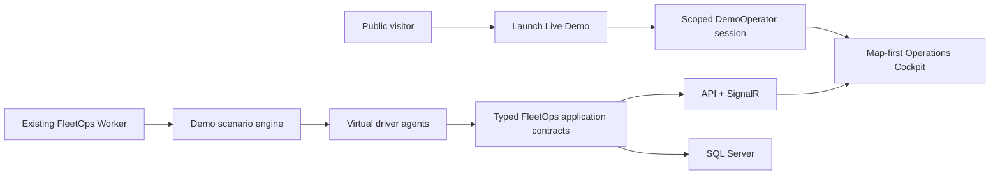

# Demo Readiness Architecture

FleetOps Demo Readiness is a portfolio-focused consolidation phase, not a second product. It preserves the existing modular monolith and proves the existing chain: fleet → tracking → mission → driver workflow → proof → exception.

The Worker hosts the internal Demo engine where possible. The engine uses a shared deterministic clock, seed, realistic local fixtures, and typed domain/application operations; it never changes business tables directly to simulate an outcome. Development simulators remain independent test tools.

The UI stays Vue 3, Pinia, Leaflet, and SignalR. The default signed-in route becomes a map-first cockpit. Leaflet stays in place; map-tile URL and attribution move behind configuration before hosting.

`Demo` is an explicit runtime mode beside Development and Production. It has dedicated synthetic tenant data, short-lived least-privilege sessions, reset controls, rate limits, and sandboxed side effects. Production remains fail-fast and never enables Development seed behavior.

Details: [Cockpit](MAP_FIRST_COCKPIT.md), [engine](HOSTED_DEMO_ENGINE.md), [agents](VIRTUAL_DRIVER_AGENTS.md), and [security boundary](DEMO_MODE_SECURITY.md).
