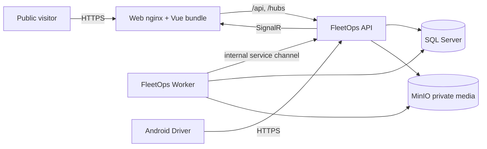

# Deployment Topology

FleetOps ships as one modular monolith with four deployable processes and two backing services. Development, Demo, and Production remain distinct runtime modes; the Demo profile is a packaging overlay, not a second product.

## Topology



## Profiles

| Profile | Compose files | Runtime | Purpose |
|---|---|---|---|
| Local infrastructure | `docker-compose.yml` | Development | SQL Server, MinIO, MQTT, Mailpit only |
| Pilot | `docker-compose.yml` + `docker-compose.pilot.yml` | Production | Real users, bootstrap provisioning, private media |
| Hosted Demo | `docker-compose.yml` + `docker-compose.pilot.yml` + `docker-compose.demo.yml` | Demo | Public rate-limited launch on the synthetic `public-demo` tenant |

The hosted Demo profile:

- starts the API in `Demo` with `Bootstrap:PublicDemoOnly`, one passwordless Operator identity, bounded session lifetime, launch rate limiting, and sandboxed side effects;
- starts the Worker with `DemoEngine:Enabled`, `RuntimeMode=Demo`, `OrganizationSlug=public-demo`, and a persisted engine state volume so the synthetic fleet keeps moving across restarts;
- connects the Worker to `/api/internal/v1/tracking/*` through the bounded internal service channel (`InternalApi:Key` configuration sent as the `X-FleetOps-Internal-Key` header), because public Demo sessions must stay read-only;
- keeps the internal endpoints `404` outside Development/Demo/DemoTesting.

```powershell
# One command, documented in the README
pwsh -File scripts/demo-up.ps1
pwsh -File scripts/demo-smoke.ps1 -SkipBuild   # health, readiness, launch, sandbox, reset, fleet
pwsh -File scripts/demo-down.ps1
```

## Health, migrations, and reset lifecycle

- The API applies EF Core migrations at startup; `/health` is liveness and `/health/ready` verifies the migrated database dependency. The Demo smoke test waits for both before asserting behavior.
- Public Demo sessions expire server-side. Expiry revokes the session, removes private scenario state in bounded batches, and returns the browser to `/demo?expired=1`.
- Scenario RESET is serialized per organization by `TrackingResetCoordinator` and deletes only that tenant's telemetry points and current positions.
- The Demo engine writes its deterministic state atomically to a dedicated volume under `/var/opt/fleetops/demo-engine-state.json`.

## Side-effect sandbox

The Demo profile never enables real e-mail, webhook, or external telemetry providers. `PublicDemo:SideEffectsSandboxed` is required by configuration validation in `Demo`, and the public Demo smoke test verifies that a public session cannot read administration surfaces or identity sessions.

## Rollback

1. Stop public Demo ingress and let sessions expire (or revoke them).
2. `pwsh -File scripts/demo-down.ps1` to stop the Demo overlay; keep volumes for inspection.
3. Restore the last known-good images and configuration; the pilot profile stays untouched.
4. Never modify Production tenant data while rolling back the Demo profile.

## Hosted virtual drivers

The hosted Demo profile animates the fleet with the deterministic Demo engine. Virtual-driver agent execution (inspection, departure, proof, delay) requires per-agent user credentials that a clean passwordless Demo deployment intentionally does not possess, so agent execution is not provisioned in the hosted profile. The agent activity surface remains proven by the development simulation workflow and by the Playwright operations journey, which record activity through the canonical `POST /api/v1/demo/agent-activities` contract. See the release checklist for the exact tested facts and follow-up.
