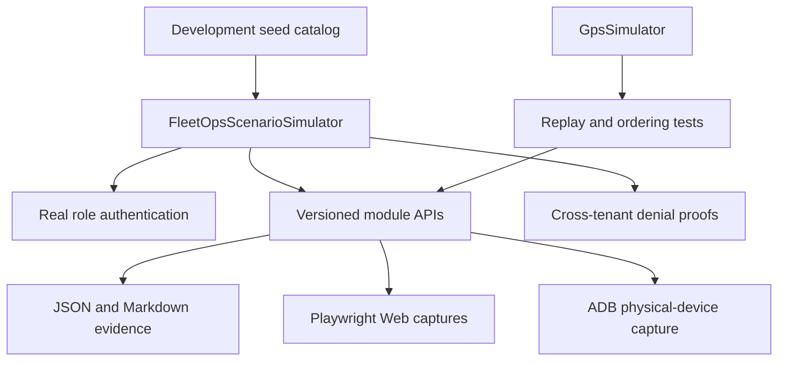

# Simulation Strategy

## Purpose and evidence boundary

FleetOps simulation validates product behavior before real customer data is available. It is deterministic, development-only, and uses fictitious identities, organizations, assets, locations, and evidence. Generated artifacts are labelled `SIMULATED DEVELOPMENT EVIDENCE — NOT PILOT OR COMMERCIAL PROOF` and must never be used to satisfy the Sprint 20 measured-alpha commercial gate.

Development seeds are enabled only with `Bootstrap:SeedDemoData=true`. Production configuration rejects that option. The full simulator starts an isolated in-memory API and does not read or write the configured SQL Server database.

## Simulation layers



- `FleetOpsScenarioSimulator` coordinates the complete business walkthrough through HTTP.
- `GpsSimulator` remains the focused source for concurrent routes, duplicate events, out-of-order events, pauses, network loss, battery, and ignition behavior.
- Playwright authenticates against the real Web session boundary and captures stable tenant-specific workspaces.
- The Android helper builds and installs the Debug app, uses ADB reverse networking, signs in as a fictitious Driver, and captures the real Compose mission surfaces.

## Fictitious sectors and personas

| Organization | Sector | Fleet prefix | Roles |
|---|---|---|---|
| Northwind Logistics | Local delivery | `NW-` | Admin, Operator, Driver |
| Southridge Transport | Regional transport | `SR-` | Admin, Operator, Driver |
| Westland Field Services | Mobile field service | `WF-` | Admin, Operator, Driver |

Credentials are listed in the repository `README.md`. They are intentionally local and must not be reused outside Development.

## Complete scenario coverage

For each tenant the runner authenticates every persona, verifies Admin-only authorization, reads the fleet, sends device telemetry, creates and completes a mission, submits a pre-departure inspection, uploads photo and signature media, records proof of delivery, completes maintenance, creates compliance risk, scans alerts, inspects operations and integration state, and exports consent-aware pilot aggregates. It then attempts cross-tenant mission discovery with users from every other organization and requires `404`.

The scenario is modular: tenant profiles live in `SimulationCatalog`, HTTP behavior in `FleetOpsSimulationClient`, orchestration in `FullFleetScenario`, and artifact rendering in `SimulationReport`. Adding a future sector requires a catalog profile and seed data, not a copy of the workflow engine.

## Running the simulation

From the repository root on Windows:

```powershell
powershell -ExecutionPolicy Bypass -File scripts/run-full-simulation.ps1
```

To include one connected Android device:

```powershell
adb devices
powershell -ExecutionPolicy Bypass -File scripts/run-full-simulation.ps1 -IncludeAndroid
```

Useful options:

- `-SkipScreenshots` runs the API scenario without Node.js or Web capture;
- `-ApiPort 5091 -WebPort 4175` selects alternate local ports;
- the scenario runner itself accepts `--tenant <slug>` for a focused tenant run against an already running seeded API.

Reports and transient logs are created under `.runtime/full-simulation/`. Curated Web and Android PNG files are copied to `docs/assets/screenshots/`. Tokens and private media payloads are never written to reports.

## Verification rules

- Every request derives the organization from the authenticated identity; simulator payloads never select a tenant freely.
- Cross-tenant reads must be indistinguishable from missing resources.
- Operator and Driver attempts against Admin-only pilot endpoints must return `403`.
- Sensitive evidence uses the same private upload and proof endpoints as the Android application.
- No simulated niche decision is created; real pilot consent and outcomes remain a human evidence gate.
- The PowerShell quality gate runs the headless full scenario after build and backend tests.
